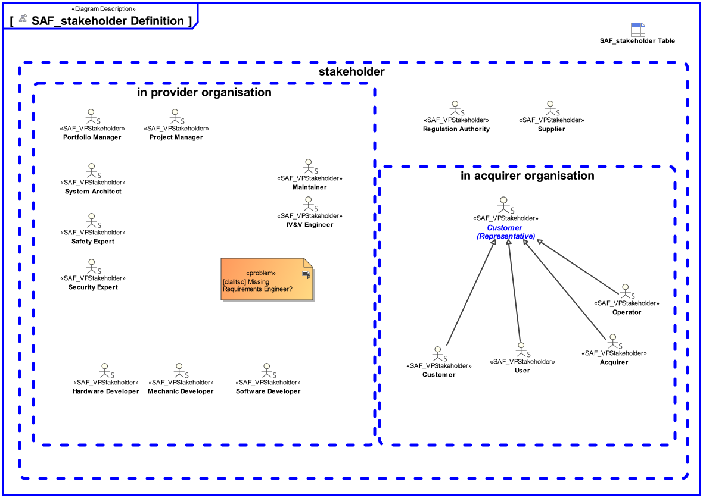

# SAF User Documentation : Stakeholders

This section provides a list of the Stakeholder roles considered for the elicitaiton of converns for SAF viewpoints. For each, the section lists the concerns that the Stakeholder has that can be addressed by the information in this SAF framework.

Each Stakeholder of a system - customer, user, project manager, coder, analyst, tester, and so on - is concerned with different characteristics of the system that are affected by its architecture.

For example, the user has specific concerns which interactions he or sh has with the system.; the customer is has a concern if and how the operational capabilities are supported by the system.

The stakeholders concerns vary with project phases, e.g. the system architect needs to make sure before a PDR, that the systems function are delegated to subsystems completely, and to communicate this to subsystem responsibles.

The following subchapters describe the stakeholders and their concerns:

# Acquirer
Definition - Acquirer:
Stakeholder that acquires or procures a product or service from a supplier, [ISO/IEC 15288:2022 - Systems engineering - System life-cycle processes]
The Acquirer is a Stakeholder that acquires or procures a product or service from a supplier. The Acquirer may be an organization or an individual acting on behalf of the customer or the user.
He is responsible for providing a feasible solution within a given budget. The Acquirer must plan and control the delivery of the system-of-interest as well as other systems together with necessary infrastructure, equipment or training. He must plan the integration of all the procured items to provide a complete solution ready for operation. For large enterprises standardization is an issue. Therefore, the acquirer is interested that standard items are considered in the system architecture.

## Concern
* Are defined standard items considered in the architecture?
* For what purpose is the system developed or adapted? 

  ***Rationale:  In my role, I need to check whether the overall system purpose is supported.***
* How does a system function interact with its environment?
* How is the system being used or utilized and interacting with other external systems to satisfy user needs? 

  ***Rationale:  In my role, I need to check whether the system complies with the higher-level operating concept.***
* Show in a concise manner the relationships from operational capability to operational story, to operational activity, and to operational performer.
* Show in a concise manner the relationships from operational process to operational story and to operational performer.
* What are necessary enabling systems?
* What are necessary inputs for operating the system expected to be provided by other external entitys?
* What are the capabilities that are supported by the system?
* What are the different contexts the system is embedded and utilized in?
* What are the external physical entities the system interacts with in the respective context?
* What are the geographical and physical locations of the intended / proposed elements of the solution?
* What are the normal and extreme environmental conditions for normal operation, for not operational, for storage, and for transport?
* What are the operational scenarios (operational stories) relevant to the system?
* What are the planned architectural means for risk mitigation?
* What are the relationships between the partys involved in the operation of the intended solution?
* What are the scenarios a system function is utilized in?
* What existing elements of the organization, enterprise, or operational entity need to be integrated in the intended solution?
* What is the cost for each required function?
* What is the lack / deficiency / gap in current capability implementation that is addressed with the intended solution?
* What is the necessary response time for an interface or a service?
* What is the operational context to achieve an operational story?
* What is the priority of each function?
* What is the system boundary definition?
* What is the time schedule for delivering the functions?
* What kind of conceptual items (energy, material, information, etc.) are exchanged between the system and external entities?
* What operational capabilities are defined?
* What operational exchanges do operational performers need to consume or provide?
* What operational process activities shall be executed during the execution of an operational story?
* What performers or resources are necessary to operate the intended solution?
* What possible threads of operational process activities have to be carried out to achieve the operational story main and alternative goals?
* What services are expected from external entities?
* What shall be validated to the customer at system level?
* Which Operational Performer will operate or run the system?
* Which conceptual level data / energy / material definitions have to be known by the SOI and used by the SOI? 

  ***Rationale:  In my role, I use them as basis for understanding interfaces on conceptual level.***
* Which functions will the system provide? 

  ***Rationale:  In my role, I need to check whether the overall system purpose is supported.***
* Which information is exchanged between the system and external entities?
* Which is the operational scenario, i.e., course of action, for the mission and the context in which the system of systems solution will exist?
* Which operational activity shall be executed by which operational performer in the operational story?
* Who are the (Major) Stakeholders involved in the intended solution?
* Who provides the inputs to a critical function?
* Why types of exchange can exist between Operational Performers (i.e., flows of information, people, material, or energy)?
# Customer
Definition - Customer (also Acquirer):
Organization or person that receives a product or service, [ISO/IEC 15288:2022 – Systems engineering - System life-cycle processes]
The Customer is an organization or person that receives a product. Examples: Consumer, client, end user, retailer, beneficiary, and purchaser. A customer can be internal or external to the organization. Customer is a broader reference than Acquirer, operator, or user and includes those roles as well as others. However, the Customer provides the funding.

## Concern
* How does a system function interact with its environment?
* How is the system being used or utilized and interacting with other external systems to satisfy user needs? 

  ***Rationale:  In my role, I need to check whether intended solution satisfies my customer needs.***
* Show in a concise manner the relationships from operational capability to operational story, to operational activity, and to operational performer.
* Show in a concise manner the relationships from operational process to operational story and to operational performer.
* What are necessary enabling systems?
* What are necessary inputs for operating the system expected to be provided by other external entitys?
* What are the different contexts the system is embedded and utilized in?
* What are the external physical entities the system interacts with in the respective context?
* What are the normal and extreme environmental conditions for normal operation, for not operational, for storage, and for transport?
* What are the operational scenarios (operational stories) relevant to the system?
* What are the planned architectural means for risk mitigation?
* What are the relationships between the partys involved in the operation of the intended solution?
* What are the scenarios a system function is utilized in?
* What is the necessary response time for an interface or a service?
* What is the operational context to achieve an operational story?
* What is the rationale when requirements are not considered?
* What is the system boundary definition?
* What kind of conceptual items (energy, material, information, etc.) are exchanged between the system and external entities?
* What operational capabilities are defined?
* What operational exchanges do operational performers need to consume or provide?
* What operational process activities shall be executed during the execution of an operational story?
* What performers or resources are necessary to operate the intended solution?
* What possible threads of operational process activities have to be carried out to achieve the operational story main and alternative goals?
* What services are expected from external entities?
* What shall be validated to the customer at system level?
* Which Operational Performer will operate or run the system?
* Which conceptual level data / energy / material definitions have to be known by the SOI and used by the SOI? 

  ***Rationale:  In my role, I use them as basis for understanding interfaces on conceptual level.***
* Which functions will the system provide?
* Which information is exchanged between the system and external entities?
* Which is the operational scenario, i.e., course of action, for the mission and the context in which the system of systems solution will exist?
* Which operational activity shall be executed by which operational performer in the operational story?
* Who provides the inputs to a critical function?
* Why types of exchange can exist between Operational Performers (i.e., flows of information, people, material, or energy)?
# Customer (Representative)
Definition - Customer (Representative):
(1) [SAF] The primary goal in a Customer (Representative) role is to represent the end-user, an individual, organization, or enterprise that benefits from the operation of the system. In this role the Customer (Representative) provides usage scenarios, user needs and requirements.
(2) [SAF] The secondary goal in a Customer (Representative) role is to represent the Acquirer, who buys or procures a product or service from a supplier. The Acquirer selected by the User to serve as their technical representative to:
1. Specify the system.
2. Select a System Developer or Services Provider.
3. Provide technical assistance.
4. Provide contractual oversight for the execution of the contract and delivery of a
verified and validated system to the User.
Note: All other Stakeholders do not use the system for purpose, and they do not need or require the system to satisfy any need. Therefore, interests of the end-user and claims of the other stakeholders could be contradicting and the Customer (Representative) role therefore strives for a solution satisfying all the Stakeholder Requirements.

## Concern
# Hardware Developer
Definition - Developer:
Organization that performs development tasks (including requirements analysis, design, testing through acceptance) during a life cycle process. [ISO/IEC 12207:2008]
The Developer is a group or an individual implementing the system parts according to defined requirements. On the lowest level of the system architecture there are the Hardware Developer responsible for implementing the hardware components.

## Concern
* How are error states handled?
* What additional information the system or a system element needs to generate to enable testing?
* What are the Interface Requirements regarding bandwidth, data throughput and latency?
* What are the encryption means used for an exchange?
* What are the functional requirements imposed on the system? 

  ***Rationale:  In my role, I need to trace my derived requirements against these ones relevant to me.***
* What are the non-functional requirements imposed on the system? 

  ***Rationale:  In my role, I need to trace my derived requirements against these ones relevant to me.***
* What are the protocols for exchanging items on specific interface? 

  ***Rationale:  In my role, I need to implement the protocol.***
* What are the provided power inputs?
* What delivery standards need to be provided?
* What is the allocated power consumption?
* What is the allocated reliability for a single function?
* What is the allocated reliability for the complete item?
* What is the allocated space?
* What is the allocated weight?
* What is the allocation of functions to the physical architecture? 

  ***Rationale:  In my role, I need to implement the realization of sub-functions by my HW subsystem.***
* What is the necessary accuracy and resolution for analog signal acquisition?
* What is the necessary accuracy and resolution for processing?
* What is the necessary memory size for processing nodes and data storage?
* What is the necessary processing performance?
* What is the necessary response time for an interface or a service?
* What is the scope of a delivery standard?
* What is the sequence of interactions among the system and context elements on physical level? 

  ***Rationale:  In my role, I need to interface with the environment.***
* What items (e.g.  data /energy material) are exchanged within the system?
* What kind of conceptual items (energy, material, information, etc.) are exchanged between the system and external entities? 

  ***Rationale:  In my role, I need to coordinate external interfaces with external partners.***
* Which (system and system partial) functions are assigned to a logical item and logical item components?
Note: if allocation of usage is used, then allocation of definition is a derived relationship XOR. 

  ***Rationale:  In my role, I need to take this into account when planning realization.***
* Which HW interfaces are necessary? 

  ***Rationale:  In my role, I need to implement interfaces with my HW subsystem, if necessary.***
* Which Stakeholders are relevant to the system and might impose requirements? 

  ***Rationale:  In my role, I need to give feedback on existing or missing stakeholders.***
* Which conceptual level data / energy / material definitions have to be known by the SOI and used by the SOI? 

  ***Rationale:  In my role, I must derive interface design from them.***
* Which design level data / energy / material definitions have to be known by the SOI and used by the SOI? 

  ***Rationale:  In my role, I must use these in interface design.***
* Which functions need to be realized by HW?
* Which functions will the system provide? 

  ***Rationale:  In my role, I need to provide qualified feedback on how my how the sub-functions assigned to my subsystem contributes to the function of the system.***
* Which interface design items are on an interface of a physical architecture element? 

  ***Rationale:  In my role, I need to implement interfaces with my HW subsystem, if necessary.***
* Which interface partners does a physical system element have? 

  ***Rationale:  In my role, I need to implement interfaces with my HW subsystem, if necessary.***
* Which modes and states does the system have? 

  ***Rationale:  In my role, I need to know which system modes and states my subsystem must support.***
* Which protection means need to be provided for an interface?
* Which standards, protocols and format specifications are associated with a specific interface? 

  ***Rationale:  In my role, I need to implement them.***
* Which variants of a HW item need to be provided?
* Who provides the inputs to a critical function?
# IV&V Engineer
Definition - IV&V Engineer
Individuals or groups responsible for integration, verification and validation.
IV&V Engineers are individuals or groups responsible for integration, validation and verification during development of the system. Integration, Verification and Validation are activities that are performed simultaneously, and alternately i.e. virtual integration is used to validate requirements, verification of prototypes is performed to validate requirements and design decisions, verification of interfaces is performed during integration on various integration levels allowing to gather enough test coverage.

## Concern
* Are safety related design principles) followed e.g. segregation of monitors or independence or redundant elements?
* How are error states handled?
* How does a system function interact with its environment? 

  ***Rationale:  In my role, I need to perform the integration of the system into its deployment environment.***
* How does the elements of the test environment interact with each other?
* How is the system being used or utilized and interacting with other external systems to satisfy user needs? 

  ***Rationale:  In my role, I need to take this into account when planning integration.***
* How to connect the system or a system element to a test equipment? 

  ***Rationale:  In my role, I need to plan the test environment***
* What additional information the system or a system element needs to generate to enable testing?
* What additional interfaces are necessary to expose internal properties, states and modes for testing?
* What are the external physical entities the system interacts with in the respective context? 

  ***Rationale:  In my role, I need to integrate and test the interfaces.***
* What are the functional requirements imposed on the system? 

  ***Rationale:  In my role, I need to prove System Requirements via test cases.***
* What are the items exchanged at the boundary of the system with external entities? 

  ***Rationale:  In my role, I need to integrate and test the interfaces.***
* What are the non-functional requirements imposed on the system? 

  ***Rationale:  In my role, I need to prove System Requirements via test cases.***
* What are the protocols for exchanging items on specific interface? 

  ***Rationale:  In my role, I need to integrate and test the interface.***
* What is the flow of critical information and data through the system?
* What is the necessary response time for an interface or a service?
* What is the physical breakdown of the system? 

  ***Rationale:  In my role, I need to test and integrate the items into the sytem.***
* What is the sequence of interactions among the system and context elements on physical level? 

  ***Rationale:  In my role, I need to plan the test environment.***
* What items (e.g.  data /energy material) are exchanged within the system?
* What kind of conceptual items (energy, material, information, etc.) are exchanged between the system and external entities? 

  ***Rationale:  In my role, I need to integrate and test the interfaces.***
* What kind of physical items (energy, material, information, etc.) are exchanged between the system and external entities? 

  ***Rationale:  In my role, I need to integrate and test the interfaces.***
* What kind of test equipment is necessary to test the system elements?
* What shall be validated to the customer at system level?
* Which functions will the system provide? 

  ***Rationale:  In my role, I need to understand the system in order to put it into operation.***
* Which information is exchanged between the system and external entities?
* Which interface design items are on an interface of a physical architecture element? 

  ***Rationale:  In my role, I need to  test the interface.***
* Which interface partners does the system have? 

  ***Rationale:  In my role, I need to integrate and test the interfaces.***
* Which modes and states does the system have? 

  ***Rationale:  In my role, I need to understand the system in order to put it into operation.***
* Which standards, protocols and format specifications are associated with a specific interface? 

  ***Rationale:  In my role, I need to test and integrate them.***
* Which users does the system support?  

  ***Rationale:  In my role, I need to cover these users with my test.***
* Who provides the inputs to a critical function?
# Maintainer
Definition - Maintainer
Individual or organization that performs maintenance activities, [ISO/IEC 12207:2008]
The Maintainer is an individual, group or organization responsible to maintain the system during its operational usage. The Maintainer assures the availability of the system over its foreseen lifetime. It involves obsolescence management, technology evolution, repair, update or replacement of parts of the system or even of the whole system. The Maintainer provides major non-functional requirements (e.g. reliability, availability, mean time to repair), but also functional requirements e.g. to ensure the compatibility with existing enabling systems.

## Concern
* How are error states handled?
* How to connect the system or a system element to a test equipment?
* How to ensure full Operational Capability of the system after maintenance activities with a system element or component? 
* How to install / de-install components to / from the system?
* What are the replaceable system components?
* What is the order information for each identified system element or component?
* What kind of conceptual items (energy, material, information, etc.) are exchanged between the system and external entities?
* Which modes and states does the system have?
# Mechanic Developer
Definition - Developer:
Organization that performs development tasks (including requirements analysis, design, testing through acceptance) during a life cycle process. [ISO/IEC 12207:2008]
The Developer is a group or an individual implementing the system parts according to defined requirements. On the lowest level of the system architecture there are the Mechanic Developer responsible for implementing the mechanical components.

## Concern
# Operator
Definition - Operator:
Individual or organization that performs the operations of a system, [ISO/IEC 15288:2022 – Systems engineering - System life-cycle processes]
The Operator is an individual or organization that uses knowledge, skills and procedures to perform the functions of the system to provide the benefit, product or service. 
An individual Operator combined with knowledge, skills, and procedures may be considered as an element of the system. The role of the operator and the role of the user can be delegated to a single individual or may be simultaneously instantiated in the same organization. 
*For example: Air passengers are the user of the air transport system while a single flight is operated by an air carrier like the Lufthansa using aircrafts of various types to provide the transport service. 
To provide the service to the passengers the carrier’s organization must implement lots of services utilizing several other enabling systems. 
The individual aircraft is operated by the pilot who uses the on-board systems to control the aircraft and to navigate during that flight. 
The example illustrates, that the roles user and operator are depending heavily on the definition of the SOI Scope.*

## Concern
* How does a system function interact with its environment?
* How is the system being used or utilized and interacting with other external systems to satisfy user needs?
* What are necessary inputs for operating the system expected to be provided by other external entitys?
* What are the scenarios a system function is utilized in?
* What is the necessary response time for an interface or a service?
* Which users does the system support?  

  ***Rationale:  In my role, I need to check whether the system fits into the higher-level user concept.***
# Portfolio Manager
Portfolio Manager:
Individual or organization that plans the Product portfolio, i.e. which products are available, will be available, which capabilities will they have.

## Concern
* Show in a concise manner the relationships from operational capability to operational story, to operational activity, and to operational performer.
* Show in a concise manner the relationships from operational process to operational story and to operational performer.
* What operational capabilities are defined?
# Project Manager
Definition - Project Manager: 
The responsibility of the Project Manager is to make the right resources with the right skills available in time to get the identified work done. The Project Manager controls that the work packages are completed in time and agreed milestones are met. A clear definition of the solution for the stated problem allows planning to be done properly.
Systems Engineering creates a clear and manageable system structure, which is the basis for project planning and task assignment.

## Concern
* For what purpose is the system developed or adapted? 

  ***Rationale:  In my role, I need to check whether the project order is implemented correctly.***
* How to involve a Stakeholder and to what degree?
* In which phases of the life cycle is a Stakeholder involved in the project? 

  ***Rationale:  In my role, I need to give feedback on existing or missing stakeholders.***
* What are the consequences not considering a Stakeholder?
* What are the consequences, if the Stakeholder’s concerns are not considered?
* What are the system delivery standards?
* What concerns and rationals does a Stakeholder have?
* What impact does a Stakeholder have on the project?
* What is the functional scope of each system delivery standard?
* What is the rationale when requirements are not considered?
* What is the risk involved with each development item?
* What services are expected from external entities?
* When do product functions or features become available?
* Which Stakeholder Requirements are addressed by System Requirements? 

  ***Rationale:  In my role, I need to check whether we fulfill our contract.***
* Which Stakeholders are relevant to the system and might impose requirements? 

  ***Rationale:  In my role, I need to give feedback on existing or missing stakeholders.***
* Which development effort is associated with each individual element?
* Which functions will the system provide?
* Who provides the inputs to a critical function?
# Regulation Authority
Definition - Regulation Authority:
Regulation Authorities can have impact by imposing Stakeholder Requirements against the system and by their involvement in the development and acceptance phases (e.g. safety or IT security acceptance audits). 
The term “authorities” also refers to current applicable regulations and laws.
The requirements stipulated on the system are diverse. They can be functional and non-functional requirements.
Systems Engineering must adhere to relevant standards and needs to demonstrate compliance with those standards and requirements.

## Concern
* How are applicable requirements considered in the system architecture?
* How are error states handled?
* What additional information the system or a system element needs to generate to enable testing?
* What is the rationale when requirements are not considered?
* Which modes and states does the system have?
* Why types of exchange can exist between Operational Performers (i.e., flows of information, people, material, or energy)?
# Safety Expert
Definition - Safety Specialist:
Safety is one subject matter of specialty engineering but important enough to be treated separately. 
The safety experts evaluate a proposed system architecture and design for safety applying different analysis considering the criticality of the system functions. The result of the activity are safety requirements that need to be considered in the system design.

## Concern
* Are safety related design principles) followed e.g. segregation of monitors or independence or redundant elements?
* How are error states handled?
* How are safety features verified?
* How do the logical system elements interact to to provide the system function?
* How do the physical system elements interact to provide the system function?
* How does a system function interact with its environment?
* How does criticality propagate down the system hierarchy?
* How is a critical function decomposed and allocated?
* What additional information the system or a system element needs to generate to enable testing?
* What are the contributors (SW and HW items contributing to a critical function) to a critical function?
* What are the encryption means used for an exchange?
* What are the external physical entities the system interacts with in the respective context?
* What are the failure modes of a system function?
* What are the hazards of a system function in an identified situation (context + scenario)?
* What are the inputs to a critical function?
* What are the planned architectural means for risk mitigation?
* What are the scenarios a system function is utilized in?
* What is the flow of critical information and data through the system?
* What is the necessary response time for an interface or a service?
* What is the physical breakdown of the system? 

  ***Rationale:  In my role, I need to assess if the system partitioning fulfills the safety requirements.***
* What is the possible harm in utilizing the system?
* What is the rationale when requirements are not considered?
* What is the sequence of interactions among the system and context elements on physical level?
* What kind of conceptual items (energy, material, information, etc.) are exchanged between the system and external entities?
* What operational exchanges do operational performers need to consume or provide?
* What shall be validated to the customer at system level?
* Which conceptual level data / energy / material definitions have to be known by the SOI and used by the SOI? 

  ***Rationale:  In my role, I use them as basis for understanding interfaces on conceptual level.***
* Which design level data / energy / material definitions have to be known by the SOI and used by the SOI? 

  ***Rationale:  In my role, I use them as basis for understanding interfaces on design level.***
* Which functions will the system provide?
* Which information is exchanged between the system and external entities?
* Which modes and states does the system have?
* Who provides the inputs to a critical function?
# Security Expert
Definition - Security Specialist:
Security is one subject matter of specialty engineering but important enough to be treated separately.
The IT-Security experts evaluate a proposed system architecture and design for IT-Security. One outcome of the activity are technical security requirements that need to be considered in the system design. Other outcomes affect the organization or the infrastructure of the user or define procedures that need to be implemented.

## Concern
* How are error states handled?
* How do the logical system elements interact to to provide the system function?
* How do the physical system elements interact to provide the system function?
* How is the interface between different domains protected?
* What additional information the system or a system element needs to generate to enable testing?
* What are necessary inputs for operating the system expected to be provided by other external entitys?
* What are the confidentiality, integrity and availability levels for processed or exchanged information?
* What are the domains of similar security levels in the system or the system participates in?
* What are the encryption means used for an exchange?
* What are the interfaces between different domains?
* What are the protocols for exchanging items on specific interface? 

  ***Rationale:  In my role, I need to assess the security on the interface.***
* What are the protocols used for exchanging information? 

  ***Rationale:  In my role, I need to assess the security based on protocol usage in general.***
* What are the requirements for security relevant IT-equipment?
* What are the scenarios a system function is utilized in?
* What is the necessary response time for an interface or a service?
* What is the physical breakdown of the system? 

  ***Rationale:  In my role, I need to assess if the system partitioning fulfills the security requirements.***
* What is the rationale when requirements are not considered?
* What is the sequence of interactions among the system and context elements on physical level?
* What items (e.g.  data /energy material) are exchanged within the system?
* What kind of conceptual items (energy, material, information, etc.) are exchanged between the system and external entities?
* What operational exchanges do operational performers need to consume or provide?
* What shall be validated to the customer at system level?
* Which conceptual level data / energy / material definitions have to be known by the SOI and used by the SOI? 

  ***Rationale:  In my role, I use them as basis for understanding interfaces on conceptual level.***
* Which design level data / energy / material definitions have to be known by the SOI and used by the SOI? 

  ***Rationale:  In my role, I use them as basis for understanding interfaces on design level.***
* Which functions will the system provide?
* Which information is exchanged between the system and external entities?
* Which modes and states does the system have?
* Which standards, protocols and format specifications are associated with a specific interface? 

  ***Rationale:  In my role, I need to assess the security based on them.***
* Why types of exchange can exist between Operational Performers (i.e., flows of information, people, material, or energy)?
# Software Developer
Definition - Developer:
Organization that performs development tasks (including requirements analysis, design, testing through acceptance) during a life cycle process. [ISO/IEC 12207:2008]
The Developer is a group or an individual implementing the system parts according to defined requirements. On the lowest level of the system architecture there are the Software Developer responsible for implementing the software components.

## Concern
* How are error states handled?
* What additional information the system or a system element needs to generate to enable testing?
* What are precision and accuracy requirements for presentation of data items on an interface?
* What are precision and accuracy requirements for processing of data items?
* What are the Interface Requirements regarding bandwidth, data throughput and latency?
* What are the algorithms to be implemented?
* What are the encryption means used for an exchange?
* What are the functional requirements imposed on the system? 

  ***Rationale:  In my role, I need to trace my derived requirements against these ones relevant to me.***
* What are the non-functional requirements applying to SW (e.g. with regard to SW quality, modularization, changeability or reuse)?
* What are the non-functional requirements imposed on the system? 

  ***Rationale:  In my role, I need to trace my derived requirements against these ones relevant to me.***
* What are the protocols for exchanging items on specific interface? 

  ***Rationale:  In my role, I need to implement the protocol.***
* What is the allocation of functions to the physical architecture? 

  ***Rationale:  In my role, I need to implement the realization of sub-functions by my SW subsystem.***
* What is the necessary accuracy and resolution for processing?
* What is the necessary performance for processing?
* What is the necessary response time for an interface or a service?
* What is the sequence of interactions among the system and context elements on physical level? 

  ***Rationale:  In my role, I need to interface with the environment.***
* What items (e.g.  data /energy material) are exchanged within the system?
* What kind of conceptual items (energy, material, information, etc.) are exchanged between the system and external entities? 

  ***Rationale:  In my role, I need to coordinate external interfaces with external partners.***
* Which (system and system partial) functions are assigned to a logical item and logical item components?
Note: if allocation of usage is used, then allocation of definition is a derived relationship XOR. 

  ***Rationale:  In my role, I need to take this into account when planning implementation.***
* Which SW interfaces are necessary? 

  ***Rationale:  In my role, I need to implement interfaces with my SW subsystem, if necessary.***
* Which Stakeholders are relevant to the system and might impose requirements? 

  ***Rationale:  In my role, I need to give feedback on existing or missing stakeholders.***
* Which conceptual level data / energy / material definitions have to be known by the SOI and used by the SOI? 

  ***Rationale:  In my role, I must derive interface design from them.***
* Which design level data / energy / material definitions have to be known by the SOI and used by the SOI? 

  ***Rationale:  In my role, I must use these in interface design.***
* Which functions and services need to be implemented in SW?
* Which functions will the system provide? 

  ***Rationale:  In my role, I need to provide qualified feedback on how my how the sub-functions assigned to my subsystem contributes to the function of the system.***
* Which interface design items are on an interface of a physical architecture element? 

  ***Rationale:  In my role, I need to implement interfaces with my SW subsystem, if necessary.***
* Which interface partners does a SW item have?
* Which interface partners does a physical system element have? 

  ***Rationale:  In my role, I need to implement interfaces with my SW subsystem, if necessary.***
* Which modes and states does the system have? 

  ***Rationale:  In my role, I need to know which system modes and states my subsystem must support.***
* Which standards, protocols and format specifications are associated with a specific interface? 

  ***Rationale:  In my role, I need to implement them.***
* Who provides the inputs to a critical function?
* Why types of exchange can exist between Operational Performers (i.e., flows of information, people, material, or energy)?
# Supplier
Definition - Supplier:
Organization or an individual that enters into an agreement with the Acquirer for the supply of a product or service, [ISO/IEC 15288:2022 – Systems engineering - System life-cycle processes]
The Supplier is the organization or individual that enters into an agreement with the Acquirer to supply a product or service. Usually, the system architect and the developers for make-items are part of the supplier’s organization. Other terms commonly used for Supplier are contractor, producer, seller or vendor.

## Concern
* What are necessary enabling systems?
* What are necessary inputs for operating the system expected to be provided by other external entitys?
* What are the capabilities that are supported by the system?
* What are the external physical entities the system interacts with in the respective context?
* What are the geographical and physical locations of the intended / proposed elements of the solution?
* What are the scenarios a system function is utilized in?
* What is the lack / deficiency / gap in current capability implementation that is addressed with the intended solution?
* What is the system boundary definition?
* What services are expected from external entities?
* Who are the (Major) Stakeholders involved in the intended solution?
# System Architect
Definition - System Architect:
The System Architect as an individual or group performing the systems engineering for the SOI. The system architect creates the system architecture i.e. the views as defined by the SAF.

## Concern
* Are safety related design principles) followed e.g. segregation of monitors or independence or redundant elements?
* For what purpose is the system developed or adapted? 

  ***Rationale:  In my role, I need to know this in order to be able to further design the system in an appropriate way.***
* Have the logical decomposition guidelines been followed?
* How are applicable requirements considered in the system architecture?
* How are error states handled?
* How do the logical system elements interact to to provide the system function?
* How do the physical system elements interact to provide the system function?
* How does a system function interact with its environment? 

  ***Rationale:  In my role, I need to delegate the realization of interfaces to subsystems.***
* How does criticality propagate down the system hierarchy?
* How does the elements of the test environment interact with each other?
* How is a critical function decomposed and allocated?
* How is the system being used or utilized and interacting with other external systems to satisfy user needs? 

  ***Rationale:  In my role, I need to pass on the resulting System Requirements to the subsystems.***
* How to involve a Stakeholder and to what degree?
* In which phases of the life cycle is a Stakeholder involved in the project? 

  ***Rationale:  In my role, I need to give feedback on existing or missing stakeholders.***
* Show in a concise manner the relationships from operational capability to operational story, to operational activity, and to operational performer.
* Show in a concise manner the relationships from operational process to operational story and to operational performer.
* What additional information the system or a system element needs to generate to enable testing?
* What are necessary enabling systems?
* What are necessary inputs for operating the system expected to be provided by other external entitys?
* What are the capabilities that are supported by the system? 

  ***Rationale:  In my role, I need to identify suitable basic components on the grounds of the required system capabilities.***
* What are the configuration items in the physical architecture?
* What are the consequences, if the Stakeholder’s concerns are not considered?
* What are the different contexts the system is embedded and utilized in?
* What are the encryption means used for an exchange?
* What are the external physical entities the system interacts with in the respective context?
* What are the functional requirements imposed on the system? 

  ***Rationale:  In my role, I need to check whether the system design realizes the System Requirements.***
* What are the geographical and physical locations of the intended / proposed elements of the solution?
* What are the non-functional requirements imposed on the system? 

  ***Rationale:  In my role, I need to check whether the system design realizes the System Requirements.***
* What are the normal and extreme environmental conditions for normal operation, for not operational, for storage, and for transport?
* What are the operational scenarios (operational stories) relevant to the system?
* What are the planned architectural means for risk mitigation?
* What are the protocols for exchanging items on specific interface? 

  ***Rationale:  In my role, I need to asses if the usage of protocols on interfaces is compatible with the system lifecyle concepts.***
* What are the protocols used for exchanging information? 

  ***Rationale:  In my role, I need to validate if they fit the purpose of the system and conform the systems concepts***
* What are the relationships between the partys involved in the operation of the intended solution?
* What are the scenarios a system function is utilized in?
* What are the system delivery standards?
* What concerns and rationals does a Stakeholder have?
* What existing elements of the organization, enterprise, or operational entity need to be integrated in the intended solution?
* What is the allocation of functions to the physical architecture? 

  ***Rationale:  In my role, I need to delegate the realization of sub-function by HW & SW subsystems.***
* What is the breakdown of functions into sub-functions?
* What is the configuration or version of each configuration item?
* What is the context of the organization, enterprise, or operational entity?
* What is the flow of critical information and data through the system?
* What is the functional scope of each system delivery standard?
* What is the lack / deficiency / gap in current capability implementation that is addressed with the intended solution?
* What is the logical breakdown of the system ?
* What is the necessary accuracy and resolution for processing?
* What is the necessary response time for an interface or a service?
* What is the operational context to achieve an operational story?
* What is the physical breakdown of the system? 

  ***Rationale:  In my role, I need to orchestrate the interface agreements among the parts of the system.***
* What is the rationale when requirements are not considered?
* What is the sequence of interactions among the system and context elements on physical level? 

  ***Rationale:  In my role, I need to [tbd].***
* What is the system boundary definition?
* What is the task executed by an organization, enterprise, or operational entity in the Operational Context?
* What items (e.g.  data /energy material) are exchanged within the system?
* What kind of conceptual items (energy, material, information, etc.) are exchanged between the system and external entities? 

  ***Rationale:  In my role, I need to coordinate external interfaces with external partners.***
* What operational capabilities are defined?
* What operational exchanges do operational performers need to consume or provide?
* What operational process activities shall be executed during the execution of an operational story?
* What performers or resources are necessary to operate the intended solution?
* What possible threads of operational process activities have to be carried out to achieve the operational story main and alternative goals?
* What services are expected from external entities?
* What shall be validated to the customer at system level?
* What system elements are make-items, reuse items, or COTS?
* Which (system and system partial) functions are assigned to a logical item and logical item components?
Note: if allocation of usage is used, then allocation of definition is a derived relationship XOR.
* Which HW interfaces are necessary?
* Which Operational Performer will operate or run the system?
* Which SW interfaces are necessary?
* Which Stakeholders are relevant to the system and might impose requirements? 

  ***Rationale:  In my role, I need to give feedback on existing or missing stakeholders.***
* Which Viewpoints are present
* Which conceptual level data / energy / material definitions have to be known by the SOI and used by the SOI? 

  ***Rationale:  In my role, I want to foster reuse of system wide concept definitions within the architecture design.***
* Which design level data / energy / material definitions have to be known by the SOI and used by the SOI? 

  ***Rationale:  In my role, I have to foster reuse of system wide concept definitions within the architecture design.***
* Which functions will the system provide? 

  ***Rationale:  In my role, I need to break these down further to be able to delegate sub-functions to subsystems.***
* Which information is exchanged between the system and external entities?
* Which interface design items are on an interface of a physical architecture element?
* Which interface partners does a SW item have?
* Which interface partners does a physical system element have? 

  ***Rationale:  In my role, I need to orchestrate interface agreements between the interface partners.***
* Which is the operational scenario, i.e., course of action, for the mission and the context in which the system of systems solution will exist?
* Which modes and states does the system have? 

  ***Rationale:  In my role, I need to understand the required system behavior in order to further design the system.***
* Which operational activity shall be executed by which operational performer in the operational story?
* Which standards, protocols and format specifications are associated with a specific interface? 

  ***Rationale:  In my role, I need to validate if they fit the purpose of the system and are complaint to the systems concepts.***
* Which system function is addressed by system requirement?
* Which system functions are dependent on a systems mode or state?
* Which users does the system support?  

  ***Rationale:  In my role, I need to delegate the realization of HMI to subsystems.***
* Who are the (Major) Stakeholders involved in the intended solution? 

  ***Rationale:  In my role, I need to give feedback on existing or missing stakeholders.***
* Who provides the inputs to a critical function?
* Why types of exchange can exist between Operational Performers (i.e., flows of information, people, material, or energy)?
# User
Definition - User:
Individual or group that interacts with a system or benefits from a system during its utilization, [ISO/IEC 15288:2022 - Systems engineering - System life-cycle processes]
The User is the individual, organization or group that benefits from the operation of the system. The User provides the usage scenarios, the User needs and finally the user requirements representing most of the functional requirements but also non-functional requirements. The role of User and the role of operator are sometimes allocated, simultaneously or sequentially, to the same individual or organization. All the other stakeholders do not use the system for any purpose, and they do not need or require the system to satisfy any need. Therefore, interests of the User and claims of the Stakeholder could be contradicting.

## Concern
* How does a system function interact with its environment?
* How is the system being used or utilized and interacting with other external systems to satisfy user needs? 

  ***Rationale:  In my role, I need to check whether intended solution satisfies my user needs.***
* What are necessary inputs for operating the system expected to be provided by other external entitys?
* What are the scenarios a system function is utilized in?
* What is the necessary response time for an interface or a service?
* Which users does the system support?  

  ***Rationale:  In my role, I need to check whether the system fits into the higher-level user concept.***
