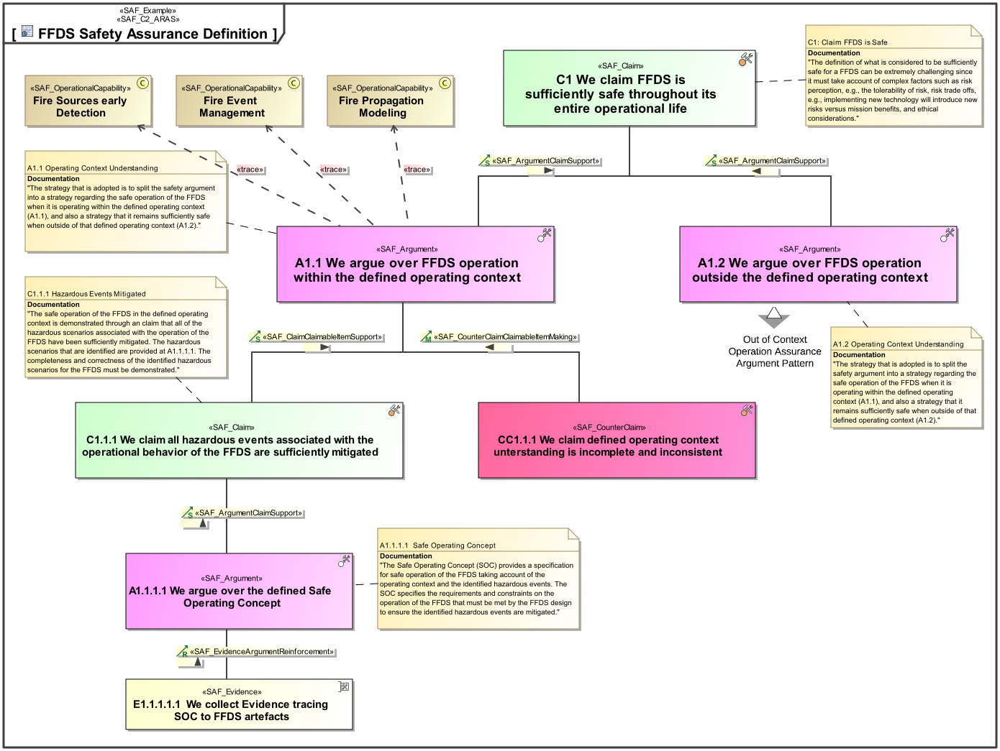

# SAF User Documentation : **C2_ARAS** Argumentation Assurance Viewpoint
|**Domain**|**Aspect**|**Maturity**|
| --- | --- | --- |
|[Common](../domains.md#Domain-Common)|[Taxonomy & Structure](../aspects.md#Aspect-Taxonomy-&-Structure)|[released](../using-saf/maturity.md#released)|
## Example

## Purpose
The Argumentation Assurance Viewpoint presents claims backed up by arguments that are supported by evidence, together with the possibility to counter such claims in a similar manner.
## Applicability
The Argumentation Assurance Viewpoint supports the ability to present an evidence pattern, a structure of claims, arguments, and evidence, which is a common need in systems engineering. It applies equally to the establishment of traceability, definition of safety assurance cases, and even the presentation of business cases.
## Presentation
A block definition diagram (BDD) featuring a claim-argument-evidence pattern (CAE).

## Stakeholder
## Concern
* [How is a evidence-based claim supported?](../concerns.md#_2021x_2_8710274_1674576758703_316775_23176)
## Profile Model Reference
The following Stereotypes / Model Elements are used in the Viewpoint:
* [SAF_ArgumentClaimSupport](../stereotypes.md#SAF_ArgumentClaimSupport)
* [SAF_Argument](../stereotypes.md#SAF_Argument)
* [SAF_C2_ARAS](../stereotypes.md#SAF_C2_ARAS)
* [SAF_ClaimAboutSubjectMaking](../stereotypes.md#SAF_ClaimAboutSubjectMaking)
* [SAF_ClaimClaimableItemSupport](../stereotypes.md#SAF_ClaimClaimableItemSupport)
* [SAF_ClaimSubject](../stereotypes.md#SAF_ClaimSubject)
* [SAF_Claim](../stereotypes.md#SAF_Claim)
* [SAF_ClaimantClaimMaking](../stereotypes.md#SAF_ClaimantClaimMaking)
* [SAF_Claimant](../stereotypes.md#SAF_Claimant)
* [SAF_CounterClaimClaimableItemMaking](../stereotypes.md#SAF_CounterClaimClaimableItemMaking)
* [SAF_CounterClaim](../stereotypes.md#SAF_CounterClaim)
* [SAF_EvidenceArgumentReinforcement](../stereotypes.md#SAF_EvidenceArgumentReinforcement)
* [SAF_Evidence](../stereotypes.md#SAF_Evidence)
* [SAF_Refuter](../stereotypes.md#SAF_Refuter)
## Input from other Viewpoints
### Required Viewpoints
*none*
### Recommended Viewpoints
*none*
