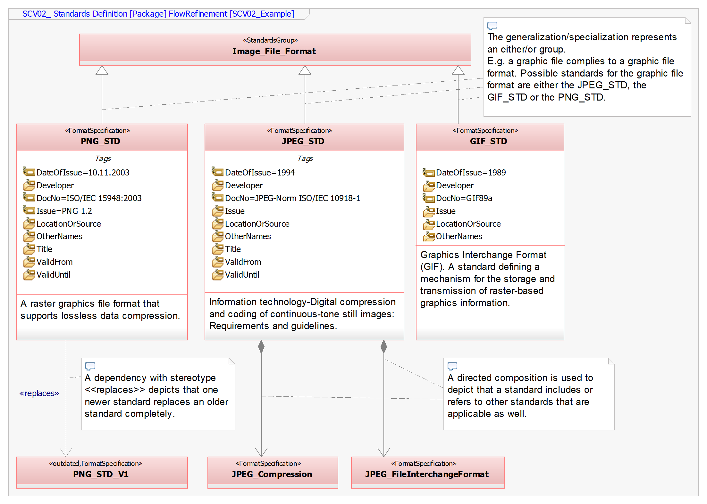

# Common Standards Definition Viewpoint
|**Domain**|**Aspect**|**Maturity**|
| --- | --- | --- |
|  [Common](../domains.md#Domain-Common) |  [Structure](../aspects.md#Aspect-Structure) | [ Proposed](../using-saf/maturity.md#proposed)|
*Domain:* **Common** *Aspect:* **Structure**
## Example

## Purpose
The SCV02 Standards Definition Viewpoint is used to define applicable standards, format specifications, protocol specifications, regulations and engineering documents that are used throughout the model. It provides the complete specification for the standards together with issue, version, release date and other information. The SCV02 helps to keep track of changes to the set of applicable documents and of new versions of the applied standards. Hyperlinks may be used to refer to documents external to the model.

Libraries may be made available defining standards commonly used throughout the enterprise or that are specific for a certain purpose.
## Applicability
The SCV02 Standards Definition Viewpoint is commonly applied to identify the applicable standards and specifications that are made applicable to interfaces, the format of items exchanged, the way those items are exchanged or to any other design element that needs to adhere to a standard.
## Stakeholder
* [Customer](../stakeholders.md#Customer)
* [Hardware Developer](../stakeholders.md#Hardware-Developer)
* [IV&V Engineer](../stakeholders.md#IV&V-Engineer)
* [Mechanic Developer](../stakeholders.md#Mechanic-Developer)
* [Regulation Authority](../stakeholders.md#Regulation-Authority)
* [Safety Expert](../stakeholders.md#Safety-Expert)
* [Security Expert](../stakeholders.md#Security-Expert)
* [Software Developer](../stakeholders.md#Software-Developer)
* [Supplier](../stakeholders.md#Supplier)
* [System Architect](../stakeholders.md#System-Architect)
* [Common Concerns](../stakeholders.md#Common-Concerns)

## Concern
* Which standards and specifications are applicable to the system of interest or its system elements and their interfaces and interactions?
* What are the relevant issues or versions of the standards to be used for the development of the system?
* What is the complete identification of a standard or a specification?
* Which other standards are referenced or referred to by applicable standards?

## Presentation
SCV02 Standard Definition Diagram defines the standards, their attributes and relationships.

SCV02 Standard Overview Table providing a list of all standards defined in the model.

## Profile Model Reference
* StandardsGroup: defines a group of alternative standards
* FormatSpecification: defines a standard applied to files and data
* replaces: defines a relationship if one standard replaces an outdated standard
* outdated: used to indicate, that a standard is outdated
* composition: [UML_Standard_Profile]
* generalization: [UML_Standard_Profile]
* SCV02_StandardsDefinition: Applicable for the diagram
* SCV02_StandardsOverview: Defines the overview table

## Input from other Viewpoints
### Required Viewpoints
*none*
### Recommended Viewpoints
*non*
