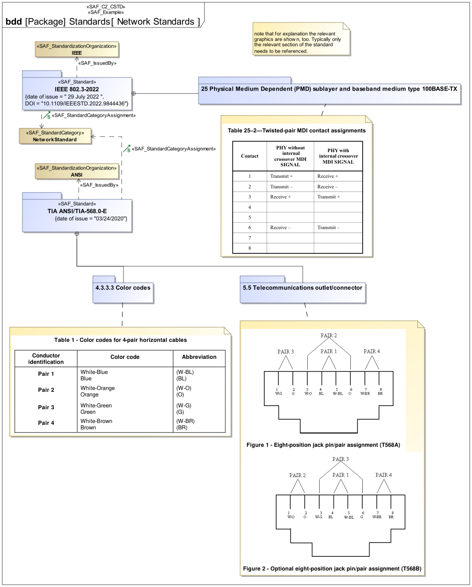

# SAF User Documentation : **C2_CSTD** Common Standards Definition Viewpoint
|**Domain**|**Aspect**|**Maturity**|
| --- | --- | --- |
|[Common](../domains.md#Domain-Common)|[Taxonomy & Structure](../aspects.md#Aspect-Taxonomy-&-Structure)|[under construction](../using-saf/maturity.md#under-construction)|
## Example

## Purpose
The Standards Definition Viewpoint supports the definition of applicable standards, e.g., for format and protocol specifications, regulations, and engineering documents that are used throughout the system life cycle. It provides the meta-data for the applied standards, guidance and policy, e.g., issue, version, issue date, and publisher. The Viewpoint helps to keep track of changes to the set of applicable documents and of new versions of applied standards. Links should be used to refer to documents external to the architecture description.
## Applicability
The Standards Definition Viewpoint supports the definition of standards, and assignment of model elements to standards, during the technical processes and according to the information management process  of the INCOSE SYSTEMS ENGINEERING HANDBOOK 2023 .
## Presentation
A block definition diagram (BDD) featuring the taxonomy of types of standards,  applicable to the system of interest, or parts of the system of interest. The Standards are represented by packages which allows to use them in model libraries and put e.g. reusable interface definitions, or terms complying to the standard into the package

A table format listing standards, applicable to the system of interest or parts of it, and the relation to which parts of the system the standards apply

## Stakeholder
## Concern
* [Which are the relevant releases of the applicable standards, guidance, and policy to be used for the development of the system of interest and its system elements?](../concerns.md#_2021x_2_8710274_1700821579663_211989_58619)
* [Which other standards are referenced or referred to by applicable standards?](../concerns.md#_2021x_2_8710274_1700821592720_121043_58626)
* [Which standards, guidance, and policy are applicable to the system of interest or its system elements and their interfaces and interactions?](../concerns.md#_2021x_2_8710274_1700821558610_489259_58612)
## Profile Model Reference
The following Stereotypes / Model Elements are used in the Viewpoint:
* SAF_Standard contained in SAF_Standard
* [SAF_C2_CSTD](../stereotypes.md#saf_c2_cstd)
* [SAF_C2_CSTD_Table](../stereotypes.md#saf_c2_cstd_table)
* [SAF_ConformsStandard](../stereotypes.md#saf_conformsstandard)
* [SAF_IssuedBy](../stereotypes.md#saf_issuedby)
* [SAF_StandardCovering](../stereotypes.md#saf_standardcovering)
* [SAF_StandardSuperseding](../stereotypes.md#saf_standardsuperseding)
* [SAF_Standard](../stereotypes.md#saf_standard)
* [SAF_StandardizationOrganization](../stereotypes.md#saf_standardizationorganization)
* [SAF_StandardizationSubject](../stereotypes.md#saf_standardizationsubject)
## Input from other Viewpoints
### Required Viewpoints
*none*
### Recommended Viewpoints
*none*
