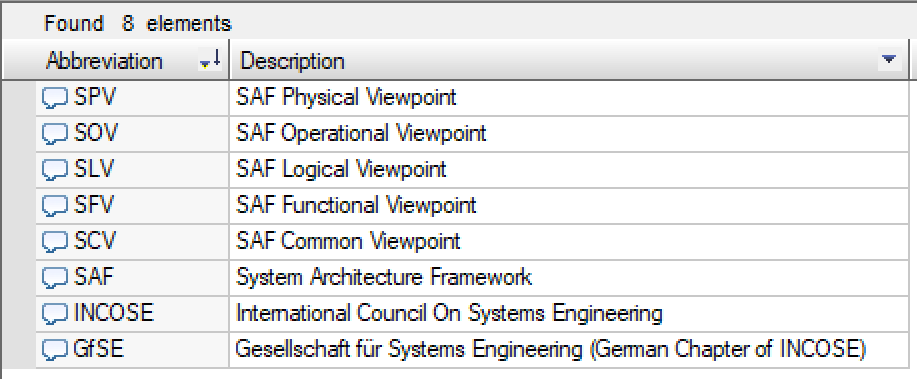
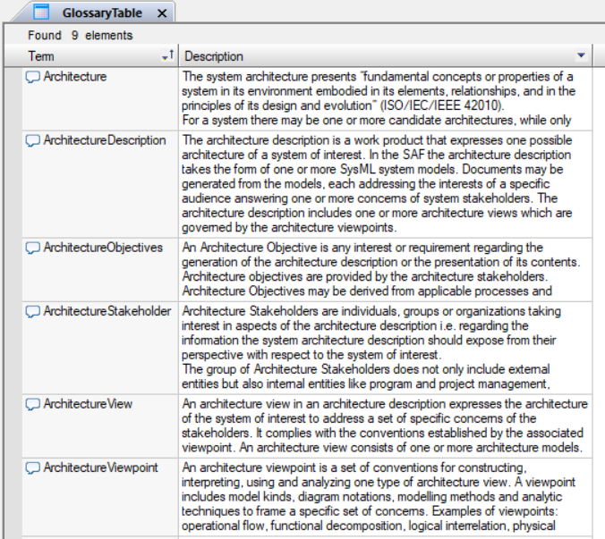

# SAF User Documentation : Common Terms and Abbreviations
|**Domain**|**Aspect**|**Maturity**|
| --- | --- | --- |
|[Common](../domains.md#Domain-Common)|[Taxonomy & Structure](../aspects.md#Aspect-Taxonomy-&-Structure)|[proposed](../using-saf/maturity.md#proposed)|
## Example

## Purpose
The viewpoint collects all the terms and abbreviations that are defined for the model.
## Applicability
The viepoint is used to collect and present terms and abbreviations that are used throughout the model, providing a description for each presenting the common understanding of a term or an abbreviation.
## Stakeholder
* [Acquirer](../stakeholders.md#Acquirer)
* [Customer](../stakeholders.md#Customer)
* [Hardware Developer](../stakeholders.md#Hardware-Developer)
* [IV&V Engineer](../stakeholders.md#IV&V-Engineer)
* [Maintainer](../stakeholders.md#Maintainer)
* [Mechanic Developer](../stakeholders.md#Mechanic-Developer)
* [Operator](../stakeholders.md#Operator)
* [Regulation Authority](../stakeholders.md#Regulation-Authority)
* [Safety Expert](../stakeholders.md#Safety-Expert)
* [Security Expert](../stakeholders.md#Security-Expert)
* [Software Developer](../stakeholders.md#Software-Developer)
* [Supplier](../stakeholders.md#Supplier)
* [System Architect](../stakeholders.md#System-Architect)
* [Common Concerns](../stakeholders.md#Common-Concerns)
* [User](../stakeholders.md#User)
## Concern
* What is the common understanding of terms and abbreviations as used throughout the model?
## Presentation
A common package “02_DictionaryOfTerms” contains the terms and abbreviations. Both are derived from a comment. Table views are used for presenting an overview.

## Profile Model Reference
* [SAF_Term](../stereotypes.md#SAF_Term)
* [SAF_Abbreviation](../stereotypes.md#SAF_Abbreviation)
## Input from other Viewpoints
### Required Viewpoints
*none*
### Recommended Viewpoints
*none*
