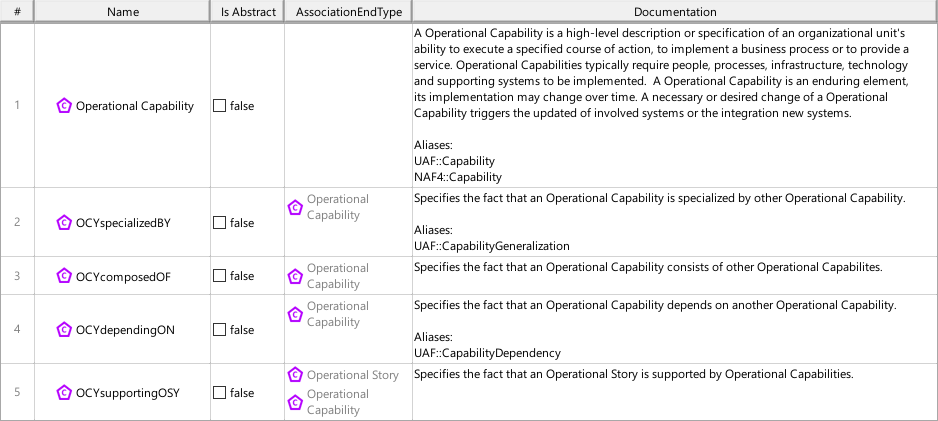
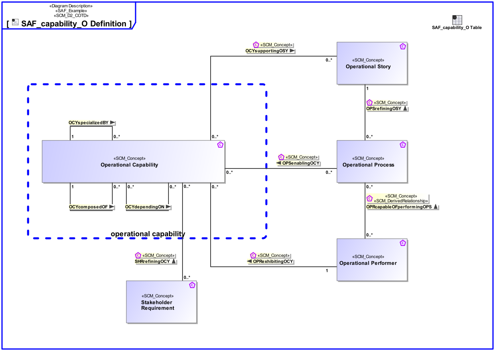

# SAF User Documentation : **D2_COTD** Concept Viewpoint
|**Domain**|**Aspect**|**Maturity**|
| --- | --- | --- |
|[SAF Development](../domains.md#Domain-SAF-Development)|[Taxonomy & Structure](../aspects.md#Aspect-Taxonomy-&-Structure)|[proposed](../using-saf/maturity.md#proposed)|
## Example

## Purpose
The Concept Viewpoint defines the SE concepts and their relationships supported by SAF.
## Applicability
The ... Viewpoint supports the ...  in INCOSE SYSTEMS ENGINEERING HANDBOOK 2023.
## Presentation
A Block Definition Diagram (BDD)  featuring elements of SCM_Concept representing SE concepts to be supported by SAF. SCM_Concept can be classes of items, relations between items. It is also possible to create relations to relations (SCM_Concepts can be Classes, Associations and Association Classes).
For relational concepts, it is reqired to display the direction, and to define the multiplicities. See SAF Development Guide for concept modeling conventions

A table featuring SCM_Concepts and their descriptions. In case of relational concepts the ends are shown also.

## Stakeholder
* [SAF Developer](../stakeholders.md#SAF-Developer)
* [SAF MBSE approch planer](../stakeholders.md#SAF-MBSE-approch-planer)
## Concern
* [Which systems engineering concepts are covered by the framework?](../concerns.md#_2024x_26f0132_1719129923965_578278_14750)
## Profile Model Reference
The following Stereotypes / Model Elements are used in the Viewpoint:
* [SCM_Concept](../stereotypes.md#scm_concept)
* [SCM_D2_COTD](../stereotypes.md#scm_d2_cotd)
* [SCM_D2_COTD_Table](../stereotypes.md#scm_d2_cotd_table)
## Input from other Viewpoints
### Required Viewpoints
*none*
### Recommended Viewpoints
*none*
