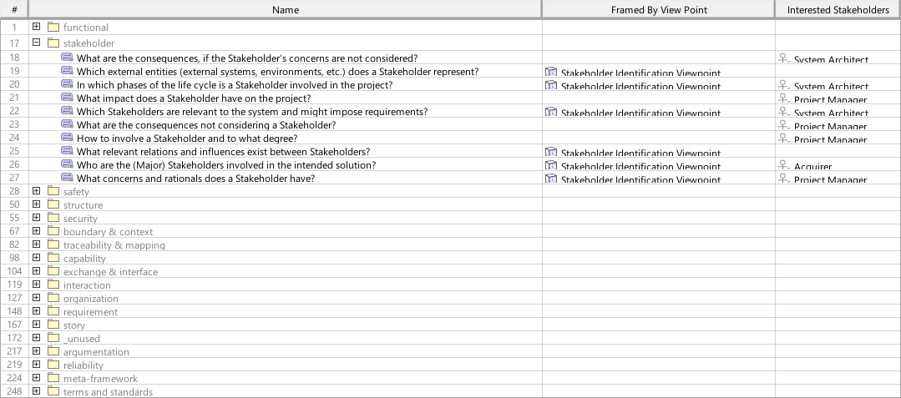

# SAF User Documentation : **D6_CCND** Concern Viewpoint
|**Domain**|**Aspect**|**Maturity**|
| --- | --- | --- |
|[SAF Development](../domains.md#Domain-SAF-Development)|[Requirement](../aspects.md#Aspect-Requirement)|[proposed](../using-saf/maturity.md#proposed)|
## Example

## Purpose
The Concern Viewpoint provides definitions of Concerns framed by Viewpoints in the context of SAF Development.
## Applicability
The ... Viewpoint supports the ...  in INCOSE SYSTEMS ENGINEERING HANDBOOK 2023.
## Presentation
A table featuring the SCM_VPConcerns elements of the SAF, and their relations to SCM_Viewpoints and SCM_VPStakeholders

## Stakeholder
* [SAF Developer](../stakeholders.md#SAF-Developer)
* [SAF MBSE approch planer](../stakeholders.md#SAF-MBSE-approch-planer)
## Concern
* [What are the concerns adressed by the frameworks viewpoints?](../concerns.md#_2024x_26f0132_1719129886772_493463_14747)
* [Which concerns are framed by a viewpoint of the framework?](../concerns.md#_2024x_26f0132_1719130076292_184990_14761)
* [Which concerns are related to the frameworks stakeholders?](../concerns.md#_2024x_26f0132_1719129962342_738625_14755)
## Profile Model Reference
The following Stereotypes / Model Elements are used in the Viewpoint:
* [SCM_D2_CCND_Table](../stereotypes.md#scm_d2_ccnd_table)
* [SCM_VPConcern](../stereotypes.md#scm_vpconcern)
* [SCM_VPStakeholder](../stereotypes.md#scm_vpstakeholder)
* [SCM_Viewpoint](../stereotypes.md#scm_viewpoint)
## Input from other Viewpoints
### Required Viewpoints
*none*
### Recommended Viewpoints
*none*
