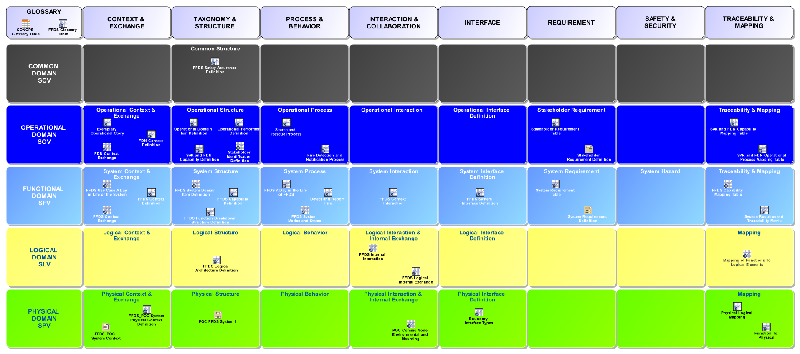

# SAF User Documentation : **C2_GRD** Grid Definition Viewpoint
|**Domain**|**Aspect**|**Maturity**|
| --- | --- | --- |
|[Common](../domains.md#Domain-Common)|[Taxonomy & Structure](../aspects.md#Aspect-Taxonomy-&-Structure)|[proposed](../using-saf/maturity.md#proposed)|
## Example

## Purpose
The Grid Definition Viewpoint serves as graphic representation of the Views present in a System Model.
## Applicability
The Grid Definition Viewpoint supports the "System Viewpoints, Views and Models" input/output of various Technical Processes in SEHB5.
## Presentation
A content diagram featuring a matrix view for the SAF Viewpoint conceptual model: Rows represent Domains, and columns represent Aspects, and the cells manage the Viewpoint Profiles.

## Stakeholder
## Concern
## Profile Model Reference
The following Stereotypes / Model Elements are used in the Viewpoint:
* [SAF_C2_GRD](../stereotypes.md#SAF_C2_GRD)
* [SAF_Diagram](../stereotypes.md#SAF_Diagram)
## Input from other Viewpoints
### Required Viewpoints
*none*
### Recommended Viewpoints
*none*
