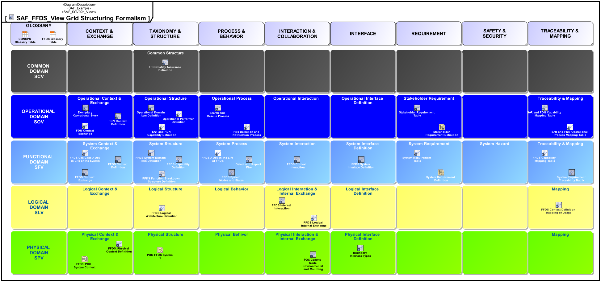

# SAF User Documentation : Grid Overview Viewpoint
|**Domain**|**Aspect**|**Maturity**|
| --- | --- | --- |
|[Common](../domains.md#Domain-Common)|[Taxonomy & Structure](../aspects.md#Aspect-Taxonomy-&-Structure)|[proposed](../using-saf/maturity.md#proposed)|
## Example

## Purpose
The grid overview viewpoint gives an overview over the used viewpoints in domain and aspect.
## Applicability
The..
## Presentation
A grid style graphical representation with rows as domains and aspects as columns. The models views (diagrams)  acording to SAF viewpoints are referenced in the cells.

## Stakeholder
## Concern
## Profile Model Reference
The following Stereotypes / Model Elements are used in the Viewpoint:
* [SAF_Diagram](../stereotypes.md#SAF_Diagram)
* [SAF_SCV02b_View](../stereotypes.md#SAF_SCV02b_View)
## Input from other Viewpoints
### Required Viewpoints
*none*
### Recommended Viewpoints
*none*
