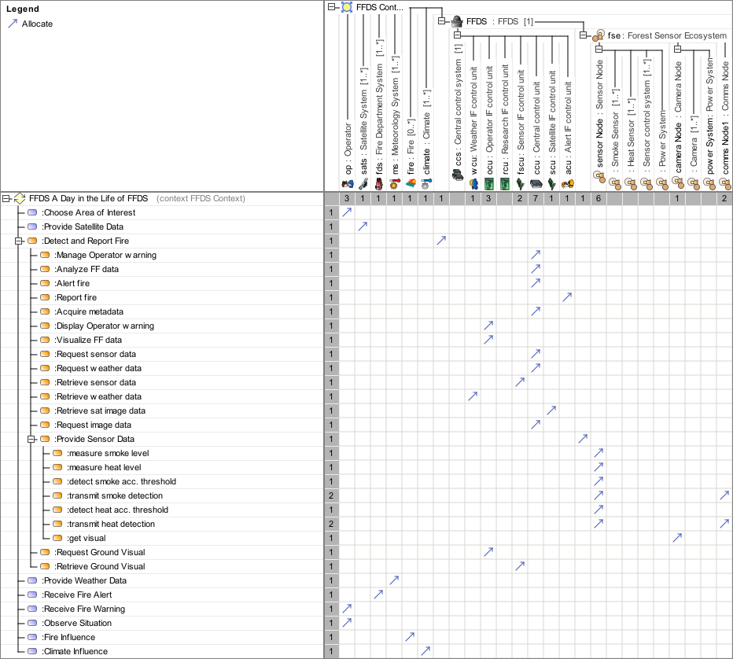

# SAF User Documentation : Logical Functional Mapping Viewpoint
|**Domain**|**Aspect**|**Maturity**|
| --- | --- | --- |
|[Logical](../domains.md#Domain-Logical)|[Traceability & Mapping](../aspects.md#Aspect-Traceability-&-Mapping)|[released](../using-saf/maturity.md#released)|
## Example

## Purpose
The Logical Functional Mapping Viewpoint captures the assignment of the System Functions and the System Partial Functions to the Logical SOI and the Logical SOI Elements.
## Applicability
The Logical Function Mapping Viewpoint supports the "System Architecture Definition process" activities of the INCOSE SYSTEMS ENGINEERING HANDBOOK 2015 [§ 4.4] and contributes to the System Architecture description.
## Presentation
A dependency matrix featuring
* the call behavior action representing usage of System Functions or System Partial Functions,
* the part properties representing usage of Logical SOI Elements,
* the allocation relationship between above mentioned elements.

## Stakeholder
* [Hardware Developer](../stakeholders.md#Hardware-Developer)
* [Software Developer](../stakeholders.md#Software-Developer)
* [System Architect](../stakeholders.md#System-Architect)
## Concern
* Which functions are allocated to a Logical Element of the logical architecture?
## Profile Model Reference
The following Stereotypes / Model Elements are used in the Viewpoint:
* Allocate [SysML Profile]
* SAF_LogicalInternalRole contained in SAF_LogicalElement
* [SAF_FunctionAction](../stereotypes.md#SAF_FunctionAction)
* [SAF_LogicalElement](../stereotypes.md#SAF_LogicalElement)
* [SAF_LogicalSOI](../stereotypes.md#SAF_LogicalSOI)
* [SAF_SLV08a_View](../stereotypes.md#SAF_SLV08a_View)
* [SAF_SystemFunction](../stereotypes.md#SAF_SystemFunction)
* [SAF_SystemPartialFunction](../stereotypes.md#SAF_SystemPartialFunction)
## Input from other Viewpoints
### Required Viewpoints
* [Logical Structure Viewpoint](Logical-Structure-Viewpoint.md)
* [System Process Viewpoint](System-Process-Viewpoint.md)
* [System Functional Refinement Viewpoint](System-Functional-Refinement-Viewpoint.md)
### Recommended Viewpoints
* [System Domain Item Kind Viewpoint](System-Domain-Item-Kind-Viewpoint.md)
