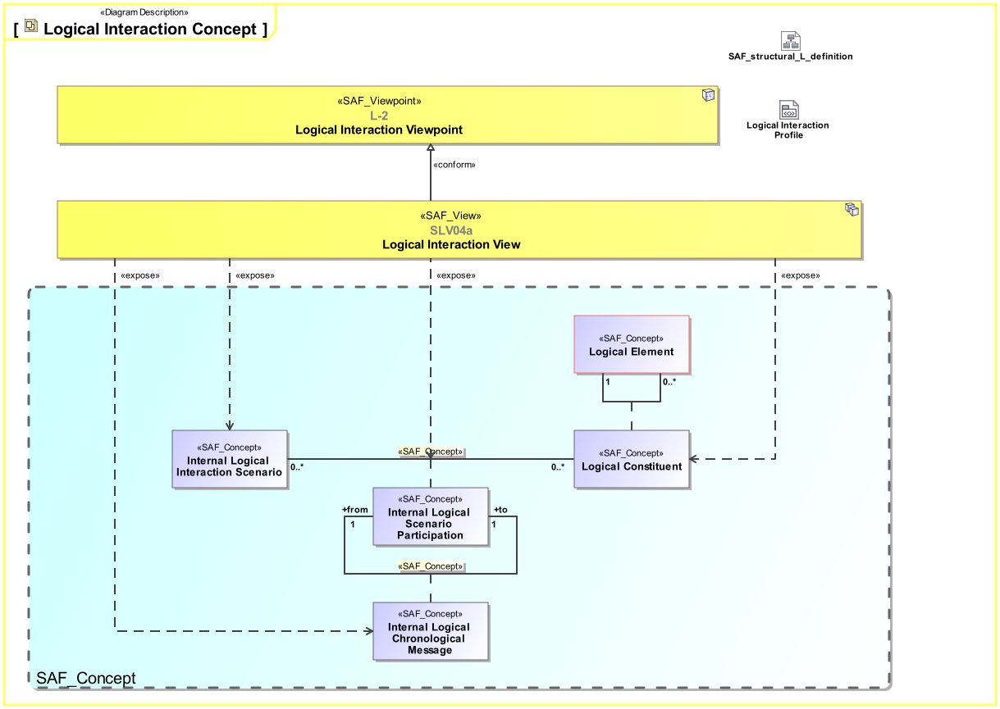
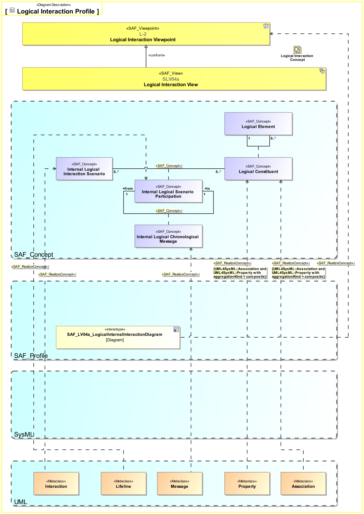

SAF_FFDS#245,SAF_Cameo_Profile#345

# Logical Interaction Viewpoint
*Domain:* **Logical** *Aspect:* **Interaction and Collaboration**
## Example

## Purpose
The Logical Interaction Viewpoint describes system internal behavior based on the exchange between the logical component(s) of the SOI. It depicts the sequence of interactions between the logical components and the exchanged data item(s) needed to accomplish a given system function.
## Applicability
The Logical Interaction Viewpoint supports the "Develop Architecture Viewpoints" and the "Develop Models and Views of Candidate Architectures" activity included in the "Architecture Definition process" activities of the INCOSE SYSTEMS ENGINEERING HANDBOOK 2015 [§ 4.4] and contributes to the artifact "System Architecture Description".
Note:
## Stakeholder
* [Hardware Developer](../stakeholders.md#Hardware-Developer)
* [IV&V Engineer](../stakeholders.md#IV&V-Engineer)
* [Mechanic Developer](../stakeholders.md#Mechanic-Developer)
* [Regulation Authority](../stakeholders.md#Regulation-Authority)
* [Safety Expert](../stakeholders.md#Safety-Expert)
* [Security Expert](../stakeholders.md#Security-Expert)
* [Software Developer](../stakeholders.md#Software-Developer)
* [Supplier](../stakeholders.md#Supplier)
* [System Architect](../stakeholders.md#System-Architect)
## Concern
* What kind of information is exchanged and processed within the system?
* What is the necessary response time for an interface or a service?
* What is the flow of critical information and data through the system?
* How do internal system elements interact with each other to provide the system function or service?
* What are the item(s) exchanged between the logical system elements during the interaction?
* Who provides the input(s) to a critical function?
* How does the SOI or a SOI element interact with the test environment?
* What additional information the SOI or a SOI element needs to generate to enable testing?
## Presentation
The Logical Interaction Viewpoint is modeled as a sequence diagram. It describes the flow of control between logical components of the SOI.This diagram represents the sending and receiving of messages between the interacting entities called lifelines where time is represented along the vertical axis. The elements on the lifelines are part properties typed by logical system elements.

## Profile Model Reference
|Stereotype | Description|realized Concept
|---|---|---|
|Association||[Logical Constituent](../concepts.md#Logical-Constituent)|
|Interaction||[Internal Logical Interaction Scenario](../concepts.md#Internal-Logical-Interaction-Scenario)|
|Lifeline||[Internal Logical Scenario Participation](../concepts.md#Internal-Logical-Scenario-Participation)|
|Message||[Internal Logical Chronological Message](../concepts.md#Internal-Logical-Chronological-Message)|
|Property||[Logical Constituent](../concepts.md#Logical-Constituent)|
|[SAF_LV04a_LogicalInternalInteractionDiagram](../stereotypes.md#SAF_LV04a_LogicalInternalInteractionDiagram)|The SAF Logical Internal Interaction Diagram contains a Sequence Diagram. It documents the interaction between parts of the logical SOI.
It contains
* Life Lines typed by parts of the logical SOI
* Synchronous or asynchronous messages representing the sequence of interactions between the parts of the logical SOI|[Logical Interaction Viewpoint](../concepts.md#Logical-Interaction-Viewpoint)|
## Input from other Viewpoints
### Required Viewpoints
* [Logical Structure Viewpoint](Logical-Structure-Viewpoint.md)
### Recommended Viewpoints
* [System Process Viewpoint](System-Process-Viewpoint.md)
# Viewpoint Concept and Profile Diagrams
## Concept

## Profile

