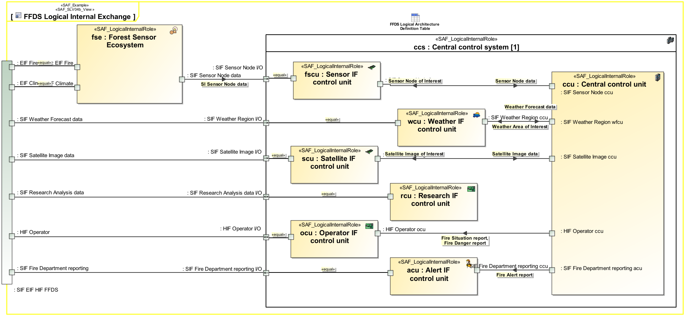

# Logical Internal Exchange Viewpoint
*Domain:* **Logical** *Aspect:* **Interaction & Collaboration**
## Example

## Purpose
The Logical Internal Exchange Viewpoint serves for the identification and definition of interface(s) of element(s) of the SOI. Also, the delegation of SOI element interface(s) to SOI boundary interface(s) is covered.
The Logical Internal Exchange Viewpoint
* identifies SOI element interface(s) on a logical level
* states to which other SOI element(s) the interface(s) are connected to
* assigns interface specification(s) to interface(s)
* defines the usage of interface(s), e.g. if only a subset of the interface(s) is used 
* defines the delegation of SOI element interface(s) to SOI boundary interface(s)
## Applicability
The Logical Internal Exchange Viewpoint supports the "Develop Models and Views of Candidate Architecture" activity included in the "Architecture Definition Process" activities of the INCOSE SYSTEMS ENGINEERING HANDBOOK 2015 [§ 4.4] and contributes to the preliminary interface definition and system architecture description.
## Stakeholder
* [Hardware Developer](../stakeholders.md#Hardware-Developer)
* [IV&V Engineer](../stakeholders.md#IV&V-Engineer)
* [Safety Expert](../stakeholders.md#Safety-Expert)
* [Security Expert](../stakeholders.md#Security-Expert)
* [Software Developer](../stakeholders.md#Software-Developer)
* [Supplier](../stakeholders.md#Supplier)
* [System Architect](../stakeholders.md#System-Architect)
## Concern
* How do internal system elements interact with each other to provide the system function or service?
* How do the logical system elements interact to fulfill the designated system function?
* What additional information the system or a system element needs to generate to enable testing?
* What are data / information items exchanged?
* What are the items exchanged between the logical system elements during the interaction?
* Which interface partners does a SW item have?
* Which interfaces are necessary?
* Which requirements apply to a logical interface?
## Presentation
One or more IBD featuring the logical element(s) of the SOI, and the SOI boundary, containing connector(s) for each identified SOI interface delegation to SOI element(s), as well as connector(s) between related interface(s) of SOI parts. An interface is a connection resource for hooking on the logical SOI element(s) to other logical SOI element(s). Item flows are defined for each exchange on the identified interface.  Recommendation: Use more than one IBD focused on different areas of interest to keep the view comprehensive. Depending on the Stakeholder concern(s) the logical item exchange information might be suppressed.

## Profile Model Reference
* Connector [UML_Standard_Profile]
* InterfaceBlock [SysML Profile]
* ItemFlow [SysML Profile]
* ProxyPort [SysML Profile]
* [SAF_DomainKind](../stereotypes.md#SAF_DomainKind)
* [SAF_LogicalElement](../stereotypes.md#SAF_LogicalElement)
* [SAF_SLV04b_View](../stereotypes.md#SAF_SLV04b_View)
## Input from other Viewpoints
### Required Viewpoints
* [System Domain Item Kind Viewpoint](System-Domain-Item-Kind-Viewpoint.md)
* [Logical Structure Viewpoint](Logical-Structure-Viewpoint.md)
### Recommended Viewpoints
* [System Process Viewpoint](System-Process-Viewpoint.md)
