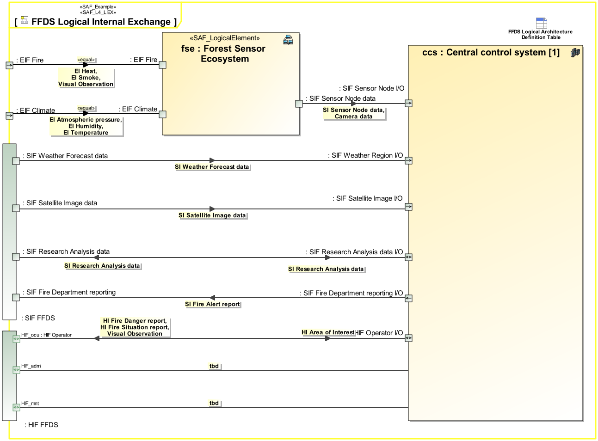

# SAF User Documentation : Logical Internal Exchange Viewpoint
|**Domain**|**Aspect**|**Maturity**|
| --- | --- | --- |
|[Logical](../domains.md#Domain-Logical)|[Interaction & Collaboration](../aspects.md#Aspect-Interaction-&-Collaboration)|[released](../using-saf/maturity.md#released)|
## Example

## Purpose
The Logical Internal Exchange Viewpoint serves for the identification and definition of interfaces of elements of the Logical System. Also, the delegation of system element interfaces to the Logical System boundary interfaces is covered.
The Logical Internal Exchange Viewpoint
* identifies system element interfaces on a Logical Level
* states to which other system elements the interfaces are connected to
* assigns interface specifications to interfaces
* defines the usage of interfaces, e.g., if only a subset of the interfaces is used 
* defines the delegation of system element interfaces to the system boundary interfaces
## Applicability
The Logical Internal Exchange Viewpoint supports the "Develop Models and Views of Candidate Architecture" activity included in the "Architecture Definition Process" activities of the INCOSE SYSTEMS ENGINEERING HANDBOOK 2015 [§ 4.4] and contributes to the preliminary interface definition and system architecture description.
## Presentation
One or more IBD featuring the Logical Elements of the SOI, and the SOI boundary, containing connectors for each identified SOI interface delegation to SOI elements, as well as connectors between related interfaces of SOI parts. An interface is a connection resource for hooking on the Logical SOI Elements to other Logical SOI Elements. Item flows are defined for each exchange on the identified interface.  Recommendation: Use more than one IBD focused on different areas of interest to keep the view comprehensive. Depending on the Stakeholder Concerns the logical item exchange information might be suppressed.

## Stakeholder
* [Hardware Developer](../stakeholders.md#Hardware-Developer)
* [IV&V Engineer](../stakeholders.md#IV&V-Engineer)
* [Safety Expert](../stakeholders.md#Safety-Expert)
* [Security Expert](../stakeholders.md#Security-Expert)
* [Software Developer](../stakeholders.md#Software-Developer)
* [System Architect](../stakeholders.md#System-Architect)
## Concern
* How do the logical system elements interact to to provide the system function?
* What items (e.g.  data /energy material) are exchanged within the system?
* Which requirements apply to a logical interface?
## Profile Model Reference
The following Stereotypes / Model Elements are used in the Viewpoint:
* Attribute "realizingConnector" of InformationFlow referencing Connector
* Connector [UML_Standard_Profile]
* FlowProperty [SysML Profile]
* FlowProperty contained in SAF_ConceptualInterfaceDefinition
* FlowProperty typed by SAF_DomainKind
* ItemFlow [SysML Profile]
* ItemFlow typed by SAF_DomainKind
* ProxyPort [SysML Profile]
* ProxyPort typed by InterfaceBlock
* [SAF_ConceptualInterfaceDefinition](../stereotypes.md#SAF_ConceptualInterfaceDefinition)
* [SAF_DomainKind](../stereotypes.md#SAF_DomainKind)
* [SAF_LogicalElement](../stereotypes.md#SAF_LogicalElement)
* [SAF_SLV04b_View](../stereotypes.md#SAF_SLV04b_View)
## Input from other Viewpoints
### Required Viewpoints
* [System Domain Item Kind Viewpoint](System-Domain-Item-Kind-Viewpoint.md)
* [Logical Structure Viewpoint](Logical-Structure-Viewpoint.md)
### Recommended Viewpoints
* [System Process Viewpoint](System-Process-Viewpoint.md)
* [System Functional Refinement Viewpoint](System-Functional-Refinement-Viewpoint.md)
