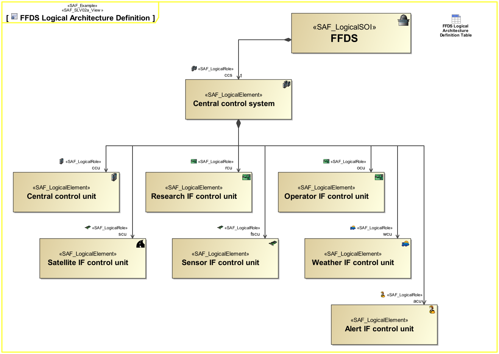

SAF_FFDS#320,SAF_Cameo_Profile#413

# Logical Structure Viewpoint
*Domain:* **Logical** *Aspect:* **Structure**
## Example

## Purpose
The Logical Structure Viewpoint covers the basic technical notion of the system and is widely reusable among similar systems like product families or generations. The Logical Structure Viewpoint specifies how the SOI is decomposed into a hierarchical structure of logical component(s) responsible for different system function(s) (divide & conquer principle).
## Applicability
The Logical Structure Viewpoint supports the "Develop Architecture Viewpoints" and the "Develop Models and Views of Candidate Architectures" activity included in the "Architecture Definition process" activities of the INCOSE SYSTEMS ENGINEERING HANDBOOK 2015 [§ 4.4] and contributes to the artifact "System Architecture Description".
Note:
## Stakeholder
* [Acquirer](../stakeholders.md#Acquirer)
* [Customer](../stakeholders.md#Customer)
* [IV&V Engineer](../stakeholders.md#IV&V-Engineer)
* [Regulation Authority](../stakeholders.md#Regulation-Authority)
* [Safety Expert](../stakeholders.md#Safety-Expert)
* [Security Expert](../stakeholders.md#Security-Expert)
* [System Architect](../stakeholders.md#System-Architect)
## Concern
* What are the logical components the system is composed of?
* How are applicable requirements considered in the system architecture?
## Presentation
A BDD features the logical System block and logical blocks for each kind of Logical Element the system is composed of. The elements are connected to the system block by means of aggregation relationships. Multiple relationship(s) to a kind of element are allowed meaning, that this kind of element is used in several roles. 

## Profile Model Reference
* Association [UML_Standard_Profile]
* Property [UML_Standard_Profile]
* [SAF_LogicalElement](../stereotypes.md#SAF_LogicalElement)
* [SAF_LogicalSOI](../stereotypes.md#SAF_LogicalSOI)
* [SAF_SLV02a_View](../stereotypes.md#SAF_SLV02a_View)
## Input from other Viewpoints
### Required Viewpoints
* [System Functional Breakdown Viewpoint](System-Functional-Breakdown-Viewpoint.md)
### Recommended Viewpoints
* [System Process Viewpoint](System-Process-Viewpoint.md)
