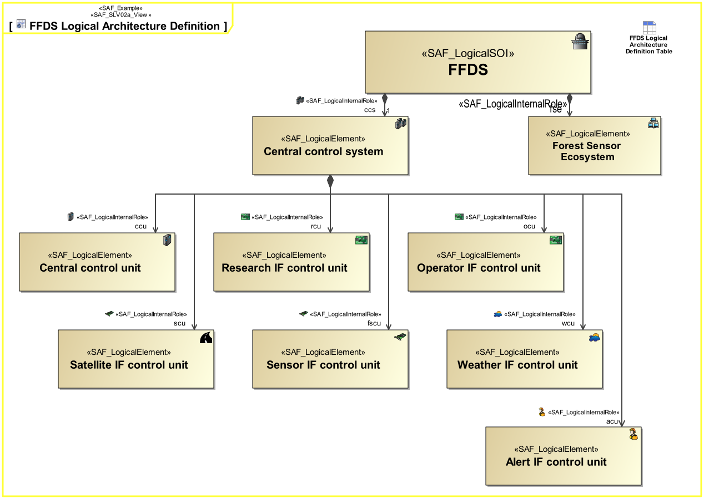

# SAF User Documentation : Logical Structure Viewpoint
|**Domain**|**Aspect**|**Maturity**|
| --- | --- | --- |
|[Logical](../domains.md#Domain-Logical)|[Taxonomy & Structure](../aspects.md#Aspect-Taxonomy-&-Structure)|[released](../using-saf/maturity.md#released)|
## Example

## Purpose
The Logical Structure Viewpoint covers the basic technical notion of the System and is widely reusable among similar systems like product families, or product generations. The Logical Structure Viewpoint specifies how the system is decomposed into a hierarchical structure of logical components responsible for different System Functions (divide & conquer principle).
## Applicability
The Logical Structure Viewpoint supports the "Develop Architecture Viewpoints", and the "Develop Models and Views of Candidate Architectures" activity included in the "Architecture Definition process" activities of the INCOSE SYSTEMS ENGINEERING HANDBOOK 2015 [§ 4.4] and contributes to the artifact "System Architecture Description".
## Stakeholder
* [Regulation Authority](../stakeholders.md#Regulation-Authority)
* [System Architect](../stakeholders.md#System-Architect)
## Concern
* How are applicable requirements considered in the system architecture?
* What are the logical components the system is composed of?
## Presentation
A block definition diagram (BDD) featuring the logical System block and logical blocks for each kind of Logical Element the system is composed of. The elements are connected to the System block by means of aggregation relationships. 
Note: Multiple relationships to a kind of element are allowed meaning, that this kind of element is used in several roles.

## Profile Model Reference
The following Stereotypes / Model Elements are used in the Viewpoint:
* [SAF_LogicalElement](../stereotypes.md#SAF_LogicalElement)
* [SAF_LogicalInternalRole](../stereotypes.md#SAF_LogicalInternalRole)
* [SAF_LogicalSOI](../stereotypes.md#SAF_LogicalSOI)
* [SAF_SLV02a_View](../stereotypes.md#SAF_SLV02a_View)
## Input from other Viewpoints
### Required Viewpoints
* [System Functional Breakdown Structure Viewpoint](System-Functional-Breakdown-Structure-Viewpoint.md)
### Recommended Viewpoints
* [System Process Viewpoint](System-Process-Viewpoint.md)
