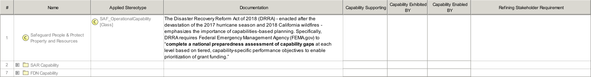

# SAF User Documentation : **O8_OCM** Operational Capability Mapping Viewpoint
|**Domain**|**Aspect**|**Maturity**|
| --- | --- | --- |
|[Operational](../domains.md#Domain-Operational)|[Traceability & Mapping](../aspects.md#Aspect-Traceability-&-Mapping)|[released](../using-saf/maturity.md#released)|
## Example

## Purpose
The Operational Capability Mapping Viewpoint describes the relationships of Operational Capabilities. The reasoning for Operational Capabilities as support for Operational Stories and the contribution of Operational Processes to Capabilities are described. Operational Capabilities encoded in Stakeholder Requirements are identified.
## Applicability
The Operational Capability Mapping Viewpoint supports the "Business or Mission Analysis Process" activities of the INCOSE SYSTEMS ENGINEERING HANDBOOK 2015 [§ 4.1] and contributes to the definition of Operational Capabilities.
## Presentation
A tabular format listing the relationships of Operational Capabilities to Stakeholder Requirements, Operational Stories, and Operational Process Activities.

## Stakeholder
* [Acquirer](../stakeholders.md#Acquirer)
* [Customer](../stakeholders.md#Customer)
* [Portfolio Manager](../stakeholders.md#Portfolio-Manager)
* [System Architect](../stakeholders.md#System-Architect)
## Concern
* [Show in a concise manner the relationships from operational capability to operational story, to operational activity, and to operational performer.](../concerns.md#_2021x_2_8710274_1674576758591_594647_23070)
## Profile Model Reference
The following Stereotypes / Model Elements are used in the Viewpoint:
* [SAF_O8_OCM](../stereotypes.md#SAF_O8_OCM)
* [SAF_OperationalCapabilityComposition](../stereotypes.md#SAF_OperationalCapabilityComposition)
* [SAF_OperationalCapabilityDependency](../stereotypes.md#SAF_OperationalCapabilityDependency)
* [SAF_OperationalCapabilityGeneralization](../stereotypes.md#SAF_OperationalCapabilityGeneralization)
* [SAF_OperationalCapabilitySupport](../stereotypes.md#SAF_OperationalCapabilitySupport)
* [SAF_OperationalCapability](../stereotypes.md#SAF_OperationalCapability)
* [SAF_OperationalPerformerExhibit](../stereotypes.md#SAF_OperationalPerformerExhibit)
* [SAF_OperationalPerformer](../stereotypes.md#SAF_OperationalPerformer)
* [SAF_OperationalProcessEnabling](../stereotypes.md#SAF_OperationalProcessEnabling)
* [SAF_OperationalProcess](../stereotypes.md#SAF_OperationalProcess)
* [SAF_OperationalStory](../stereotypes.md#SAF_OperationalStory)
* [SAF_StakeholderRequirementRefinement](../stereotypes.md#SAF_StakeholderRequirementRefinement)
* [SAF_StakeholderRequirement](../stereotypes.md#SAF_StakeholderRequirement)
## Input from other Viewpoints
### Required Viewpoints
* [Operational Capability Viewpoint](Operational-Capability-Viewpoint.md)
### Recommended Viewpoints
* [Operational Story Viewpoint](Operational-Story-Viewpoint.md)
* [Operational Process Viewpoint](Operational-Process-Viewpoint.md)
