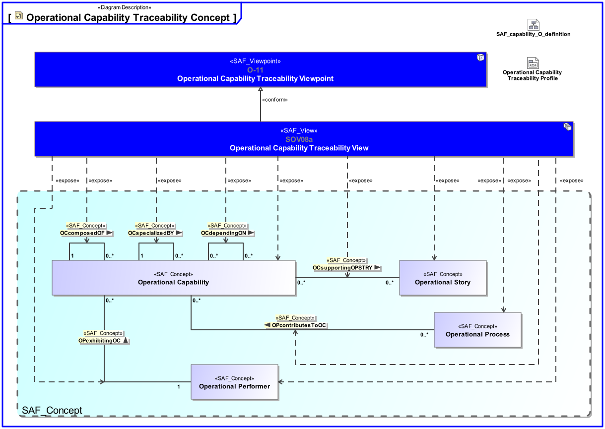
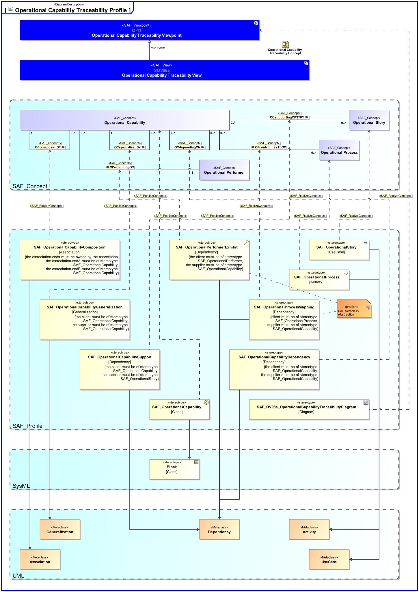

SAF_FFDS#245,SAF_Cameo_Profile#345

# Operational Capability Traceability Viewpoint
*Domain:* **Operational** *Aspect:* **Crossreference and Mapping**
## Example
*none*
## Purpose
The Operational Capability Traceability Viewpoint defines [tbd]
## Applicability
The Operational Capability Traceability Viewpoint supports the "Business or Mission Analysis Process" activities of the INCOSE SYSTEMS ENGINEERING HANDBOOK 2015 [§ 4.1] and contributes to the definition of capability(s).
Note:
## Stakeholder
* [Acquirer](../stakeholders.md#Acquirer)
* [Customer](../stakeholders.md#Customer)
* [Supplier](../stakeholders.md#Supplier)
* [System Architect](../stakeholders.md#System-Architect)
## Concern
* Show in a concise manner the relationship(s) from Operational Capability to Operational Story, to Operational Activity, and to Operational Performer.
## Presentation
The relationship(s) of Operational Capability(s) to Operational Story(s) and to Operational Performer(s) are represented in a table format.

## Profile Model Reference
|Stereotype | Description|realized Concept
|---|---|---|
|[SAF_OV08a_OperationalCapabilityTraceabilityDiagram](../stereotypes.md#SAF_OV08a_OperationalCapabilityTraceabilityDiagram)|[tbd]|[Operational Capability Traceability Viewpoint](../concepts.md#Operational-Capability-Traceability-Viewpoint)|
|[SAF_OperationalCapability](../stereotypes.md#SAF_OperationalCapability)|[tbd]|[Operational Capability](../concepts.md#Operational-Capability)|
|[SAF_OperationalCapabilityComposition](../stereotypes.md#SAF_OperationalCapabilityComposition)|[tbd]|[OCcomposedOF](../concepts.md#OCcomposedOF)|
|[SAF_OperationalCapabilityDependency](../stereotypes.md#SAF_OperationalCapabilityDependency)|[tbd]|[OCdependingON](../concepts.md#OCdependingON)|
|[SAF_OperationalCapabilityGeneralization](../stereotypes.md#SAF_OperationalCapabilityGeneralization)|[tbd]|[OCspecializedBY](../concepts.md#OCspecializedBY)|
|[SAF_OperationalCapabilitySupport](../stereotypes.md#SAF_OperationalCapabilitySupport)|[tbd]|[OCsupportingOPSTRY](../concepts.md#OCsupportingOPSTRY)|
|[SAF_OperationalPerformerExhibit](../stereotypes.md#SAF_OperationalPerformerExhibit)|[tbd]|[OPexhibitingOC](../concepts.md#OPexhibitingOC)|
|[SAF_OperationalProcess](../stereotypes.md#SAF_OperationalProcess)|[tbd]|[Operational Process](../concepts.md#Operational-Process)|
|[SAF_OperationalProcessMapping](../stereotypes.md#SAF_OperationalProcessMapping)|[tbd]|[OPcontributesToOC](../concepts.md#OPcontributesToOC)|
|[SAF_OperationalStory](../stereotypes.md#SAF_OperationalStory)|[tbd]|[Operational Story](../concepts.md#Operational-Story)|
## Input from other Viewpoints
### Required Viewpoints
* [Operational Capability Viewpoint](Operational-Capability-Viewpoint.md)
### Recommended Viewpoints
*none*
# Viewpoint Concept and Profile Diagrams
## Concept

## Profile

