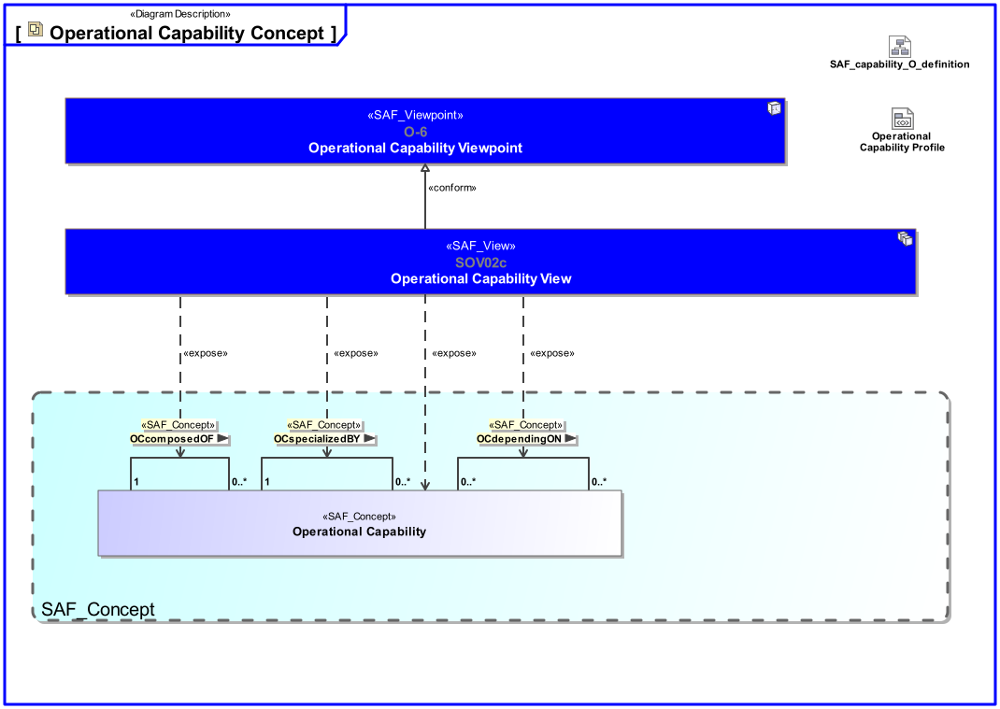
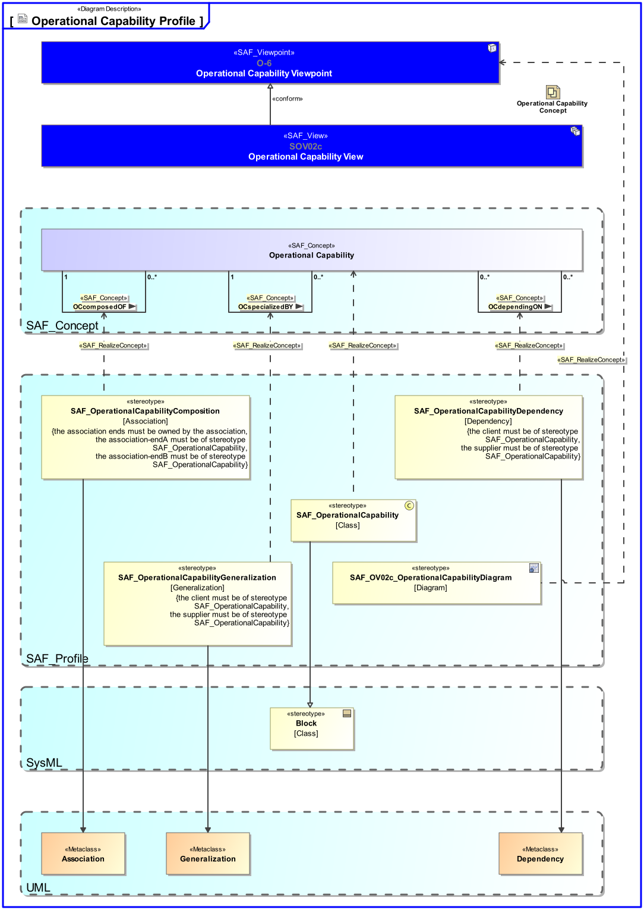

SAF_FFDS#245,SAF_Cameo_Profile#345

# Operational Capability Viewpoint
*Domain:* **Operational** *Aspect:* **Structure**
## Example

## Purpose
The Operational Capability Viewpoint defines a taxonomy of Capability(s) from a Stakeholder’s perspective including composition, specialization, and dependency relationship(s) between Operational Capability(s).
## Applicability
The Operational Capability Viewpoint supports the "Business or Mission Analysis Process" activities of the INCOSE SYSTEMS ENGINEERING HANDBOOK 2015 [§ 4.1] defining Capability(s) at an operational level (e.g. business or mission profile and operational scenarios). The Operational Capability Viewpoint contributes to the problem or opportunity statement.
Note:
## Stakeholder
* [Acquirer](../stakeholders.md#Acquirer)
* [Customer](../stakeholders.md#Customer)
* [Supplier](../stakeholders.md#Supplier)
* [System Architect](../stakeholders.md#System-Architect)
## Concern
* What Operational Capability(s) are required for each phase and mode of operation?
* What is the lack / deficiency / gap in current Capability implementation that is addressed with the intended solution?
## Presentation
The result of the business and mission analysis is one or more block definition diagram(s) (BDD) featuring Operational Capability(s) and their composition, specialization and dependency relationship(s).

## Profile Model Reference
|Stereotype | Description|realized Concept
|---|---|---|
|[SAF_OV02c_OperationalCapabilityDiagram](../stereotypes.md#SAF_OV02c_OperationalCapabilityDiagram)|[tbd]|[Operational Capability Viewpoint](../concepts.md#Operational-Capability-Viewpoint)|
|[SAF_OperationalCapability](../stereotypes.md#SAF_OperationalCapability)|[tbd]|[Operational Capability](../concepts.md#Operational-Capability)|
|[SAF_OperationalCapabilityComposition](../stereotypes.md#SAF_OperationalCapabilityComposition)|[tbd]|[OCcomposedOF](../concepts.md#OCcomposedOF)|
|[SAF_OperationalCapabilityDependency](../stereotypes.md#SAF_OperationalCapabilityDependency)|[tbd]|[OCdependingON](../concepts.md#OCdependingON)|
|[SAF_OperationalCapabilityGeneralization](../stereotypes.md#SAF_OperationalCapabilityGeneralization)|[tbd]|[OCspecializedBY](../concepts.md#OCspecializedBY)|
## Input from other Viewpoints
### Required Viewpoints
* [Operational Story Viewpoint](Operational-Story-Viewpoint.md)
* [Operational Performer Viewpoint](Operational-Performer-Viewpoint.md)
### Recommended Viewpoints
*none*
# Viewpoint Concept and Profile Diagrams
## Concept

## Profile

