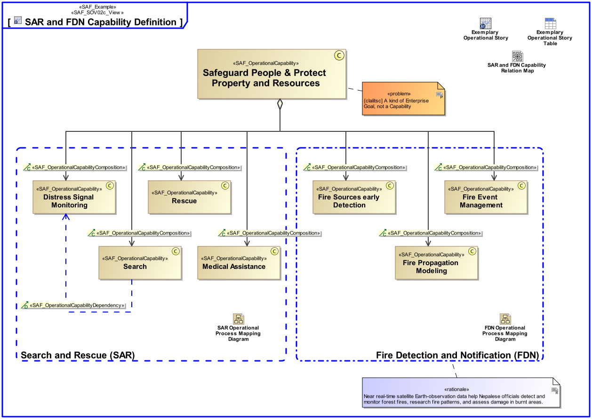

# SAF User Documentation : Operational Capability Viewpoint
|**Domain**|**Aspect**|**Maturity**|
| --- | --- | --- |
|[Operational](../domains.md#Domain-Operational)|[Taxonomy & Structure](../aspects.md#Aspect-Taxonomy-&-Structure)|[released](../using-saf/maturity.md#released)|
## Example

## Purpose
The Operational Capability Viewpoint defines a taxonomy of Capabilities from a Stakeholder’s perspective including composition, specialization, and dependency relationships between Operational Capabilities.
## Applicability
The Operational Capability Viewpoint supports the "Business or Mission Analysis Process" activities of the INCOSE SYSTEMS ENGINEERING HANDBOOK 2015 [§ 4.1] defining Capabilities at an operational level (e.g., business or mission profile, and operational scenarios). The Operational Capability Viewpoint contributes to the problem or opportunity statement.
## Stakeholder
* [Acquirer](../stakeholders.md#Acquirer)
* [Customer](../stakeholders.md#Customer)
* [Portfolio Manager](../stakeholders.md#Portfolio-Manager)
* [System Architect](../stakeholders.md#System-Architect)
## Concern
* What operational capabilities are defined?
* What operational capabilities are required for each phase and mode of operation?
## Presentation
A block definition diagram (BDD) featuring Operational Capabilities, their composition, specialization, and dependency relationships.

## Profile Model Reference
The following Stereotypes / Model Elements are used in the Viewpoint:
* [SAF_OperationalCapability](../stereotypes.md#SAF_OperationalCapability)
* [SAF_OperationalCapabilityComposition](../stereotypes.md#SAF_OperationalCapabilityComposition)
* [SAF_OperationalCapabilityDependency](../stereotypes.md#SAF_OperationalCapabilityDependency)
* [SAF_OperationalCapabilityGeneralization](../stereotypes.md#SAF_OperationalCapabilityGeneralization)
* [SAF_SOV02c_View](../stereotypes.md#SAF_SOV02c_View)
## Input from other Viewpoints
### Required Viewpoints
*none*
### Recommended Viewpoints
* [Operational Story Viewpoint](Operational-Story-Viewpoint.md)
* [Operational Process Viewpoint](Operational-Process-Viewpoint.md)
