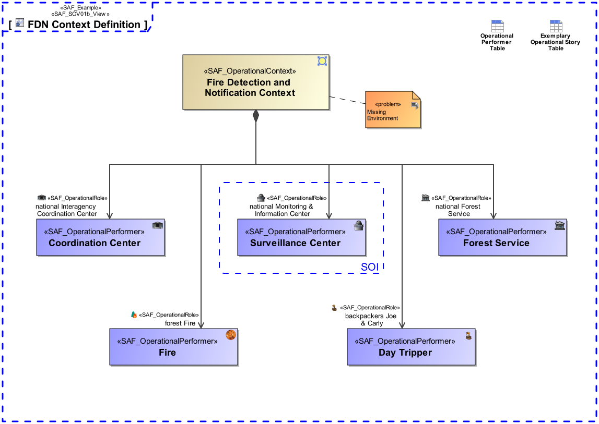

# SAF User Documentation : Operational Context Definition Viewpoint
|**Domain**|**Aspect**|**Maturity**|
| --- | --- | --- |
|[Operational](../domains.md#Domain-Operational)|[Context & Exchange](../aspects.md#Aspect-Context-&-Exchange)|[released](../using-saf/maturity.md#released)|
## Example

## Purpose
The Operational Context Definition Viewpoint provides the Operational Contexts, and the involved Operational Performers necessary to support a specific set of Operational Capabilities.
## Applicability
The Operational Context Definition Viewpoint supports the "Business or Mission Analysis Process" activities of the INCOSE SYSTEMS ENGINEERING HANDBOOK 2015 [§ 4.1] and contributes to both the problem or opportunity statement and the Major Stakeholder Identification.
## Stakeholder
* [Acquirer](../stakeholders.md#Acquirer)
* [Customer](../stakeholders.md#Customer)
* [System Architect](../stakeholders.md#System-Architect)
## Concern
* What Performers or Resources are necessary to operate the intended solution?
* What is the operational context to achieve an operational story?
## Presentation
A block definition diagram (BDD) featuring the identified Operational Performers playing a role in the Operational Context being addressed.

## Profile Model Reference
The following Stereotypes / Model Elements are used in the Viewpoint:
* Association [UML_Standard_Profile]
* [SAF_OperationalContext](../stereotypes.md#SAF_OperationalContext)
* [SAF_OperationalPerformer](../stereotypes.md#SAF_OperationalPerformer)
* [SAF_OperationalRole](../stereotypes.md#SAF_OperationalRole)
* [SAF_SOV01b_View](../stereotypes.md#SAF_SOV01b_View)
## Input from other Viewpoints
### Required Viewpoints
* [Operational Performer Viewpoint](Operational-Performer-Viewpoint.md)
### Recommended Viewpoints
*none*
