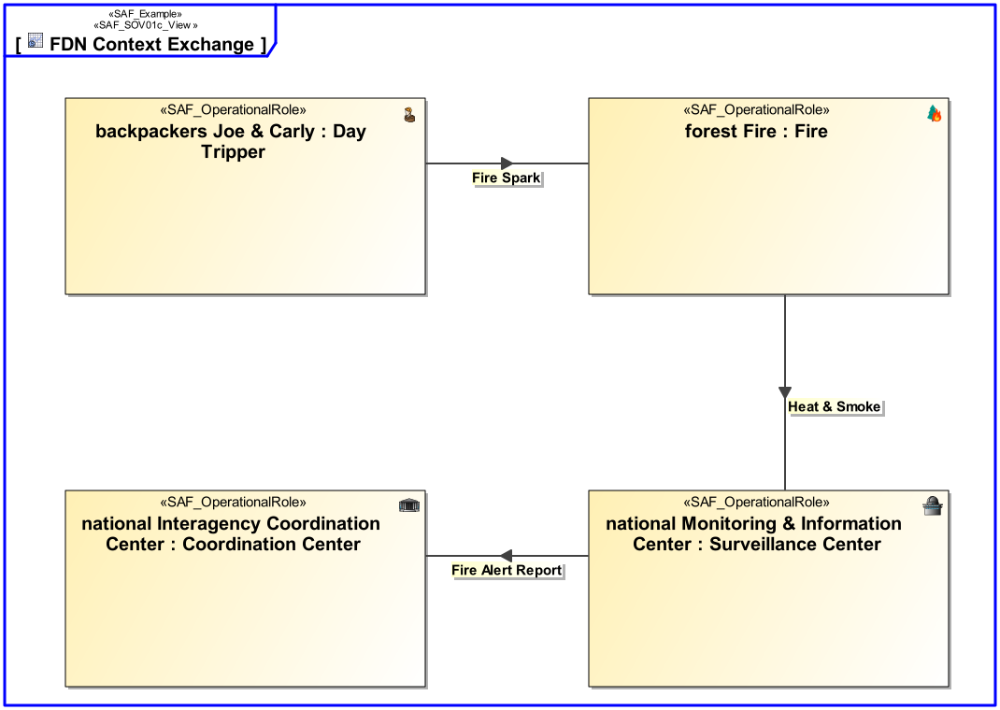

SAF_FFDS#246,SAF_Cameo_Profile#346

# Operational Context Exchange Viewpoint
*Domain:* **Operational** *Aspect:* **Context**
## Example

## Purpose
The Operational Context Exchange Viewpoint defines connectivity and exchange between Operational Performer(s).
## Applicability
The Operational Context Exchange Viewpoint supports the "Business or Mission Analysis Process" activities of the INCOSE SYSTEMS ENGINEERING HANDBOOK 2015 [§ 4.1] and contributes to the problem or opportunity statement.
Note:
## Stakeholder
* [Acquirer](../stakeholders.md#Acquirer)
* [Customer](../stakeholders.md#Customer)
* [Supplier](../stakeholders.md#Supplier)
* [System Architect](../stakeholders.md#System-Architect)
## Concern
* What Operational Exchange the Operational Performer(s) need to consume or provide?
## Presentation
An internal block diagram (IBD) associated to an Operational Context showing the connected Operational Performer(s) in their respective Operational Role and the Operational Exchange per connection.

## Profile Model Reference
* Connector [UML_Standard_Profile]
* ItemFlow [SysML Profile]
* ItemFlow [SysML Profile]
* [SAF_OV01c_OperationalContextExchangeDiagram](../stereotypes.md#SAF_OV01c_OperationalContextExchangeDiagram)
* [SAF_OperationalContext](../stereotypes.md#SAF_OperationalContext)
* [SAF_OperationalDomainKind](../stereotypes.md#SAF_OperationalDomainKind)
* [SAF_OperationalRole](../stereotypes.md#SAF_OperationalRole)
## Input from other Viewpoints
### Required Viewpoints
* [Operational Context Definition Viewpoint](Operational-Context-Definition-Viewpoint.md)
* [Operational Domain Item Kind Viewpoint](Operational-Domain-Item-Kind-Viewpoint.md)
### Recommended Viewpoints
*none*
