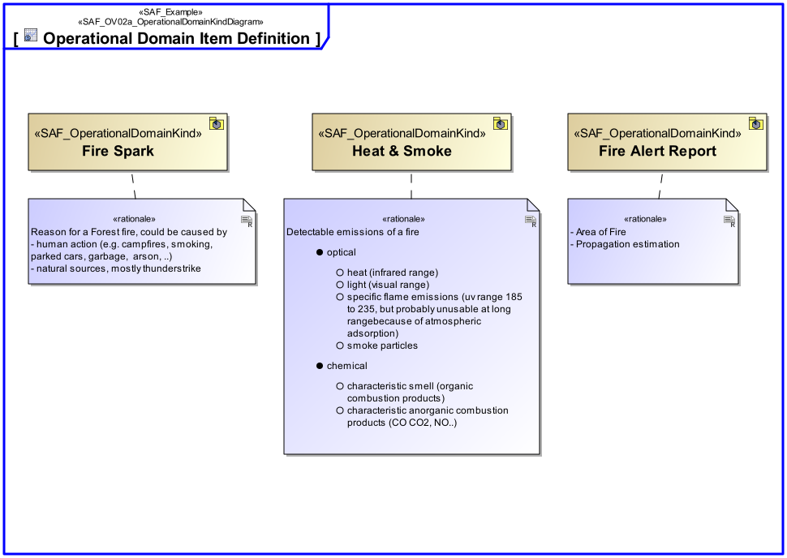

# Operational Domain Item Kind Viewpoint
*Domain:* [Operational](../domains.md#Domain-Operational) *Aspect:* [Structure](../aspects.md#Aspect-Structure)
## Example

## Purpose
The Operational Domain Item Kind Viewpoint collects type definition(s) for any exchanged item of the Operational Domain. Its purpose is to define those item type(s) and their relationship(s).
## Applicability
The Operational Domain Item Kind Viewpoint supports [tbd].
## Stakeholder
## Concern
* What operational exchange does the operational performers need to consume or provide?
## Presentation
Operational Domain Item Kind(s) are managed in the domain knowledge package of Enterprise. Operational Domain Item Kind(s) shall be value type(s) or block(s). A BBD diagram featuring Operational Domain Item Kind(s) and their relationship(s) in terms of generalization, composition or general association shall be used.

## Profile Model Reference
* ItemFlow [SysML Profile]
* ObjectFlow [UML_Standard_Profile]
* [SAF_OperationalDomainKind](../stereotypes.md#SAF_OperationalDomainKind)
* [SAF_OperationalDomainKindComposition](../stereotypes.md#SAF_OperationalDomainKindComposition)
* [SAF_SOV02a_View](../stereotypes.md#SAF_SOV02a_View)
## Input from other Viewpoints
### Required Viewpoints
*none*
### Recommended Viewpoints
* [Operational Story Viewpoint](Operational-Story-Viewpoint.md)
