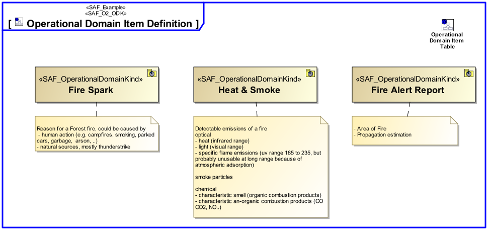
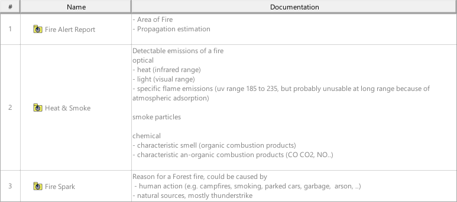

# SAF User Documentation : **O2_ODK** Operational Domain Item Kind Viewpoint
|**Domain**|**Aspect**|**Maturity**|
| --- | --- | --- |
|[Operational](../domains.md#Domain-Operational)|[Taxonomy & Structure](../aspects.md#Aspect-Taxonomy-&-Structure)|[released](../using-saf/maturity.md#released)|
## Example

## Purpose
The Operational Domain Item Kind Viewpoint captures enterprise wide concepts and collects type definitions for any exchanged item of the Operational Domain. Its purpose is to define these item types and their relationships.
## Applicability
The Operational Domain Item Kind Viewpoint supports the "Business or Mission Analysis Process" activities of the INCOSE SYSTEMS ENGINEERING HANDBOOK 2015 [§ 4.1] and contributes to the problem or opportunity statement.
## Presentation
A block definition diagram (BDD) featuring Operational Domain Item Kinds and their relationships.

A Table featuring Operational Domain Item Kinds, their relationships and their Documentation

## Stakeholder
* [Acquirer](../stakeholders.md#Acquirer)
* [Customer](../stakeholders.md#Customer)
* [Regulation Authority](../stakeholders.md#Regulation-Authority)
* [Security Expert](../stakeholders.md#Security-Expert)
* [Software Developer](../stakeholders.md#Software-Developer)
* [System Architect](../stakeholders.md#System-Architect)
## Concern
* [Why types of exchange can exist between Operational Performers (i.e., flows of information, people, material, or energy)?](../concerns.md#_2021x_2_6d8019d_1693570065115_738458_24748)
## Profile Model Reference
The following Stereotypes / Model Elements are used in the Viewpoint:
* ObjectFlow [UML_Standard_Profile]
* [SAF_O2_ODK](../stereotypes.md#SAF_O2_ODK)
* [SAF_OperationalDomainKindComposition](../stereotypes.md#SAF_OperationalDomainKindComposition)
* [SAF_OperationalDomainKind](../stereotypes.md#SAF_OperationalDomainKind)
## Input from other Viewpoints
### Required Viewpoints
*none*
### Recommended Viewpoints
* [Operational Story Viewpoint](Operational-Story-Viewpoint.md)
