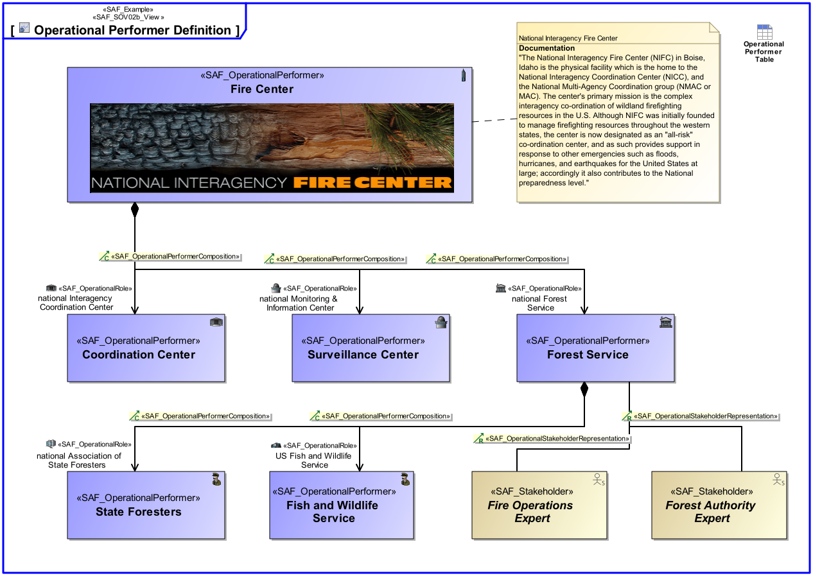

SAF_FFDS#321,SAF_Cameo_Profile#413

# Operational Performer Viewpoint
*Domain:* **Operational** *Aspect:* **Structure**
## Example

## Purpose
The Operational Performer Viewpoint represents the taxonomy of the identified Operational Performer(s), if existing and relevant for the understanding of the operation of the intended solution. 

## Applicability
The Operational Performer Viewpoint supports the "Business or Mission Analysis Process" activities of the INCOSE SYSTEMS ENGINEERING HANDBOOK 2015 [§ 4.1] and contributes to the problem or opportunity statement.
Note:
## Stakeholder
* [Acquirer](../stakeholders.md#Acquirer)
* [Customer](../stakeholders.md#Customer)
* [System Architect](../stakeholders.md#System-Architect)
## Concern
* What are the relationships between the partys involved in the operation of the intended solution?
* What partys of the organization, enterprise, or operational entity are needed to achieve an intended Operational Capability?
## Presentation
A block definition diagram (BDD) depicts Operational Performer(s) and their relation(s) in terms of decomposition or generalization at a level of detail required for the understanding and analysis. 
Note: Identified Stakeholders are related to Operational Performer(s) if appropriate.

## Profile Model Reference
* [SAF_OperationalPerformer](../stereotypes.md#SAF_OperationalPerformer)
* [SAF_OperationalPerformerComposition](../stereotypes.md#SAF_OperationalPerformerComposition)
* [SAF_OperationalStakeholderRepresentation](../stereotypes.md#SAF_OperationalStakeholderRepresentation)
* [SAF_SOV02b_View](../stereotypes.md#SAF_SOV02b_View)
* [SAF_Stakeholder](../stereotypes.md#SAF_Stakeholder)
## Input from other Viewpoints
### Required Viewpoints
*none*
### Recommended Viewpoints
*none*
