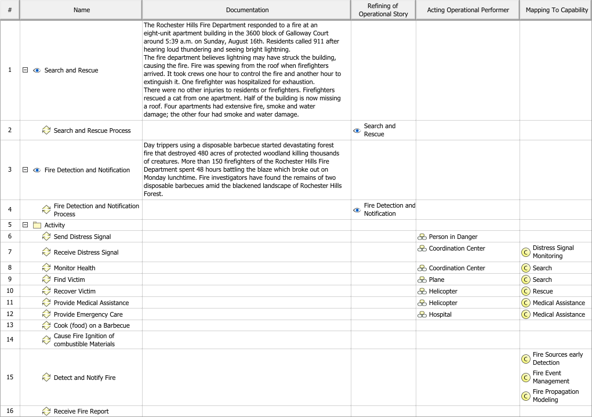
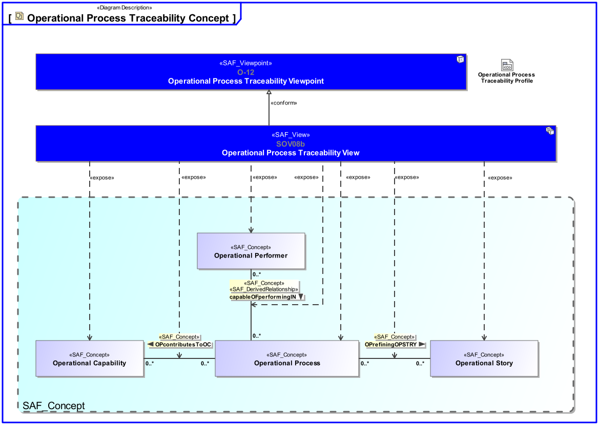
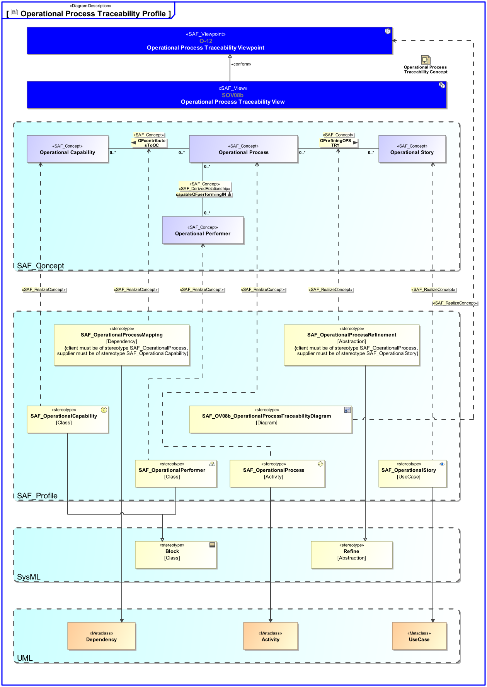

SAF_FFDS#245,SAF_Cameo_Profile#345

# Operational Process Traceability Viewpoint
*Domain:* **Operational** *Aspect:* **Crossreference and Mapping**
## Example

## Purpose
The Operational Process Traceability Viewpoint describes the relationship(s) of Operational Process(es). The reasoning for Operational Process(es) from Operational Story(s) and their contribution to Capability(s) is described. The assignment of Operational Process(es) to Operational Performer(s) is captured.
## Applicability
The Operational Process Traceability Viewpoint supports the "Business or Mission Analysis Process" activities of the INCOSE SYSTEMS ENGINEERING HANDBOOK 2015 [§ 4.1] and contributes to the definition of operational scenario(s).
Note:
## Stakeholder
* [Acquirer](../stakeholders.md#Acquirer)
* [Customer](../stakeholders.md#Customer)
* [Supplier](../stakeholders.md#Supplier)
* [System Architect](../stakeholders.md#System-Architect)
## Concern
* Show in a concise manner the relationship(s) from Operational Process to Operational Story and to Operational Performer.
## Presentation
The relationship(s) of Operational Process Activity(s) to Operational Story(s) and to Operational Performer(s) are represented in a table format.

## Profile Model Reference
|Stereotype | Description|realized Concept
|---|---|---|
|[SAF_OV08b_OperationalProcessTraceabilityDiagram](../stereotypes.md#SAF_OV08b_OperationalProcessTraceabilityDiagram)|[tbd]|[Operational Process Traceability Viewpoint](../concepts.md#Operational-Process-Traceability-Viewpoint)|
|[SAF_OperationalProcessRefinement](../stereotypes.md#SAF_OperationalProcessRefinement)|[tbd]|[OPrefiningOPSTRY](../concepts.md#OPrefiningOPSTRY)|
|[SAF_OperationalProcess](../stereotypes.md#SAF_OperationalProcess)|[tbd]|[Operational Process](../concepts.md#Operational-Process)|
|[SAF_OperationalCapability](../stereotypes.md#SAF_OperationalCapability)|[tbd]|[Operational Capability](../concepts.md#Operational-Capability)|
|[SAF_OperationalProcessMapping](../stereotypes.md#SAF_OperationalProcessMapping)|[tbd]|[OPcontributesToOC](../concepts.md#OPcontributesToOC)|
|[SAF_OperationalStory](../stereotypes.md#SAF_OperationalStory)|[tbd]|[Operational Story](../concepts.md#Operational-Story)|
|[SAF_OperationalPerformer](../stereotypes.md#SAF_OperationalPerformer)|[tbd]|[Operational Performer](../concepts.md#Operational-Performer)|
## Input from other Viewpoints
### Required Viewpoints
* [Operational Process Viewpoint](Operational-Process-Viewpoint.md)
### Recommended Viewpoints
* [Operational Context Definition Viewpoint](Operational-Context-Definition-Viewpoint.md)
# Viewpoint Concept and Profile Diagrams
## Concept

## Profile

