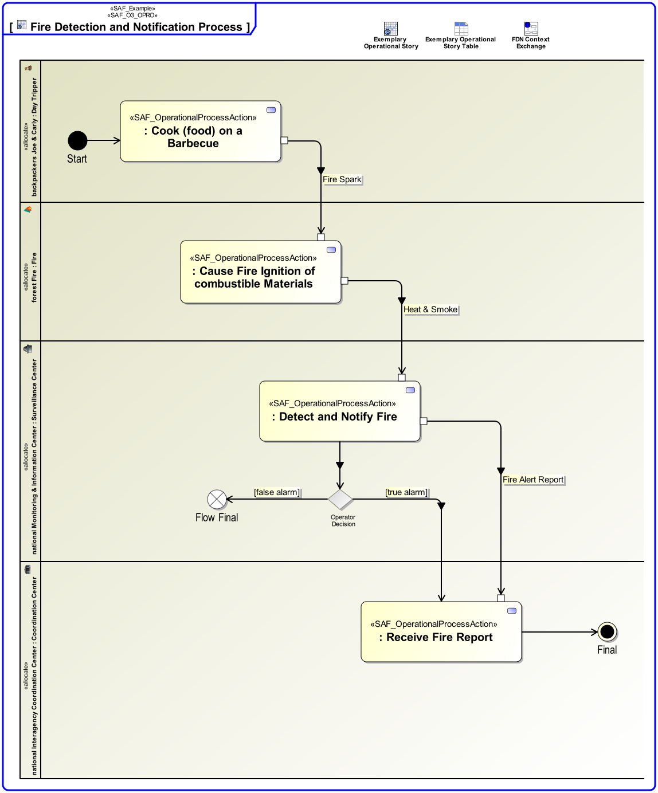

# SAF User Documentation : Operational Process Viewpoint
|**Domain**|**Aspect**|**Maturity**|
| --- | --- | --- |
|[Operational](../domains.md#Domain-Operational)|[Process & Behavior](../aspects.md#Aspect-Process-&-Behavior)|[released](../using-saf/maturity.md#released)|
## Example

## Purpose
The Operational Process Viewpoint describes the Operational Processes related to a specific Operational Story, the sequence of execution, and their Operational Exchanges, including information, materials, natural resources, etc. The assignment of Operational Processes to Operational Performers is captured.
## Applicability
The Operational Process Viewpoint supports the "Business or Mission Analysis Process" and the "Stakeholder Needs and Requirements Definition Process" activities of the INCOSE SYSTEMS ENGINEERING HANDBOOK 2015 [§ 4.1, § 4.2] and contributes to the definition of operational scenarios.
## Presentation
An activity diagram featuring the ordered execution of Operational Process Actions. Operational Processes may be linked in terms of control flow and/or data flow visualizing the Operational Exchanges needed. 
Note: Operational Process Actions are assigned to Operational Roles and therefore in a more general manner to Operational Performers.

## Stakeholder
* [Acquirer](../stakeholders.md#Acquirer)
* [Customer](../stakeholders.md#Customer)
* [System Architect](../stakeholders.md#System-Architect)
## Concern
* What operational process activities shall be executed during the execution of an operational story?
* Which operational activity shall be executed by which operational performer in the operational story?
## Profile Model Reference
The following Stereotypes / Model Elements are used in the Viewpoint:
* Allocate [SysML Profile]
* ControlFlow [UML_Standard_Profile]
* InputPin [UML_Standard_Profile]
* ObjectFlow [UML_Standard_Profile]
* OutputPin [UML_Standard_Profile]
* [SAF_OperationalDomainKind](../stereotypes.md#SAF_OperationalDomainKind)
* [SAF_OperationalPerformer](../stereotypes.md#SAF_OperationalPerformer)
* [SAF_OperationalProcessAction](../stereotypes.md#SAF_OperationalProcessAction)
* [SAF_OperationalProcess](../stereotypes.md#SAF_OperationalProcess)
* [SAF_OperationalRole](../stereotypes.md#SAF_OperationalRole)
* [SAF_SOV03a_View](../stereotypes.md#SAF_SOV03a_View)
## Input from other Viewpoints
### Required Viewpoints
*none*
### Recommended Viewpoints
* [Operational Context Definition Viewpoint](Operational-Context-Definition-Viewpoint.md)
* [Operational Domain Item Kind Viewpoint](Operational-Domain-Item-Kind-Viewpoint.md)
