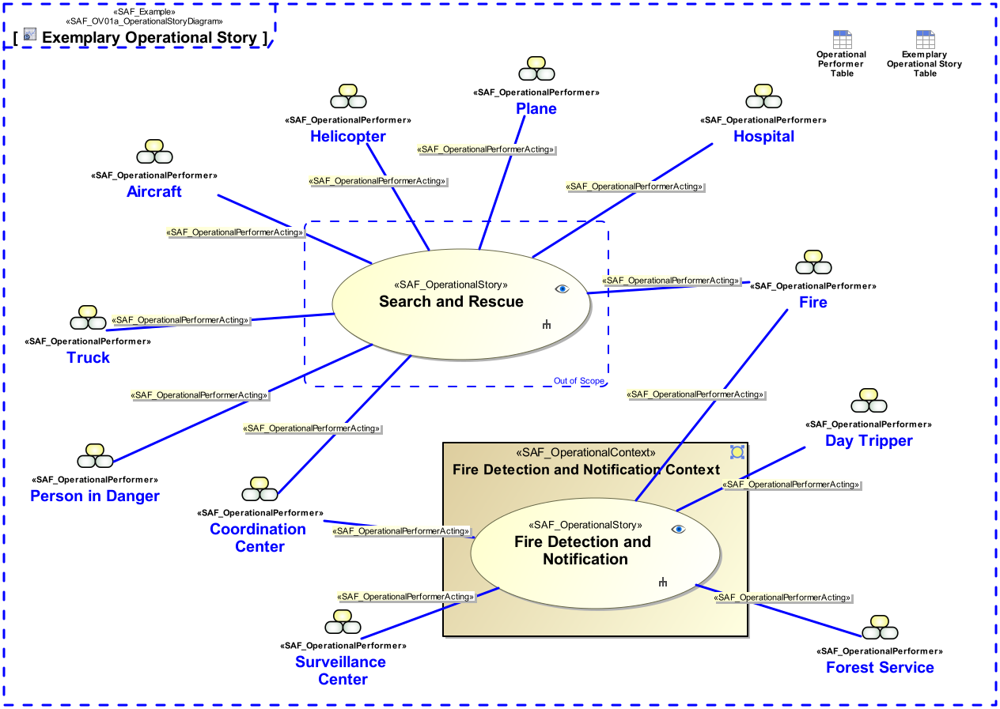

SAF_FFDS#316,SAF_Cameo_Profile#411

# Operational Story Viewpoint
*Domain:* **Operational** *Aspect:* **Context**
## Example

## Purpose
The Operational Story Viewpoint
* identifies the Operational Story(s) and their relation to Operational Performer(s) enabling operational storytelling
* illustrates the operational background from a Stakeholder’s perspective
* serves as starting point to identify Stakeholder(s) and/or context element(s)
* fosters the communication among different Stakeholder(s)
## Applicability
The Operational Story Viewpoint supports the "Business or Mission Analysis Process" activities of the INCOSE SYSTEMS ENGINEERING HANDBOOK 2015 [§ 4.1] and contributes to the problem or opportunity statement.
Note:
## Stakeholder
* [Acquirer](../stakeholders.md#Acquirer)
* [System Architect](../stakeholders.md#System-Architect)
* [User](../stakeholders.md#User)
## Concern
* Which is the Operational Story task accomplished by which operational entities in the Operational Context?
## Presentation
A use case diagram depicting model elements representing Operational Story(s) and Operational Performer(s) shall be used. In addition, an illustration (drawing, sketch, etc.) and/or a description in free text may provide a comprehensive understanding of the operational background.

## Profile Model Reference
* [SAF_OperationalPerformer](../stereotypes.md#SAF_OperationalPerformer)
* [SAF_OperationalPerformerActing](../stereotypes.md#SAF_OperationalPerformerActing)
* [SAF_OperationalSketch](../stereotypes.md#SAF_OperationalSketch)
* [SAF_OperationalStory](../stereotypes.md#SAF_OperationalStory)
* [SAF_SOV01a_View](../stereotypes.md#SAF_SOV01a_View)
## Input from other Viewpoints
### Required Viewpoints
* [Operational Performer Viewpoint](Operational-Performer-Viewpoint.md)
### Recommended Viewpoints
*none*
