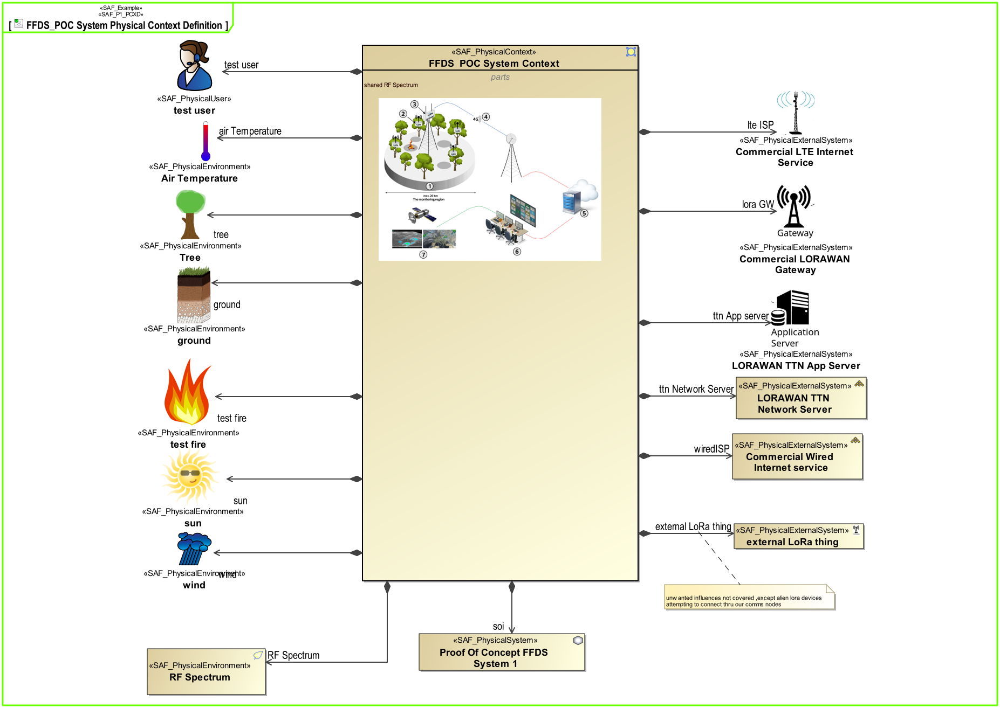

# SAF User Documentation : **P1_PCD** Physical Context Definition Viewpoint
|**Domain**|**Aspect**|**Maturity**|
| --- | --- | --- |
|[Physical](../domains.md#Domain-Physical)|[Context & Exchange](../aspects.md#Aspect-Context-&-Exchange)|[released](../using-saf/maturity.md#released)|
## Example

## Purpose
The Physical Context Definition Viewpoint identifies the various contexts the SOI is used in, along with the associated external entities sharing a physical interface with the system. For each context, the applicable environmental conditions shall be defined. The physical context helps identify the interface requirements needed to integrate a system into its environment in a given context.
## Applicability
The Physical Context Definition Viewpoint supports the "Design Definition Process" activities of the INCOSE SYSTEMS ENGINEERING HANDBOOK 2023 [§2.3.5.5] and contributes to the artifacts "System Design Description" and "System Interface Definition".
## Presentation
A block definition diagram (BDD) depicting the elements available in a specific context. At least one BDD is used per identified context featuring
* one block representing the Physical System, i.e., the system of interest
* one block representing the specific Physical System Context
* several blocks representing Physical Context Elements such as Physical User, Physical External System, and Physical Environment that are present in the Physical System Context
* composition relationships attaching the Physical Context Elements and the Physical System to the Physical System Context block

## Stakeholder
* [Acquirer](../stakeholders.md#Acquirer)
* [Customer](../stakeholders.md#Customer)
* [IV&V Engineer](../stakeholders.md#IV&V-Engineer)
* [Safety Expert](../stakeholders.md#Safety-Expert)
* [Security Expert](../stakeholders.md#Security-Expert)
* [Supplier](../stakeholders.md#Supplier)
* [System Architect](../stakeholders.md#System-Architect)
## Concern
* [Which are the external physical entities the system interacts with in the given context?](../concerns.md#_2021x_2_8710274_1674576758710_759449_23186)
* [Which are the given contexts the system is embedded and utilized in?](../concerns.md#_2021x_2_8710274_1674576758891_776196_23368)
* [Which interface partners does the system have?](../concerns.md#_2021x_2_8710274_1674576759091_673143_23507)
## Profile Model Reference
The following Stereotypes / Model Elements are used in the Viewpoint:
* SAF_PhysicalContextRole contained in SAF_PhysicalContext
* [SAF_P1_PCD](../stereotypes.md#SAF_P1_PCD)
* [SAF_PhysicalContext](../stereotypes.md#SAF_PhysicalContext)
* [SAF_PhysicalEnvironment](../stereotypes.md#SAF_PhysicalEnvironment)
* [SAF_PhysicalExternalSystem](../stereotypes.md#SAF_PhysicalExternalSystem)
* [SAF_PhysicalSystem](../stereotypes.md#SAF_PhysicalSystem)
* [SAF_PhysicalUser](../stereotypes.md#SAF_PhysicalUser)
## Input from other Viewpoints
### Required Viewpoints
*none*
### Recommended Viewpoints
*none*
