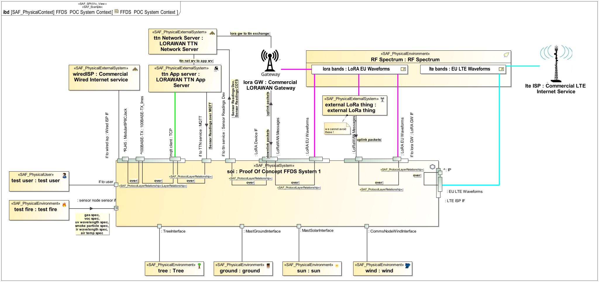
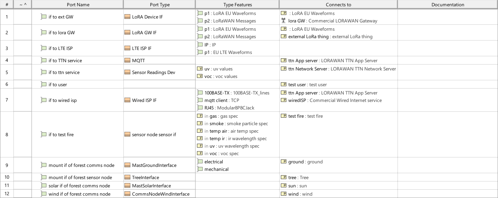

# SAF User Documentation : Physical Context Exchange Viewpoint
|**Domain**|**Aspect**|**Maturity**|
| --- | --- | --- |
|[Physical](../domains.md#Domain-Physical)|[Context & Exchange](../aspects.md#Aspect-Context-&-Exchange)|[under construction](../using-saf/maturity.md#under-construction)|
## Example

## Purpose
The Physical Context Exchange Viewpoint focuses on the identification of the physical interfaces with external entities and the identification of relevant documentation. It is used to capture Interface Design Requirements, applicable standards, protocols and format specifications, that are agreed upon the interfaces.

## Applicability
The Physical Context Exchange Viewpoint is applied early in the life cycle to generate a complete view of all the relevant external interfaces together with relevant standards.
The viewpoint guides the identification of expected interactions of the system with entities external to its system (control) boundary as defined in negotiated ICDs.
The viewpoint is used to capture the Interface Design Requirements with the relevant stakeholders and any relevant documentation, requirements, standards, format specifications and protocols.

The Physical Internal Exchange Viewpoint supports the "Create System Design " activity included in "Design Definition Process" activities of the INCOSE SYSTEMS ENGINEERING HANDBOOK 2023 [§ 2.3.5.5] and contributes to the System Interface definition.

It also supports the "Interface Management" method of the INCOSE SYSTEMS ENGINEERING HANDBOOK 2023 [§ 3.2.4].
## Presentation
A) For each identified context an IBD is used to identify the physical interfaces, the item flows that are exchanged on that interfaces and related documentation.
Mapping of protocol layere is shown as appropriate to understand the interfaces.

B) A table providing a list of all the defined external interfaces and the applicable documentation
* context element kind (environment / external entity / physical user)
* context element role name
* port name and reference to port type
* reference to context element type

C) A table listing the applicable standards, protocols and formats for the item flows exchanged via the identified interfaces.

<undefined>

## Stakeholder
* [Acquirer](../stakeholders.md#Acquirer)
* [Customer](../stakeholders.md#Customer)
* [Hardware Developer](../stakeholders.md#Hardware-Developer)
* [IV&V Engineer](../stakeholders.md#IV&V-Engineer)
* [Maintainer](../stakeholders.md#Maintainer)
* [Safety Expert](../stakeholders.md#Safety-Expert)
* [Security Expert](../stakeholders.md#Security-Expert)
* [Software Developer](../stakeholders.md#Software-Developer)
* [Supplier](../stakeholders.md#Supplier)
* [System Architect](../stakeholders.md#System-Architect)
## Concern
* How does the system or a system element interact with the test environment?
* How to connect the system or a system element to a test equipment?
* What are the Interface Requirements regarding bandwidth, data throughput and latency?
* What are the external physical entities the system interacts with in the respective context?
* What are the protocols for exchanging items on an interface?
* Which HW interfaces are necessary?
* Which SW interfaces are necessary?
* Which interface partners does a HW item have?
* Which interface partners does a SW item have?
## Profile Model Reference
The following Stereotypes / Model Elements are used in the Viewpoint:
* Attribute "realizing connector" of ItemFlow referencing Connector
* Connector [UML_Standard_Profile]
* FlowProperty contained in SAF_PhysicalInterfaceDefinition
* FlowProperty typed by SAF_PhysicalExchangeType
* FlowProperty [SysML Profile]
* ItemFlow typed by SAF_PhysicalExchangeType
* ItemFlow [SysML Profile]
* ProxyPort typed by SAF_PhysicalInterfaceDefinition
* ProxyPort [SysML Profile]
* [SAF_PhysicalEnvironment](../stereotypes.md#SAF_PhysicalEnvironment)
* [SAF_PhysicalExchangeType](../stereotypes.md#SAF_PhysicalExchangeType)
* [SAF_PhysicalExternalSystem](../stereotypes.md#SAF_PhysicalExternalSystem)
* [SAF_PhysicalInterfaceDefinition](../stereotypes.md#SAF_PhysicalInterfaceDefinition)
* [SAF_PhysicalSystem](../stereotypes.md#SAF_PhysicalSystem)
* [SAF_PhysicalUser](../stereotypes.md#SAF_PhysicalUser)
* [SAF_ProtocolLayerRelationship](../stereotypes.md#SAF_ProtocolLayerRelationship)
* [SAF_SPV01c_View](../stereotypes.md#SAF_SPV01c_View)
## Input from other Viewpoints
### Required Viewpoints
* [Physical Context Definition Viewpoint](Physical-Context-Definition-Viewpoint.md)
### Recommended Viewpoints
*none*
