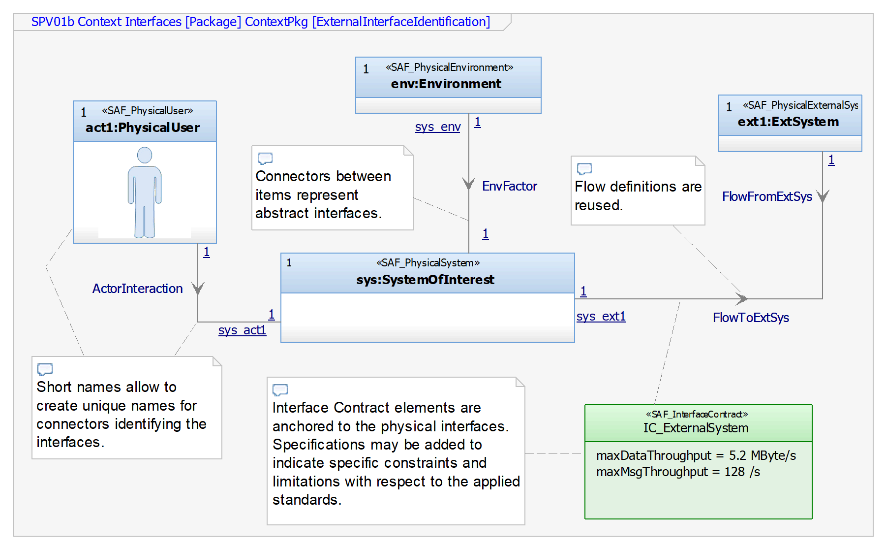

# Physical Context Exchange Viewpoint
|**Domain**|**Aspect**|**Maturity**|
| --- | --- | --- |
|[Physical](../domains.md#Domain-Physical)|[Context & Exchange](../aspects.md#Aspect-Context-&-Exchange)|[under construction](../using-saf/maturity.md#under-construction)|
## Example

## Purpose
The Physical Context Exchange Viewpoint focuses on the identification of the physical interfaces with external entities and the identification of relevant documentation. It is used to capture Interface Requirements for IRS, applicable standards, protocols and format specifications that are agreed upon the interfaces.
Note: Trace physical interfaces to logical interfaces  (the physical interfaces fulfill the exchange requirements stated on Logical Level)
## Applicability
The Physical Context Exchange Viewpoint supports the “Architecture Definition process” activities of the INCOSE SYSTEMS ENGINEERING HANDBOOK 2015 [§ 4.4]. 
The Physical Context Exchange Viewpoint is applied early in the life cycle to generate a complete view of all the relevant external interfaces together with relevant standards.
The viewpoint guides the identification of expected interactions of the system with entities external to its system (control) boundary as defined in negotiated ICDs.
The viewpoint is used to capture the Interface Requirements with the relevant stakeholders and any relevant documentation, requirements, standards, format specifications and protocols.
## Stakeholder
* [Acquirer](../stakeholders.md#Acquirer)
* [Customer](../stakeholders.md#Customer)
* [Hardware Developer](../stakeholders.md#Hardware-Developer)
* [IV&V Engineer](../stakeholders.md#IV&V-Engineer)
* [Maintainer](../stakeholders.md#Maintainer)
* [Safety Expert](../stakeholders.md#Safety-Expert)
* [Software Developer](../stakeholders.md#Software-Developer)
* [Supplier](../stakeholders.md#Supplier)
* [System Architect](../stakeholders.md#System-Architect)
## Concern
* How does the system or a system element interact with the test environment?
* How to connect the system or a system element to a test equipment?
* What are the Interface Requirements regarding bandwidth, data throughput and latency?
* What are the external physical entities the system interacts with in the respective context?
* Which HW interfaces are necessary?
* Which SW interfaces are necessary?
* Which interface partners does a HW item have?
* Which interface partners does a SW item have?
## Presentation
The following artifacts support the modeling activities:
A) For each identified context a physical context interface IBD is used to identify the physical interfaces, the item flows that are exchanged on that interface and related documentation.
B) A physical context interface table provides a list of all the defined external interfaces and the applicable documentation
* context element kind (environment / external entity / physical user)
* context element role name
* port name and reference to port type
* reference to context element type

C) A context interface table is used to define the applicable standards, protocols and formats for the item flows exchanged via the identified interfaces.

## Profile Model Reference
## Input from other Viewpoints
### Required Viewpoints
* [Physical Context Definition Viewpoint](Physical-Context-Definition-Viewpoint.md)
### Recommended Viewpoints
*none*
