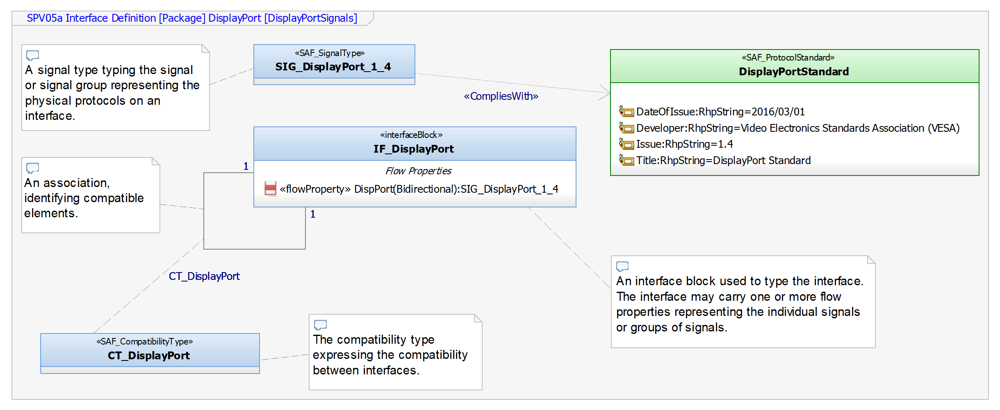
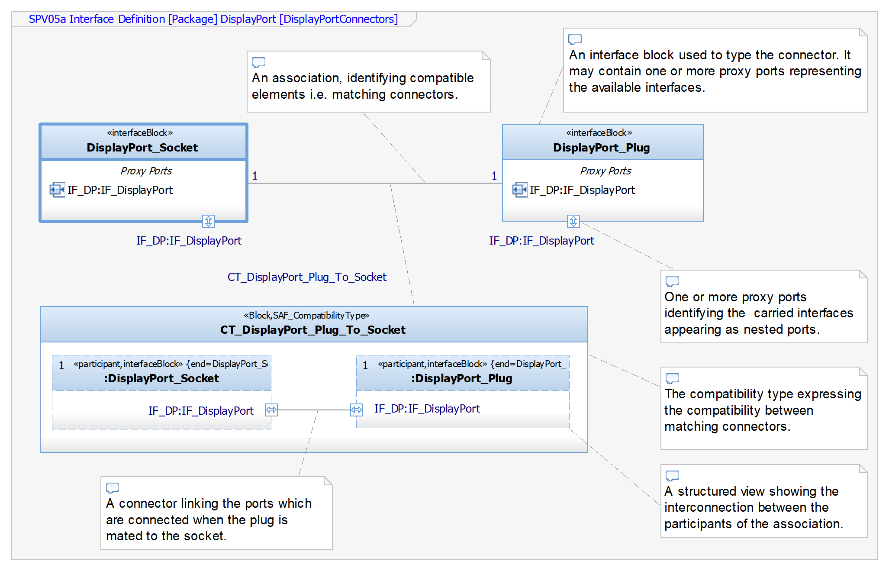

# Physical Interface Definition Viewpoint
|**Domain**|**Aspect**|**Maturity**|
| --- | --- | --- |
|  [Physical](../domains.md#Domain-Physical) |  [Interface](../aspects.md#Aspect-Interfaces) | [ Proposed](../using-saf/maturity.md#proposed)|

*Domain:* **Physical** *Aspect:* **Interfaces**
## Example
To define signal types and their compatibility

to define connectors and their compatibility

## Purpose
The Physical Interface Definition viewpoint defines the single physical signal, interface and connector types and defines the compatibility between those items.
Any information necessary to understand an interface is provided with each interface, forming the information base for the generation of an Interface Control Document. 
The defined signal, interface and connector types are subject for reuse. In a more developed MBSE environment, the interface definitions may be available as library.

## Applicability
The viewpoint is applied as a starting point in modelling the details of physical interfaces. 
The defined signal, interface or connector types are used to type the proxy ports of the system elements representing a physical connection. The viewpoint does not use any elements from other viewpoints instead it defines the basics for use in other viewpoints.
## Stakeholder
* [System Architect](../stakeholders.md#System-Architect)
* [Hardware Developer](../stakeholders.md#Hardware-Developer)
## Concern
* What are the basic signal types?
* What are the basic interface types?
* What are the basic connector types?
* What are the properties of physical interfaces?
* Which documents (e.g. interface specifications) are associated with a specific interface?
## Presentation
The following artifact(s) support the modeling activities:
* SAF SPV05a Physical Interface Definition
* SAF SPV05a Physical Connector Definition
* SAF SPV05a Physical Interface Overview table listing all the defined interfaces

## Profile Model Reference
* SAF_SPV05a_InterfaceDefinition
* InterfaceBlock (SysML)
* SAF_CompatibilityType
* SAF_SignalType

## Input from other Viewpoints
### Required Viewpoints
*none*
### Recommended Viewpoints
*none*
