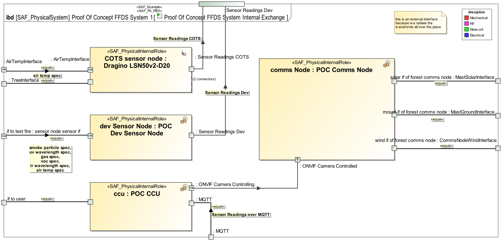

# SAF User Documentation : **P4_PIEX** Physical Internal Exchange Viewpoint
|**Domain**|**Aspect**|**Maturity**|
| --- | --- | --- |
|[Physical](../domains.md#Domain-Physical)|[Interaction & Collaboration](../aspects.md#Aspect-Interaction-&-Collaboration)|[released](../using-saf/maturity.md#released)|
## Example

## Purpose
The Physical Internal Exchange Viewpoint serves for the identification and definition of interfaces of elements of the physical system. also, the delegation of system element interfaces to the physical system boundary interfaces is covered.
The Physical Internal Exchange Viewpoint
* identifies system element interfaces on a physical level
* states to which other physical elements the interfaces are connected to
* assigns physical interface definitions to interfaces
* defines the usage of interfaces, e.g., if only a subset of the interfaces is used
* defines the delegation of physical system element interfaces to physical system boundary interfaces
## Applicability
The Physical Internal Exchange Viewpoint supports the “Design Definition Process” activities of the INCOSE SYSTEMS ENGINEERING HANDBOOK 2023 [§2.3.5.5] and contributes to the artifacts "System Design Description" and "System Interface Definition". It also supports the "Interface Management" method of the INCOSE SYSTEMS ENGINEERING HANDBOOK 2023 [§3.2.4].
## Presentation
One or more IBDs featuring the SOI boundary, the parts representing physical elements of the SOI. At the SOI boundary, the interfaces of the SOI represented as proxy ports. At the parts, proxy ports representing the SOI parts interfaces. Binding Connectors for each identified SOI interface delegated to physical SOI elements interfaces.  connectors representing connections between interfaces of SOI parts. Item flows are defined for each planned exchange on the identified interfaces.
Note: Please use more than one IBD focused on different areas of interest to keep the view comprehensive.
Note: Ports may be nested to organize interfaces, but it is recommended to use only only one level.

A Table representing the content or part of the ibd content.

## Stakeholder
* [Hardware Developer](../stakeholders.md#Hardware-Developer)
* [IV&V Engineer](../stakeholders.md#IV&V-Engineer)
* [Mechanic Developer](../stakeholders.md#Mechanic-Developer)
* [Safety Expert](../stakeholders.md#Safety-Expert)
* [Security Expert](../stakeholders.md#Security-Expert)
* [Software Developer](../stakeholders.md#Software-Developer)
* [System Architect](../stakeholders.md#System-Architect)
## Concern
* [How do physical system elements interact to provide system functions?](../concerns.md#_2021x_2_8710274_1674576758600_423008_23078)
* [Which are the protocols for exchanging physical items on a specific interface?](../concerns.md#_2021x_2_8710274_1674576759247_884832_23642)
* [Which kind of physical items (energy, material, information, etc.) are used on an interface of a physical architecture element?](../concerns.md#_2021x_2_8710274_1674576758561_575110_23056)
* [Which physical items (energy, material, information, etc.) are exchanged within the system?](../concerns.md#_2021x_2_8710274_1698410513910_480926_28625)
* [Which standards, protocols, and format specifications apply to a physical interface?](../concerns.md#_2021x_2_8710274_1674576758891_215548_23373)
## Profile Model Reference
The following Stereotypes / Model Elements are used in the Viewpoint:
* Attribute "realizingConnector" of InformationFlow referencing Connector
* Connector [UML_Standard_Profile]
* FlowProperty [SysML Profile]
* FlowProperty contained in SAF_PhysicalInterfaceDefinition
* FlowProperty typed by SAF_PhysicalExchangeType
* ItemFlow [SysML Profile]
* ItemFlow typed by SAF_PhysicalExchangeType
* ProxyPort [SysML Profile]
* ProxyPort contained in SAF_PhysicalItem
* ProxyPort typed by SAF_PhysicalInterfaceDefinition
* [SAF_InterfaceLayerRelationship](../stereotypes.md#saf_interfacelayerrelationship)
* [SAF_P4_PIEX](../stereotypes.md#saf_p4_piex)
* [SAF_P4_PIEX_Table](../stereotypes.md#saf_p4_piex_table)
* [SAF_PhysicalElement](../stereotypes.md#saf_physicalelement)
* [SAF_PhysicalExchangeType](../stereotypes.md#saf_physicalexchangetype)
* [SAF_PhysicalHardwareElement](../stereotypes.md#saf_physicalhardwareelement)
* [SAF_PhysicalInterfaceDefinition](../stereotypes.md#saf_physicalinterfacedefinition)
* [SAF_PhysicalSoftwareElement](../stereotypes.md#saf_physicalsoftwareelement)
## Input from other Viewpoints
### Required Viewpoints
* [Physical Structure Definition Viewpoint](Physical-Structure-Definition-Viewpoint.md)
### Recommended Viewpoints
*none*
