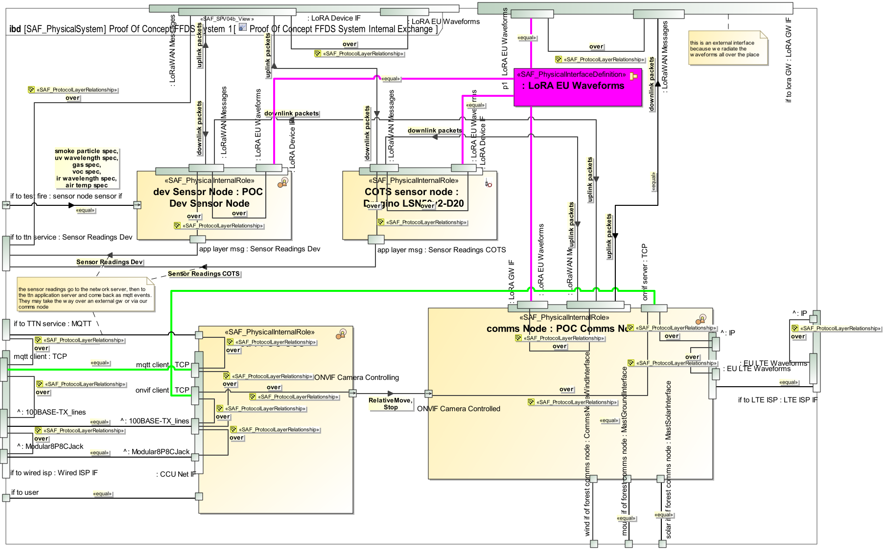
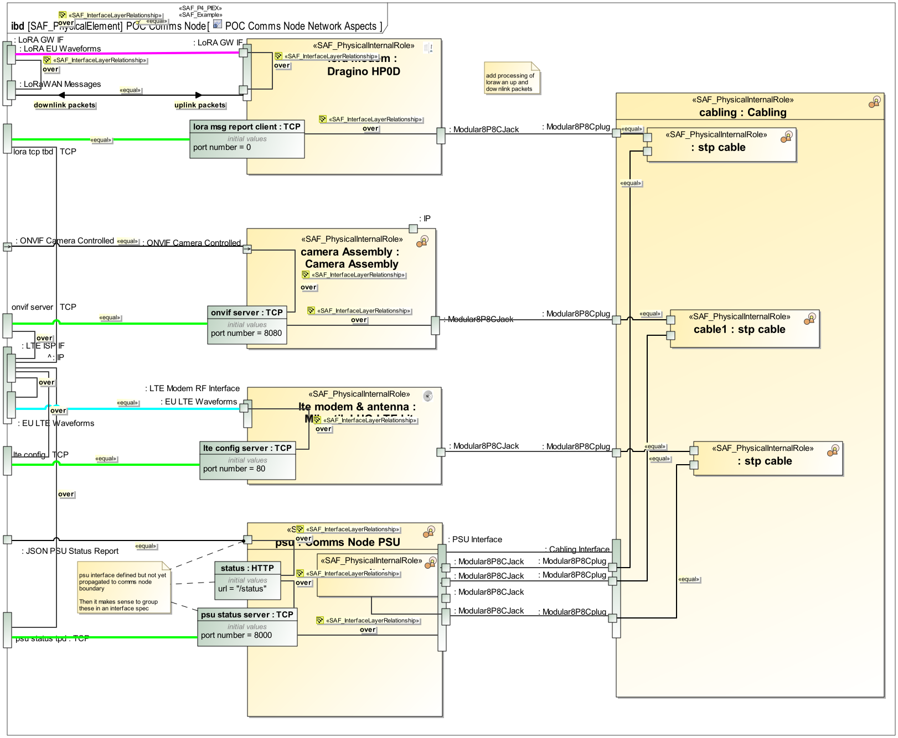

# SAF User Documentation : Physical Internal Exchange Viewpoint
|**Domain**|**Aspect**|**Maturity**|
| --- | --- | --- |
|[Physical](../domains.md#Domain-Physical)|[Interaction & Collaboration](../aspects.md#Aspect-Interaction-&-Collaboration)|[released](../using-saf/maturity.md#released)|
## Example

## Purpose
The Physical Internal Exchange Viewpoint serves for the identification and definition of interfaces of elements of the Physical System. Also, the delegation of System Element Interfaces to the Physical System Boundary Interfaces is covered.
The Physical Internal Exchange Viewpoint
* identifies System Element Interfaces on a Physical Level
* states to which other system elements the interfaces are connected to
* assigns interface specifications to interfaces
* defines the usage of interfaces, e.g., if only a subset of the interfaces is used
* defines the delegation of System Element to Physical System Boundary Interfaces
## Applicability
The Physical Context Definition Viewpoint supports the “System Architecture Definition Process” activities of the INCOSE SYSTEMS ENGINEERING HANDBOOK 2023 [§2.3.5.4] and contributes to the artifacts "System Architecture Description" and "System Interface Definition". It also supports the "Interface Management" method of the INCOSE SYSTEMS ENGINEERING HANDBOOK 2023 [§3.2.4].
## Presentation
One or more IBDs featuring the SOI boundary, the physical elements of the SOI, the connectors for each identified SOI interface delegation to Physical SOI Elements, as well as those connectors between related interfaces of Physical SOI Elements. An interface is a connection resource for hooking on the Logical SOI Elements to other Logical SOI Elements. Item flows are defined for each exchange on the identified interface.
Note: Please use more than one IBD focused on different areas of interest to keep the view comprehensive.

## Stakeholder
* [Hardware Developer](../stakeholders.md#Hardware-Developer)
* [IV&V Engineer](../stakeholders.md#IV&V-Engineer)
* [Mechanic Developer](../stakeholders.md#Mechanic-Developer)
* [Safety Expert](../stakeholders.md#Safety-Expert)
* [Security Expert](../stakeholders.md#Security-Expert)
* [Software Developer](../stakeholders.md#Software-Developer)
* [System Architect](../stakeholders.md#System-Architect)
## Concern
* What are the protocols for exchanging items on specific interface?
* What items (energy, material, information, etc.) are exchanged within the system?
* Which design level data / energy / material definitions are used on an interface of a physical architecture element?
* Which standards, protocols, and format specifications are associated with a specific interface?
* Which system internal interface partners does a physical system element have?
## Profile Model Reference
The following Stereotypes / Model Elements are used in the Viewpoint:
* Attribute "realizingConnector" of InformationFlow referencing Connector
* Connector [UML_Standard_Profile]
* FlowProperty [SysML Profile]
* FlowProperty contained in SAF_PhysicalInterfaceDefinition
* FlowProperty typed by SAF_PhysicalExchangeType
* ItemFlow [SysML Profile]
* ItemFlow typed by SAF_PhysicalExchangeType
* ProxyPort [SysML Profile]
* ProxyPort contained in SAF_PhysicalItem
* ProxyPort typed by SAF_PhysicalInterfaceDefinition
* [SAF_PhysicalElement](../stereotypes.md#SAF_PhysicalElement)
* [SAF_PhysicalExchangeType](../stereotypes.md#SAF_PhysicalExchangeType)
* [SAF_PhysicalHardwareElement](../stereotypes.md#SAF_PhysicalHardwareElement)
* [SAF_PhysicalInterfaceDefinition](../stereotypes.md#SAF_PhysicalInterfaceDefinition)
* [SAF_PhysicalSoftwareElement](../stereotypes.md#SAF_PhysicalSoftwareElement)
* [SAF_ProtocolLayerRelationship](../stereotypes.md#SAF_ProtocolLayerRelationship)
* [SAF_SPV04b_View](../stereotypes.md#SAF_SPV04b_View)
## Input from other Viewpoints
### Required Viewpoints
* [Physical Structure Viewpoint](Physical-Structure-Viewpoint.md)
### Recommended Viewpoints
*none*
