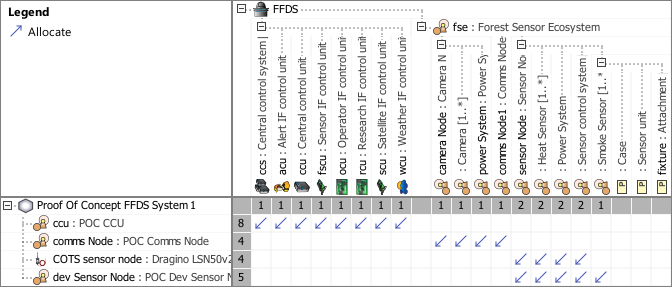

# SAF User Documentation : **P8_PLOM** Physical Logical Mapping Viewpoint
|**Domain**|**Aspect**|**Maturity**|
| --- | --- | --- |
|[Physical](../domains.md#Domain-Physical)|[Traceability & Mapping](../aspects.md#Aspect-Traceability-&-Mapping)|[released](../using-saf/maturity.md#released)|
## Example

## Purpose
The Physical Logical Mapping Viewpoint  supports the definition of the assignment of conceptual logical system elements to physical system elements comprising the SOI.

Following the identification of physical system elements capable of performing the system functions of logical elements, the Physical Logical Mapping Viewpoint provides feedback to the System Architecture Definition process to consolidate or confirm the allocation, partitioning, and alignment of logical elements to physical elements that comprise the SOI.
## Applicability
The Physical Logical Mapping Viewpoint supports the “Design Definition Process” activities of the INCOSE SYSTEMS ENGINEERING HANDBOOK 2023 [§2.3.5.5] and contributes to the artifact "Traceability Mapping".

Furthermore, the Physical Logical Mapping Viewpoint supports the "Allocation and Partitioning of Logical Entities to Physical Entities" activities of the INCOSE SYSTEMS ENGINEERING HANDBOOK 2015 [§4.4.2.7].
## Presentation
A assignment matrix featuring
* Logical Element Breakdown Structure showing Logical Element Roles and Logical Elements
* Physical Element Breakdown Structure showing physical element roles and physical elements
* Allocation relationship from logical system element roles to physical system element roles

## Stakeholder
* [Hardware Developer](../stakeholders.md#Hardware-Developer)
* [IV&V Engineer](../stakeholders.md#IV&V-Engineer)
* [Mechanic Developer](../stakeholders.md#Mechanic-Developer)
* [Software Developer](../stakeholders.md#Software-Developer)
* [System Architect](../stakeholders.md#System-Architect)
## Concern
* [Which logical elements are allocated to the physical SOI physical architecture?](../concerns.md#_2021x_2_8710274_1698399385413_529894_33129)
## Profile Model Reference
The following Stereotypes / Model Elements are used in the Viewpoint:
* Allocate [SysML Profile]
* Attribute "logical_element" of SAF_PhysicalItem referencing SAF_LogicalElement
* SAF_LogicalInternalRole contained in SAF_LogicalElement
* [SAF_LogicalElement](../stereotypes.md#SAF_LogicalElement)
* [SAF_P8_PLOM_Matrix](../stereotypes.md#SAF_P8_PLOM_Matrix)
* [SAF_PhysicalElement](../stereotypes.md#SAF_PhysicalElement)
* [SAF_PhysicalHardwareElement](../stereotypes.md#SAF_PhysicalHardwareElement)
* [SAF_PhysicalInternalRole](../stereotypes.md#SAF_PhysicalInternalRole)
* [SAF_PhysicalSoftwareElement](../stereotypes.md#SAF_PhysicalSoftwareElement)
## Input from other Viewpoints
### Required Viewpoints
* [Logical Structure Definition Viewpoint](Logical-Structure-Definition-Viewpoint.md)
* [Physical Structure Definition Viewpoint](Physical-Structure-Definition-Viewpoint.md)
* [Logical Functional Mapping Viewpoint](Logical-Functional-Mapping-Viewpoint.md)
### Recommended Viewpoints
* [System Functional Breakdown Structure Viewpoint](System-Functional-Breakdown-Structure-Viewpoint.md)
