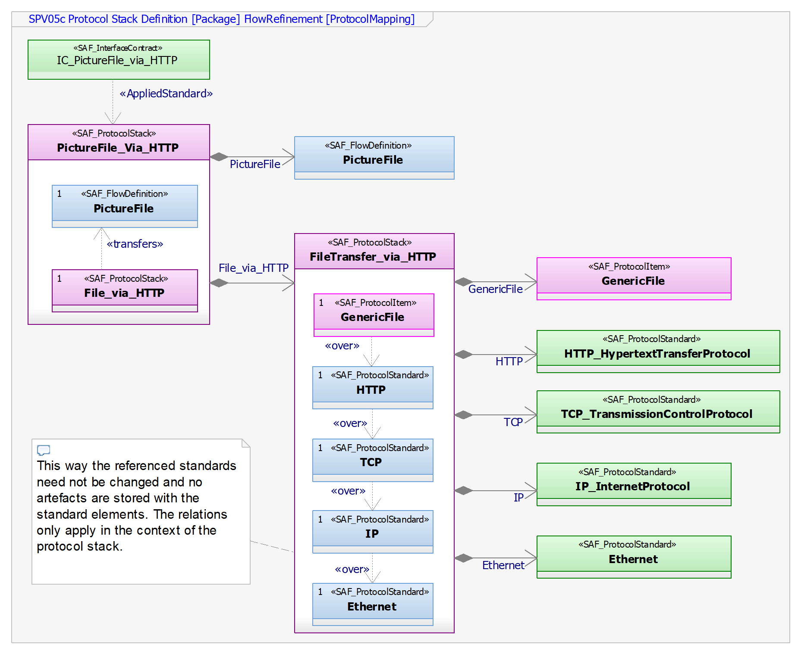

# Physical Protocol Stack Definition Viewpoint
*Domain:* **Physical** *Aspect:* **Interfaces**
## Example

## Purpose
In the context of complex exchanges between system elements in information technology (IT) systems, a protocol is seen as a physical interface that carries exchanges of data (acc. INCOSE Hdbk, §4.4.2.5 Notion of Interfaces). 
Protocol and format standards are defined in SCV02 Common Standards Definition. However, for transferring data via an interface several protocol standards may be available and only a subset applies. Protocol stacks are structured e.g. according to the Open Systems Interconnection model (OSI model) standardized by ISO/IEC. The SPV05c Protocol Stack Definition defines protocol stacks that are used to exchange data or information items. The defined protocol stacks are utilized in interface identification.

*See:*
**ISO/IEC 7498-1:1994**  Information technology -- Open Systems Interconnection -- Basic Reference Model: The Basic Model
"Publicly Available Standards". Standards.iso.org. Retrieved 04 January 2020.
## Applicability
The SPV05c Protocol Stack Definition viewpoint is applied as a starting point in modelling the details of physical interfaces.
## Stakeholder
* [Acquirer](../stakeholders.md#Acquirer)
* [Customer](../stakeholders.md#Customer)
* [System Architect](../stakeholders.md#System-Architect)
## Concern
* What protocol stacks are used to transfer data items and information via a physical interface?
* What are the different protocols constituting a protocol stack?
## Presentation
The following artifact(s) support the modeling activities:
* ProtocolStack represents the protocol stack itself
* transfers dependency to indicate the items a protocol stack is used to exchange
* over dependency indicates elements an protocols of a stack
* composition relationship(s) attaching a protocol standard to a protocol stack

## Profile Model Reference
* SAF_ProtocolItem
* SAF_ProtocolStack
* SAF_ProtocolStandard
* SAF_FormatStandard
* SAF_InterfaceContract
* SAF_FlowDefinition
* AppliedStandard
* transfer
* over
## Input from other Viewpoints
### Required Viewpoints
* [Common-Standards-Definition-Viewpoint](Common-Standards-Definition-Viewpoint.md)
### Recommended Viewpoints
*none*
