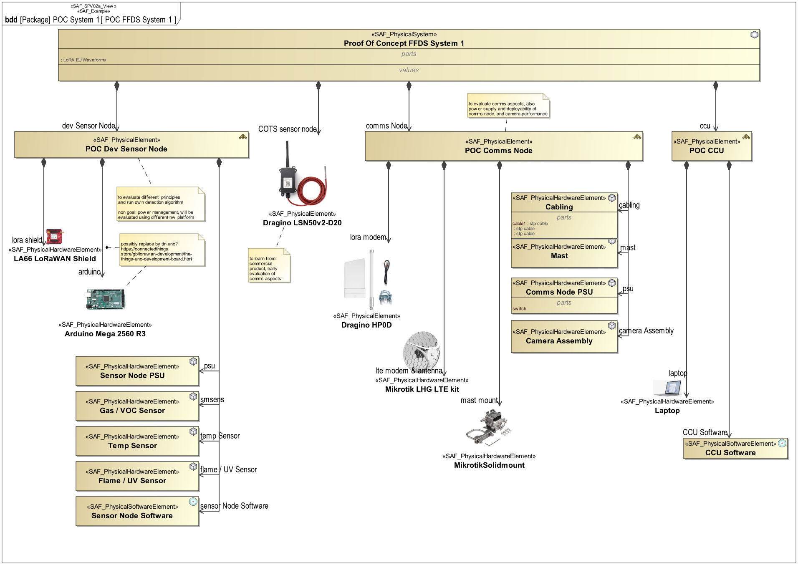

# SAF User Documentation : Physical Structure Viewpoint
|**Domain**|**Aspect**|**Maturity**|
| --- | --- | --- |
|[Physical](../domains.md#Domain-Physical)|[Taxonomy & Structure](../aspects.md#Aspect-Taxonomy-&-Structure)|[under construction](../using-saf/maturity.md#under-construction)|
## Example

## Purpose
The Physical Structure Viewpoint is used to model the internal structure of the SOI and to identify the internal system elements making up the SOI. The SOI breakdown structure identifies system elements and finally on implementation level hardware, software, mechanics. The SOI breakdown structure determines items that are reused and make or buy (COTS) items. The Physical Structure Viewpoint is elaborated for each candidate physical SOI architecture. It provides the basis for further assessment of the architecture candidates by identifying the system elements in each candidate solution.

## Applicability
The Physical Structure Viewpoint supports the "Allocation and Partitioning of Logical Entities to Physical Entities" activities of the INCOSE SYSTEMS ENGINEERING HANDBOOK 2015 [§ 4.4.2.7]. The Physical Structure Viewpoint presents the product breakdown structure of a technical solution for the SOI providing all the identified external interface(s), a structure capable to implement the functionality identified in the logical Viewpoint(s).
## Presentation
## Stakeholder
* [Acquirer](../stakeholders.md#Acquirer)
* [Project Manager](../stakeholders.md#Project-Manager)
* [Security Expert](../stakeholders.md#Security-Expert)
* [System Architect](../stakeholders.md#System-Architect)
## Concern
* What are the HW components to be provided?
* What are the SW components to be provided?
* What are the configuration items in the physical architecture?
* What are the major system elements?
* What are the physical components?
* What is the physical breakdown of the system?
* What physical items are used building up the system?
* Which physical items the SOI is built of?
* what is the decomposition hierarchy of the system/logical elements
## Profile Model Reference
The following Stereotypes / Model Elements are used in the Viewpoint:
* 
* [SAF_PhysicalElement](../stereotypes.md#SAF_PhysicalElement)
* [SAF_PhysicalHardwareElement](../stereotypes.md#SAF_PhysicalHardwareElement)
* [SAF_PhysicalInternalRole](../stereotypes.md#SAF_PhysicalInternalRole)
* [SAF_PhysicalInternalRole](../stereotypes.md#SAF_PhysicalInternalRole)
* [SAF_PhysicalInternalRole](../stereotypes.md#SAF_PhysicalInternalRole)
* [SAF_PhysicalInternalRole](../stereotypes.md#SAF_PhysicalInternalRole)
* [SAF_PhysicalSoftwareElement](../stereotypes.md#SAF_PhysicalSoftwareElement)
* [SAF_PhysicalSystem](../stereotypes.md#SAF_PhysicalSystem)
* [SAF_SPV02a_View](../stereotypes.md#SAF_SPV02a_View)
## Input from other Viewpoints
### Required Viewpoints
*none*
### Recommended Viewpoints
*none*
