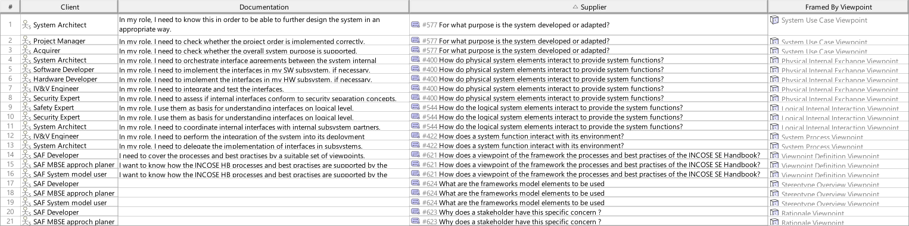

# SAF User Documentation : **D6_RATD** Rationale Viewpoint
|**Domain**|**Aspect**|**Maturity**|
| --- | --- | --- |
|[SAF Development](../domains.md#Domain-SAF-Development)|[Requirement](../aspects.md#Aspect-Requirement)|[proposed](../using-saf/maturity.md#proposed)|
## Example

## Purpose
The Rationale Viewpoint defines the relationship between Stakeholders and their Concerns in the context of Development of SAF. The Rationale formulates why a Stakeholder has a certain concern.
## Applicability
The ... Viewpoint supports the ...  in INCOSE SYSTEMS ENGINEERING HANDBOOK 2023.
## Presentation
A matrix featuring SCM_VPStakeholder elements and SCM_VPConcern elements as rows and columns, and a marking in cells where a SCM_ConcernRationale connects a stakeholder with a concern.

A table featuring the SCM_ConcernRationales that connect SCM_VPStakeholders and SCM_VPConcerns, and the rationales documentation.

## Stakeholder
* [SAF Developer](../stakeholders.md#SAF-Developer)
* [SAF MBSE approch planer](../stakeholders.md#SAF-MBSE-approch-planer)
## Concern
* [Which concerns are related to the frameworks stakeholders?](../concerns.md#_2024x_26f0132_1719129962342_738625_14755)
* [Why does a stakeholder have this specific concern ? ](../concerns.md#_2024x_26f0132_1719744888608_624464_37315)
## Profile Model Reference
The following Stereotypes / Model Elements are used in the Viewpoint:
* [SCM_ConcernRationale](../stereotypes.md#SCM_ConcernRationale)
* [SCM_D2_RATD_Table](../stereotypes.md#SCM_D2_RATD_Table)
* [SCM_VPConcern](../stereotypes.md#SCM_VPConcern)
* [SCM_VPStakeholder](../stereotypes.md#SCM_VPStakeholder)
## Input from other Viewpoints
### Required Viewpoints
*none*
### Recommended Viewpoints
*none*
