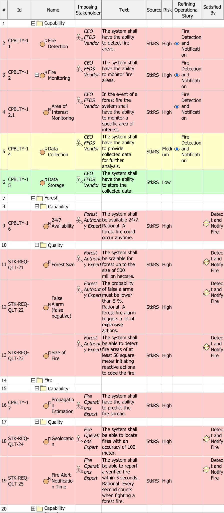

# Stakeholder Requirement Viewpoint
*Domain:* [Operational](../domains.md#Domain-Operational) *Aspect:* [Requirement](../aspects.md#Aspect-Requirement)
## Example

## Purpose
The Stakeholder Requirement Viewpoint specifies all properties that the intended solution shall possess or expose from the perspective of the stakeholders. The Stakeholder Requirement Viewpoint determines capability(s), function(s), non-functional property(s), and constraint(s).
## Applicability
The Stakeholder Requirement Viewpoint supports the "Stakeholder Needs and Requirements Definition Process" activities of the INCOSE SYSTEMS ENGINEERING HANDBOOK 2015 [§ 4.2] and contributes to the identification of solution constraint(s).
## Stakeholder
* [Acquirer](../stakeholders.md#Acquirer)
* [Customer](../stakeholders.md#Customer)
* [IV&V Engineer](../stakeholders.md#IV&V-Engineer)
* [Regulation Authority](../stakeholders.md#Regulation-Authority)
* [Supplier](../stakeholders.md#Supplier)
* [System Architect](../stakeholders.md#System-Architect)
## Concern
* What are the normal and extreme environmental conditions for normal operation, for not operational, for storage and for transport?
* What are the requirements of environmental conditions imposed on the system?
* What are the requirements that a Stakeholder imposes on the system?
* What defines a valid solution towards the customer?
* What is the range of acceptable system performance, i.e. the critical, top-level performance requirements derived from the operational needs?
## Presentation
Stakeholder Requirement(s) are structured in a way that the Stakeholder behind a requirement is identifiable. As appropriate, the identified Stakeholder Requirement(s) are receiving a Derivation Link from the justifying model artefact(s), namely Operational Performer, Operational Activity, and Operational Exchange.
Note 1: "One requirement package for each Stakeholder" is a best-practice modeling rule. A package contains the requirement(s) specific for one Stakeholder.
Note 2: Even if different Stakeholder may have intersecting interests and / or concern(s) resulting in a similar set of requirements, each Stakeholder shall have its own set managed in a dedicated requirement package. Requirement(s) shall not be shared because of their different life cycles. Resolving duplications and conflicts is subject of the requirements analysis resulting in an agreed set of system requirement(s).

## Profile Model Reference
* Package [UML_Standard_Profile]
* [SAF_SOV06a_View](../stereotypes.md#SAF_SOV06a_View)
* [SAF_Stakeholder](../stereotypes.md#SAF_Stakeholder)
* [SAF_StakeholderRequirement](../stereotypes.md#SAF_StakeholderRequirement)
* [SAF_StakeholderRequirementImposition](../stereotypes.md#SAF_StakeholderRequirementImposition)
* [SAF_StakeholderRequirementRefinement](../stereotypes.md#SAF_StakeholderRequirementRefinement)
* [SAF_StakeholderRequirementRefinement](../stereotypes.md#SAF_StakeholderRequirementRefinement)
* [SAF_SystemOfInterestConcern](../stereotypes.md#SAF_SystemOfInterestConcern)
## Input from other Viewpoints
### Required Viewpoints
* [Stakeholder Identification Viewpoint](Stakeholder-Identification-Viewpoint.md)
### Recommended Viewpoints
* [Operational Story Viewpoint](Operational-Story-Viewpoint.md)
* [Operational Performer Viewpoint](Operational-Performer-Viewpoint.md)
