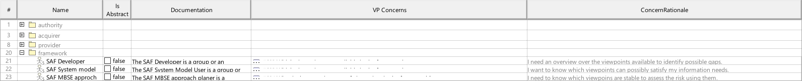

# SAF User Documentation : **D1_STKD** Stakeholder Viewpoint
|**Domain**|**Aspect**|**Maturity**|
| --- | --- | --- |
|[SAF Development](../domains.md#Domain-SAF-Development)|[Context & Exchange](../aspects.md#Aspect-Context-&-Exchange)|[proposed](../using-saf/maturity.md#proposed)|
## Example

## Purpose
The Stakeholder Viewpoint provides definitions for Stakeholders having an interest in SAF Viewpoints. The Interest is formulated using Concerns.
## Applicability
The Viewpoint supports the definition of  "Stakeholders and concerns",  and  "Specification of an architecture description framework" as defined in ISO41010:2022
## Presentation
A Block Definition Diagram (BDD) featuring *SCM_VPStakeholder* elements, and inheritance relationships if applicable.

A table featuring *SCM_VPStakeholder* elements, their documentation, and the *SCM_VPConcern* elements representing the concerns of the stakeholders regarding to SAF Viewpoints.

## Stakeholder
* [SAF Developer](../stakeholders.md#SAF-Developer)
* [SAF MBSE approch planer](../stakeholders.md#SAF-MBSE-approch-planer)
## Concern
* [Which concerns are related to the frameworks stakeholders?](../concerns.md#_2024x_26f0132_1719129962342_738625_14755)
* [Who are the Stakeholders of the frameworks viewpoints?](../concerns.md#_2024x_26f0132_1719129843876_724811_14744)
## Profile Model Reference
The following Stereotypes / Model Elements are used in the Viewpoint:
* [SCM_ConcernRationale](../stereotypes.md#scm_concernrationale)
* [SCM_D2_STKD_Table](../stereotypes.md#scm_d2_stkd_table)
* [SCM_VPConcern](../stereotypes.md#scm_vpconcern)
* [SCM_VPStakeholder](../stereotypes.md#scm_vpstakeholder)
## Input from other Viewpoints
### Required Viewpoints
*none*
### Recommended Viewpoints
*none*
