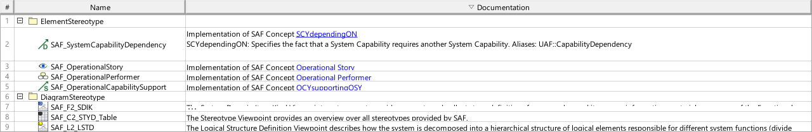

# SAF User Documentation : **C2_STYD** Stereotype Overview Viewpoint
|**Domain**|**Aspect**|**Maturity**|
| --- | --- | --- |
|[Common](../domains.md#Domain-Common)|[Taxonomy & Structure](../aspects.md#Aspect-Taxonomy-&-Structure)|[proposed](../using-saf/maturity.md#proposed)|
## Example

## Purpose
The Stereotype Viewpoint provides an overview over all stereotypes provided by SAF.
## Applicability
The ... Viewpoint supports the ...  in INCOSE SYSTEMS ENGINEERING HANDBOOK 2023.
## Presentation
A table featuring the stereotypes of the SAF profile and their documentation.

## Stakeholder
* [SAF Developer](../stakeholders.md#SAF-Developer)
* [SAF MBSE approch planer](../stakeholders.md#SAF-MBSE-approch-planer)
* [SAF System model user](../stakeholders.md#SAF-System-model-user)
## Concern
* [What are the frameworks model elements to be used](../concerns.md#_2024x_26f0132_1719746308347_570628_39136)
## Profile Model Reference
The following Stereotypes / Model Elements are used in the Viewpoint:
* [SAF_C2_STYD_Table](../stereotypes.md#saf_c2_styd_table)
## Input from other Viewpoints
### Required Viewpoints
*none*
### Recommended Viewpoints
*none*
