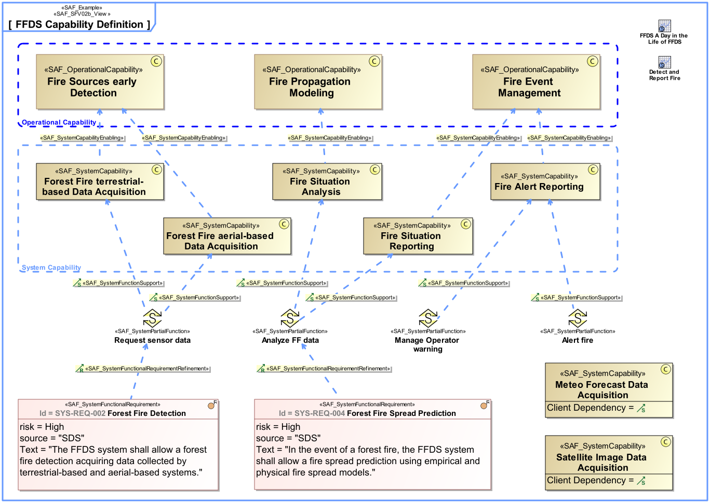

SAF_FFDS#316,SAF_Cameo_Profile#411

# System Capability Viewpoint
*Domain:* **Functional** *Aspect:* **Structure**
## Example

## Purpose
The System Capability Viewpoint defines a taxonomy of Capability(s) including composition, specialization, and dependency relationship(s) between System Capability(s).
## Applicability
The System Capability Viewpoint supports the "[tbd]" activities of the INCOSE SYSTEMS ENGINEERING HANDBOOK 2015 [§] defining System Capability(s) at a system level (e.g. [tbd] and functional process(es)). The System Capability Viewpoint contributes to [tbd].
Note:
## Stakeholder
* [Acquirer](../stakeholders.md#Acquirer)
* [Customer](../stakeholders.md#Customer)
* [System Architect](../stakeholders.md#System-Architect)
* [User](../stakeholders.md#User)
## Concern
* What are the Capabilities that are supported by the system?
## Presentation
The result of the [tbd] process is one or more block definition diagram(s) (BDD) featuring System Capability(s) and their composition, specialization and dependency relationship(s).

## Profile Model Reference
* [SAF_SFV02b_View](../stereotypes.md#SAF_SFV02b_View)
* [SAF_SystemCapability](../stereotypes.md#SAF_SystemCapability)
* [SAF_SystemCapabilityComposition](../stereotypes.md#SAF_SystemCapabilityComposition)
* [SAF_SystemCapabilityDependency](../stereotypes.md#SAF_SystemCapabilityDependency)
* [SAF_SystemCapabilityGeneralization](../stereotypes.md#SAF_SystemCapabilityGeneralization)
* [SAF_SystemCapabilityMapping](../stereotypes.md#SAF_SystemCapabilityMapping)
## Input from other Viewpoints
### Required Viewpoints
*none*
### Recommended Viewpoints
* [Operational Capability Viewpoint](Operational-Capability-Viewpoint.md)
* [System UseCase Viewpoint](System-UseCase-Viewpoint.md)
* [System Process Viewpoint](System-Process-Viewpoint.md)
