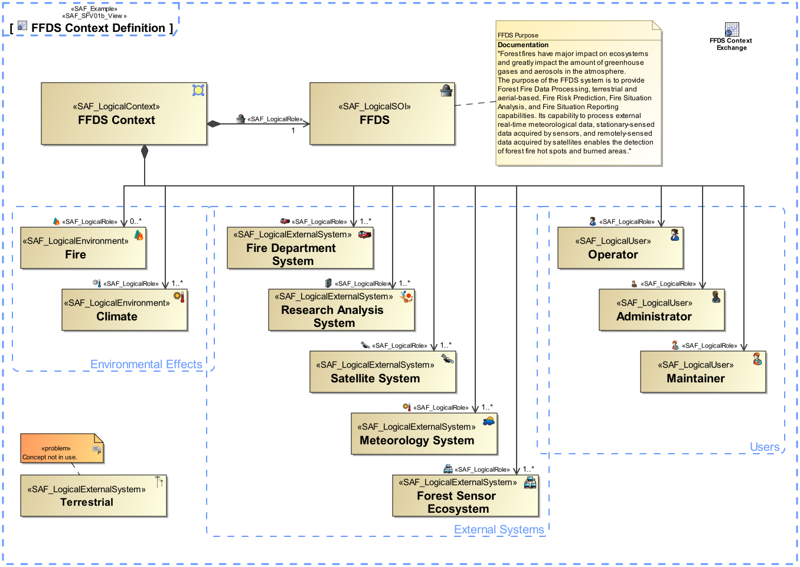

# System Context Definition Viewpoint
|**Domain**|**Aspect**|**Maturity**|
| --- | --- | --- |
|[Functional](../domains.md#Domain-Functional)|[Context & Exchange](../aspects.md#Aspect-Context-&-Exchange)|[released](../using-saf/maturity.md#released)|
## Example

## Purpose
The System Context Definition Viewpoint defines how the SOI is embedded in its Environment, i.e. where the boundary of the SOI is and who the External Entitys are the SOI interacts with (e.g. Users, other External Systems, Environmental Conditions, etc.). The SOI provides and requests Context Functions. The SOI shall be able handle Events and Effects from the outside.
## Applicability
The System Context Definition Viewpoint supports the "Prepare for Requirement Definition" activity included in "System Requirements Definition Process" activities of the INCOSE SYSTEMS ENGINEERING HANDBOOK 2015 [§ 4.3] and contributes to the system Functional Interface Identification.
## Stakeholder
* [Acquirer](../stakeholders.md#Acquirer)
* [Customer](../stakeholders.md#Customer)
* [Supplier](../stakeholders.md#Supplier)
* [System Architect](../stakeholders.md#System-Architect)
## Concern
* What are necessary enabling systems?
* What are the different contexts the system is embedded and utilized in?
* What are the external conceptual entities the system interacts with in the respective context?
* What are the geographical and physical locations of the intended / proposed elements of the solution?
* What is the support environment for the system?
* What is the system boundary definition?
* Which classes of users (roles) will interact with the system?
* Which interface partners does the system have?
## Presentation
A BDD featuring the following elements
* a Logical Element block representing SOI in the logical domain
* a Logical Context block representing the addressed context in the logical domain
* Logical Context Element blocks for each relevant context element
* a Composition relationship from Context block to each Context Element used in the context
* a Composition relationship from Context block to the SOI

## Profile Model Reference
* Association [UML_Standard_Profile]
* Association [UML_Standard_Profile]
* [SAF_LogicalContext](../stereotypes.md#SAF_LogicalContext)
* [SAF_LogicalEnvironment](../stereotypes.md#SAF_LogicalEnvironment)
* [SAF_LogicalExternalSystem](../stereotypes.md#SAF_LogicalExternalSystem)
* [SAF_LogicalRole](../stereotypes.md#SAF_LogicalRole)
* [SAF_LogicalRole](../stereotypes.md#SAF_LogicalRole)
* [SAF_LogicalSOI](../stereotypes.md#SAF_LogicalSOI)
* [SAF_LogicalUser](../stereotypes.md#SAF_LogicalUser)
* [SAF_SFV01b_View](../stereotypes.md#SAF_SFV01b_View)
## Input from other Viewpoints
### Required Viewpoints
*none*
### Recommended Viewpoints
* [Operational Context Definition Viewpoint](Operational-Context-Definition-Viewpoint.md)
