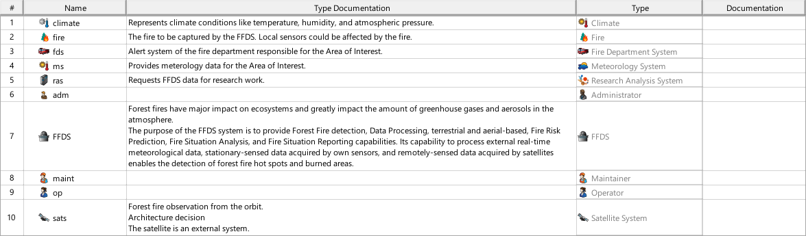
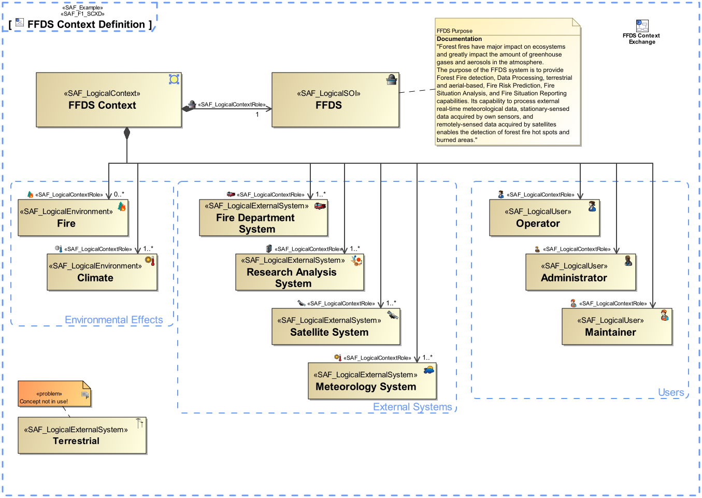

# SAF User Documentation : System Context Definition Viewpoint
|**Domain**|**Aspect**|**Maturity**|
| --- | --- | --- |
|[Functional](../domains.md#Domain-Functional)|[Context & Exchange](../aspects.md#Aspect-Context-&-Exchange)|[released](../using-saf/maturity.md#released)|
## Example

## Purpose
The System Context Definition Viewpoint defines how the SOI is embedded in its environment, i.e., where the boundary of the SOI is and who the external entities are the SOI interacts with (e.g., users, other external systems, environmental conditions, etc.). The SOI provides and requests context functions. The SOI shall be able handle events and effects from the outside. In addition, the System Context Definition Viewpoint serves as architecture concept to demonstrate how the architecture description defined in the Operational Context Definition Viewpoint is realized.
## Applicability
The System Context Definition Viewpoint supports the "prepare for system requirement definition" activity included in the "System Requirements Definition Process" activities of the INCOSE SYSTEMS ENGINEERING HANDBOOK 2023 [§2.3.5.3] and contributes to the artifact "System Requirements Definition Report".
## Presentation
A block definition diagram (BDD) featuring the following elements
* a Logical element block representing SOI in the logical domain
* a Logical context block representing the addressed context in the logical domain
* Logical context element blocks for each relevant context element
* a composition relationship from context block to each context element used in the context
* a composition relationship from context block to the SOI

A tabular format listing context roles, context elements, and respective descriptions.

## Stakeholder
* [Acquirer](../stakeholders.md#Acquirer)
* [Customer](../stakeholders.md#Customer)
* [IV&V Engineer](../stakeholders.md#IV&V-Engineer)
* [Safety Expert](../stakeholders.md#Safety-Expert)
* [Security Expert](../stakeholders.md#Security-Expert)
* [Supplier](../stakeholders.md#Supplier)
* [System Architect](../stakeholders.md#System-Architect)
## Concern
* [Where and what are the geographical and physical locations of the intended or proposed elements of the solution?](../concerns.md#_2021x_2_8710274_1674576759075_442496_23491)
* [Which are the external conceptual entities the system interacts with in the given context?](../concerns.md#_2021x_2_8710274_1674576758971_129300_23418)
* [Which are the given contexts the system is embedded and utilized in?](../concerns.md#_2021x_2_8710274_1674576758891_776196_23368)
* [Which interface partners does the system have?](../concerns.md#_2021x_2_8710274_1674576759091_673143_23507)
## Profile Model Reference
The following Stereotypes / Model Elements are used in the Viewpoint:
* SAF_LogicalContextRole contained in SAF_LogicalContext
* [SAF_LogicalContext](../stereotypes.md#SAF_LogicalContext)
* [SAF_LogicalEnvironment](../stereotypes.md#SAF_LogicalEnvironment)
* [SAF_LogicalExternalSystem](../stereotypes.md#SAF_LogicalExternalSystem)
* [SAF_LogicalSOI](../stereotypes.md#SAF_LogicalSOI)
* [SAF_LogicalUser](../stereotypes.md#SAF_LogicalUser)
* [SAF_SFV01b_View](../stereotypes.md#SAF_SFV01b_View)
## Input from other Viewpoints
### Required Viewpoints
*none*
### Recommended Viewpoints
* [Operational Context Definition Viewpoint](Operational-Context-Definition-Viewpoint.md)
