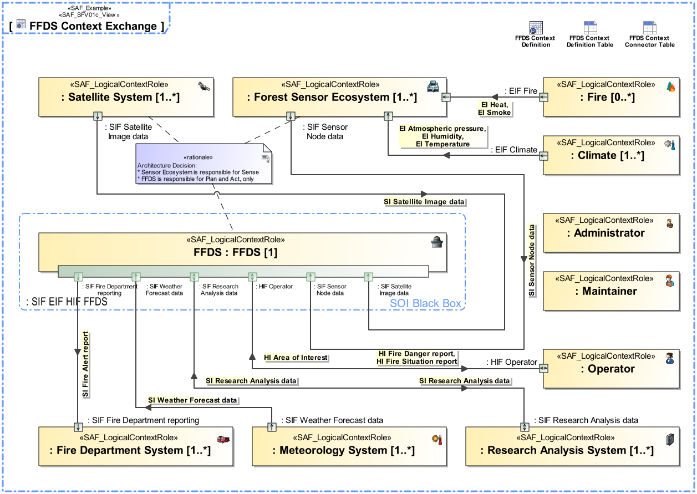

# System Context Exchange Viewpoint
|**Domain**|**Aspect**|**Maturity**|
| --- | --- | --- |
|[Functional](../domains.md#Domain-Functional)|[Context & Exchange](../aspects.md#Aspect-Context-&-Exchange)|[released](../using-saf/maturity.md#released)|
## Example

## Purpose
The System Context Exchange Viewpoint serves for the identification and definition of External Interface(s) of the SOI used for the interaction to System’s Context, such as User(s), External System(s) and other External Entity(s) defined in the specific context of the SOI. The System Context Exchange Viewpoint
* identifies System Interface(s) on a functional level
* states to which External Entity(s) the System Interface(s) are connected to
* assigns Interface Document(s) to System Interface(s)
* defines the usage of interface(s), e.g. if only a subset of the interface is used
## Applicability
The System Context Exchange Viewpoint supports the "Prepare for Requirement Definition" activity included in "System Requirements Definition Process" activities of the INCOSE SYSTEMS ENGINEERING HANDBOOK 2015 [§ 4.3] and contributes to the System Functional Interface identification.
## Stakeholder
* [Acquirer](../stakeholders.md#Acquirer)
* [Customer](../stakeholders.md#Customer)
* [Hardware Developer](../stakeholders.md#Hardware-Developer)
* [IV&V Engineer](../stakeholders.md#IV&V-Engineer)
* [Maintainer](../stakeholders.md#Maintainer)
* [Safety Expert](../stakeholders.md#Safety-Expert)
* [Security Expert](../stakeholders.md#Security-Expert)
* [Software Developer](../stakeholders.md#Software-Developer)
* [System Architect](../stakeholders.md#System-Architect)
## Concern
* How does the system or a system element interact with the test environment?
* How is the system interacting with the identified external entities?
* What are the external conceptual entities the system interacts with in the respective context?
* What are the functional interfaces of the system?
* What are the interactions among the systems users / user classes?
* What are the interface requirements imposed on the system?
* What are the items exchanged at the boundary of the system with external entities?
* What kind of information or what kind of items are exchanged between the system and external entities (incl. actors)?
* Which information is exchanged between the system and external entities?
## Presentation
An IBD featuring the SOI, the System Context Element(s) and Connector(s) for each identified Interface from SOI to the respective Context Element(s). An Interface is a connection resource for hooking on the SOI to other Context Element(s). Item flow(s) are defined for each exchange on the identified Interface. Connectors/ports may contain reference to the Interface Document(s) if applicable.
Note: more than one IBD focused on different areas of interest may be used in oder to keep the view comprehensive. Depending on the Stakeholder Concern(s) the Item Exchange information might be suppressed.

## Profile Model Reference
* Connector [UML_Standard_Profile]
* FlowProperty [SysML Profile]
* InterfaceBlock [SysML Profile]
* ItemFlow [SysML Profile]
* ProxyPort [SysML Profile]
* [SAF_DomainKind](../stereotypes.md#SAF_DomainKind)
* [SAF_LogicalEnvironment](../stereotypes.md#SAF_LogicalEnvironment)
* [SAF_LogicalExternalSystem](../stereotypes.md#SAF_LogicalExternalSystem)
* [SAF_LogicalRole](../stereotypes.md#SAF_LogicalRole)
* [SAF_LogicalRole](../stereotypes.md#SAF_LogicalRole)
* [SAF_LogicalSOI](../stereotypes.md#SAF_LogicalSOI)
* [SAF_LogicalUser](../stereotypes.md#SAF_LogicalUser)
* [SAF_SFV01c_View](../stereotypes.md#SAF_SFV01c_View)
## Input from other Viewpoints
### Required Viewpoints
* [System Context Definition Viewpoint](System-Context-Definition-Viewpoint.md)
* [System Domain Item Kind Viewpoint](System-Domain-Item-Kind-Viewpoint.md)
### Recommended Viewpoints
* [Operational Domain Item Kind Viewpoint](Operational-Domain-Item-Kind-Viewpoint.md)
