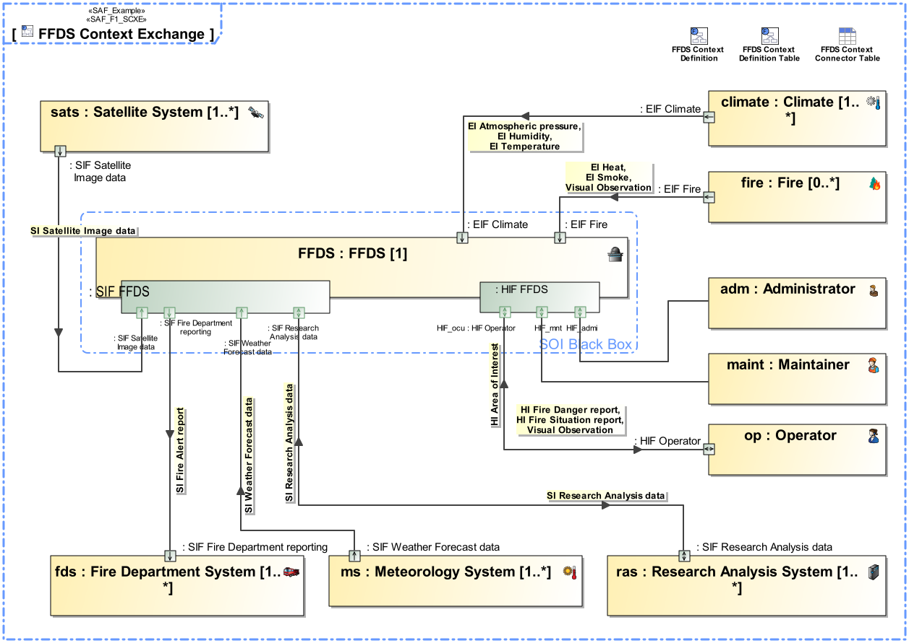

# SAF User Documentation : **F1_SCE** System Context Exchange Viewpoint
|**Domain**|**Aspect**|**Maturity**|
| --- | --- | --- |
|[Functional](../domains.md#Domain-Functional)|[Context & Exchange](../aspects.md#Aspect-Context-&-Exchange)|[released](../using-saf/maturity.md#released)|
## Example

## Purpose
The System Context Exchange Viewpoint serves for the identification and definition of external interfaces of the SOI that are used to interact, e.g., users, external systems, and other external entities defined in the given context of the SOI. The System Context Exchange Viewpoint
* identifies system interfaces on a functional level,
* states to which external entities the system interfaces are connected to,
* assigns interface documents to system interfaces,
* and defines the usage of interfaces, e.g., when only a subset of the interface is used.
## Applicability
The System Context Exchange Viewpoint supports the "prepare for system requirement definition" activity included in the "System Requirements Definition Process" activities of the INCOSE SYSTEMS ENGINEERING HANDBOOK 2023 [§2.3.5.3] and contributes to the artifact "System Requirements Definition Report".
## Presentation
An internal block diagram (IBD) - associated to the system context - featuring the SOI, the system context elements, and the connectors for each identified interface from SOI to the respective context elements. An interface is a connection resource for hooking on the SOI to other context elements. Item flows are defined for each exchange on the identified interface. Connectors/ports may contain reference to the interface documents if applicable. Ports may be structured as appropriate to manage and structure the information.
Note: more than one IBD focused on different areas of interest may be used in oder to keep the view comprehensive. Depending on the Stakeholder concerns the item exchange information might be suppressed.

A tabular format listing [tbd].

## Stakeholder
* [Acquirer](../stakeholders.md#Acquirer)
* [Customer](../stakeholders.md#Customer)
* [Hardware Developer](../stakeholders.md#Hardware-Developer)
* [IV&V Engineer](../stakeholders.md#IV&V-Engineer)
* [Maintainer](../stakeholders.md#Maintainer)
* [Safety Expert](../stakeholders.md#Safety-Expert)
* [Security Expert](../stakeholders.md#Security-Expert)
* [Software Developer](../stakeholders.md#Software-Developer)
* [System Architect](../stakeholders.md#System-Architect)
## Concern
* [How is the system interacting with the identified external entities?](../concerns.md#_2021x_2_8710274_1674576758710_799233_23181)
* [Which are the conceptual interfaces of the system?](../concerns.md#_2021x_2_8710274_1674576758808_527146_23298)
* [Which are the external conceptual entities the system interacts with in the given context?](../concerns.md#_2021x_2_8710274_1674576758971_129300_23418)
* [Which are the interface requirements imposed on the system?](../concerns.md#_2021x_2_8710274_1674576758778_979635_23258)
* [Which kind of conceptual items (energy, material, information, etc.) are exchanged between the system and external entities?](../concerns.md#_2021x_2_8710274_1674576759154_22704_23559)
## Profile Model Reference
The following Stereotypes / Model Elements are used in the Viewpoint:
* Attribute "realizingConnector" of InformationFlow referencing Connector
* Connector [UML_Standard_Profile]
* FlowProperty [SysML Profile]
* FlowProperty contained in SAF_ConceptualInterfaceDefinition
* FlowProperty typed by SAF_DomainKind
* ItemFlow [SysML Profile]
* ItemFlow typed by SAF_DomainKind
* ProxyPort [SysML Profile]
* ProxyPort typed by SAF_ConceptualInterfaceDefinition
* SAF_LogicalContextRole contained in SAF_LogicalContext
* [SAF_ConceptualInterfaceDefinition](../stereotypes.md#SAF_ConceptualInterfaceDefinition)
* [SAF_DomainKind](../stereotypes.md#SAF_DomainKind)
* [SAF_F1_SCE](../stereotypes.md#SAF_F1_SCE)
* [SAF_LogicalEnvironment](../stereotypes.md#SAF_LogicalEnvironment)
* [SAF_LogicalExternalSystem](../stereotypes.md#SAF_LogicalExternalSystem)
* [SAF_LogicalSOI](../stereotypes.md#SAF_LogicalSOI)
* [SAF_LogicalUser](../stereotypes.md#SAF_LogicalUser)
## Input from other Viewpoints
### Required Viewpoints
* [System Context Definition Viewpoint](System-Context-Definition-Viewpoint.md)
* [System Domain Item Kind Viewpoint](System-Domain-Item-Kind-Viewpoint.md)
### Recommended Viewpoints
* [Operational Domain Item Kind Viewpoint](Operational-Domain-Item-Kind-Viewpoint.md)
