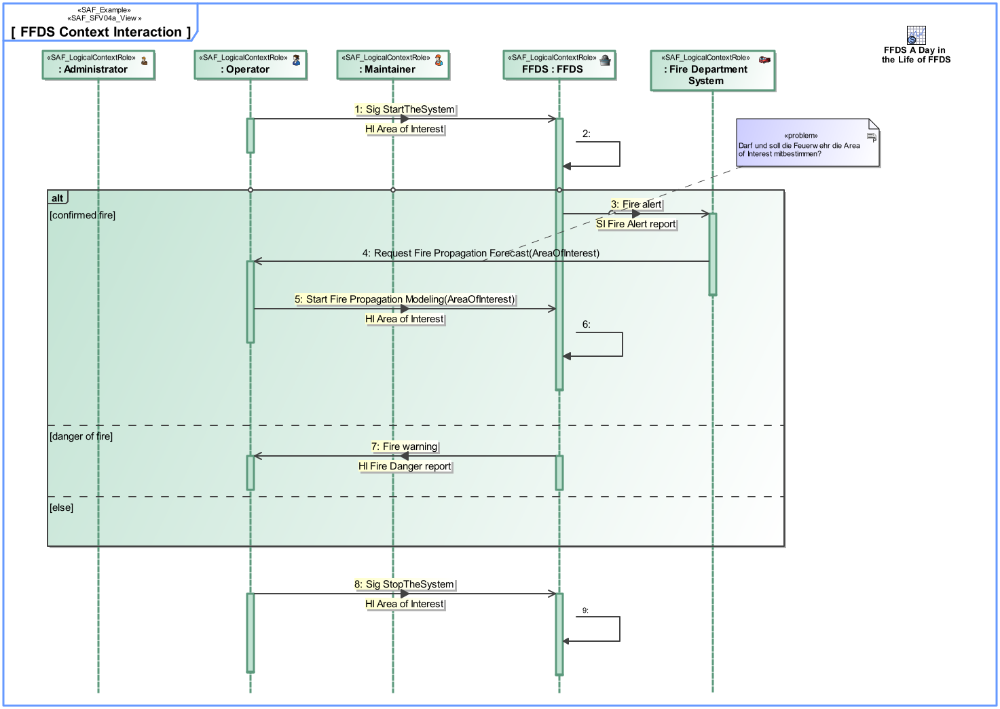

SAF_FFDS#311,SAF_Cameo_Profile#399

# System Context Interaction Viewpoint
*Domain:* **Functional** *Aspect:* **Interaction and Collaboration**
## Example

## Purpose
The System Context Interaction Viewpoint describes system external behavior based on the exchange between SOI and Context Element(s) Usage within a specific Context. It depicts the flow/sequence of interaction(s) between the logical System, the Context Element(s) and the Exchanged Data Item(s) needed to accomplish a given System Function.
## Applicability
The System Context Interaction Viewpoint supports "Prepare for Requirement Definition" activity included in "System Requirements Definition Process" activities of the INCOSE SYSTEMS ENGINEERING HANDBOOK 2015 [§ 4.3] and contributes to the identification of expected interactions with systems external to the SOI.
Note:
## Stakeholder
* [Customer](../stakeholders.md#Customer)
* [Safety Expert](../stakeholders.md#Safety-Expert)
* [Security Expert](../stakeholders.md#Security-Expert)
* [System Architect](../stakeholders.md#System-Architect)
* [User](../stakeholders.md#User)
## Concern
* What is the necessary response time for an interface or a service?
* How is the system being used or utilized and interacting with other external systems to satisfy user needs?
* What are the items exchanged at the boundary of the system with external entities?
* What is the sequence of interactions among the system and context elements
* How does the system or a system element interact with the test environment?
* What additional information the system or a system element needs to generate to enable testing?
## Presentation
The System Context Interaction Viewpoint is modeled as a sequence diagram. It describes the flow of control between SOI and Context Element(s). This diagram represents the sending and receiving of messages between the interacting entities called lifelines, where time is represented along the vertical axis. The elements on the lifelines are part properties of a System Context.

## Profile Model Reference
* Interaction [UML_Standard_Profile]
* Lifeline [UML_Standard_Profile]
* Message [UML_Standard_Profile]
* Property [UML_Standard_Profile]
* [SAF_SFV04a_View](../stereotypes.md#SAF_SFV04a_View)
## Input from other Viewpoints
### Required Viewpoints
* [System Context Definition Viewpoint](System-Context-Definition-Viewpoint.md)
### Recommended Viewpoints
* [Operational Context Definition Viewpoint](Operational-Context-Definition-Viewpoint.md)
