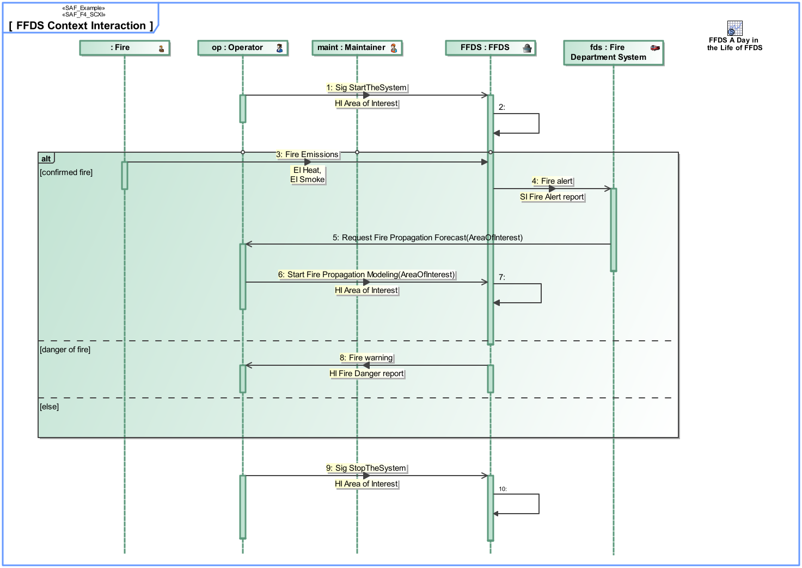

# SAF User Documentation : **F4_SCXI** System Context Interaction Viewpoint
|**Domain**|**Aspect**|**Maturity**|
| --- | --- | --- |
|[Functional](../domains.md#Domain-Functional)|[Interaction & Collaboration](../aspects.md#Aspect-Interaction-&-Collaboration)|[released](../using-saf/maturity.md#released)|
## Example

## Purpose
The System Context Interaction Viewpoint describes the System external behavior based on the exchange between Logical SOI and Logical Context Elements Usage in a given System Context. It depicts the sequence of interactions between the Logical SOI, the Context Elements and the exchanged Domain Item Kinds needed to accomplish a given System Process. 
Note: The System Context Interaction Viewpoint may refine a System Use Case.
## Applicability
The System Context Interaction Viewpoint supports the "prepare for requirement definition" activity part of the "System Requirements Definition Process" activities of the INCOSE SYSTEMS ENGINEERING HANDBOOK 2015 [§ 4.3] and contributes to the identification of expected interactions with systems external to the SOI.
## Presentation
A sequence diagram featuring the flow of control between SOI and Context Elements Roles of a System Context to achieve one outcome of a System Use Case. 
Note: This diagram depicts the sending and receiving of messages between the interacting entities called lifelines, where time is represented along the vertical axis. The lifelines representatives are part properties typed by a System Context Elements.

## Stakeholder
* [Acquirer](../stakeholders.md#Acquirer)
* [Customer](../stakeholders.md#Customer)
* [Hardware Developer](../stakeholders.md#Hardware-Developer)
* [IV&V Engineer](../stakeholders.md#IV&V-Engineer)
* [Operator](../stakeholders.md#Operator)
* [Safety Expert](../stakeholders.md#Safety-Expert)
* [Security Expert](../stakeholders.md#Security-Expert)
* [Software Developer](../stakeholders.md#Software-Developer)
* [System Architect](../stakeholders.md#System-Architect)
* [User](../stakeholders.md#User)
## Concern
* [How is the system being used or utilized and interacting with other external systems to satisfy user needs?](../concerns.md#_2021x_2_8710274_1674576758841_451500_23327)
* [What is the necessary response time for an interface or a service?](../concerns.md#_2021x_2_8710274_1674576759095_626726_23511)
* [What is the sequence of interactions among the system and context elements on concpetual level?](../concerns.md#_2021x_2_8710274_1697718624828_512543_29114)
## Profile Model Reference
The following Stereotypes / Model Elements are used in the Viewpoint:
* Interaction [UML_Standard_Profile]
* Lifeline [UML_Standard_Profile]
* Message [UML_Standard_Profile]
* [SAF_F4_SCXI](../stereotypes.md#saf_f4_scxi)
* [SAF_LogicalContextRole](../stereotypes.md#saf_logicalcontextrole)
* [SAF_LogicalContext](../stereotypes.md#saf_logicalcontext)
## Input from other Viewpoints
### Required Viewpoints
* [System Context Definition Viewpoint](System-Context-Definition-Viewpoint.md)
### Recommended Viewpoints
* [Operational Context Definition Viewpoint](Operational-Context-Definition-Viewpoint.md)
