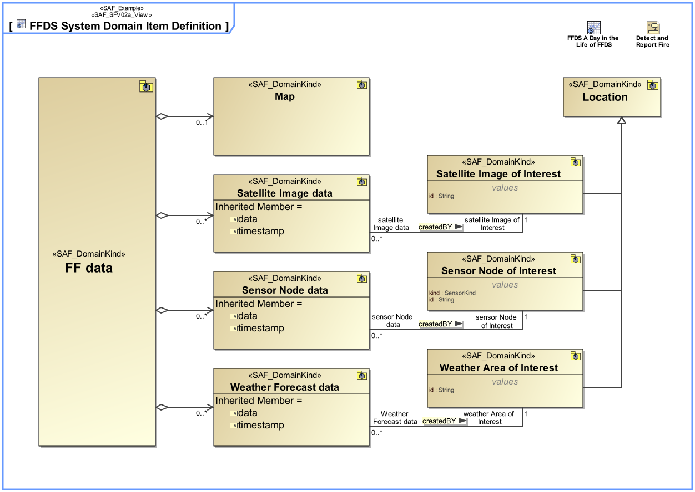

# System Domain Item Kind Viewpoint
|**Domain**|**Aspect**|**Maturity**|
| --- | --- | --- |
|[Functional](../domains.md#Domain-Functional)|[Structure](../aspects.md#Aspect-Structure)|[released](../using-saf/maturity.md#released)|
## Example

## Purpose
The System Domain Item Kind Viewpoint collects type definition(s) for any exchanged item, information, material, or energy of the Functional, Logical and Physical domain. Its purpose is to define those item types and their relationships. Also, the System Domain Item Kind Viewpoint specifies the data types, physical entity types, related value types and units that are used (“known”) by the SOI. 
Note: Domain Item Kinds are used as type(s) of function input and output in the Functional Domain and for types of interfaces in the logical domain. They specify what is to be exchanged, but not how.
## Applicability
The System Domain Item Kind Viewpoint supports [tbd].
## Stakeholder
## Concern
## Presentation
Domain Item Kinds are managed in the domain knowledge package of the SOI, the Domain Item Kinds are visible and usable to all sub elements of the SOI. Domain Item Kinds shall be value types or blocks. A BDD diagram featuring Domain Item Kinds and their Relationships in terms of generalization, composition or general association shall be used.

## Profile Model Reference
* FlowProperty [SysML Profile]
* ItemFlow [SysML Profile]
* Parameter [UML_Standard_Profile]
* Pin [UML_Standard_Profile]
* [SAF_DomainKind](../stereotypes.md#SAF_DomainKind)
* [SAF_DomainKindComposition](../stereotypes.md#SAF_DomainKindComposition)
* [SAF_DomainKindDerivation](../stereotypes.md#SAF_DomainKindDerivation)
* [SAF_OperationalDomainKind](../stereotypes.md#SAF_OperationalDomainKind)
* [SAF_SFV02a_View](../stereotypes.md#SAF_SFV02a_View)
* State [UML_Standard_Profile]
## Input from other Viewpoints
### Required Viewpoints
*none*
### Recommended Viewpoints
* [Operational Domain Item Kind Viewpoint](Operational-Domain-Item-Kind-Viewpoint.md)
