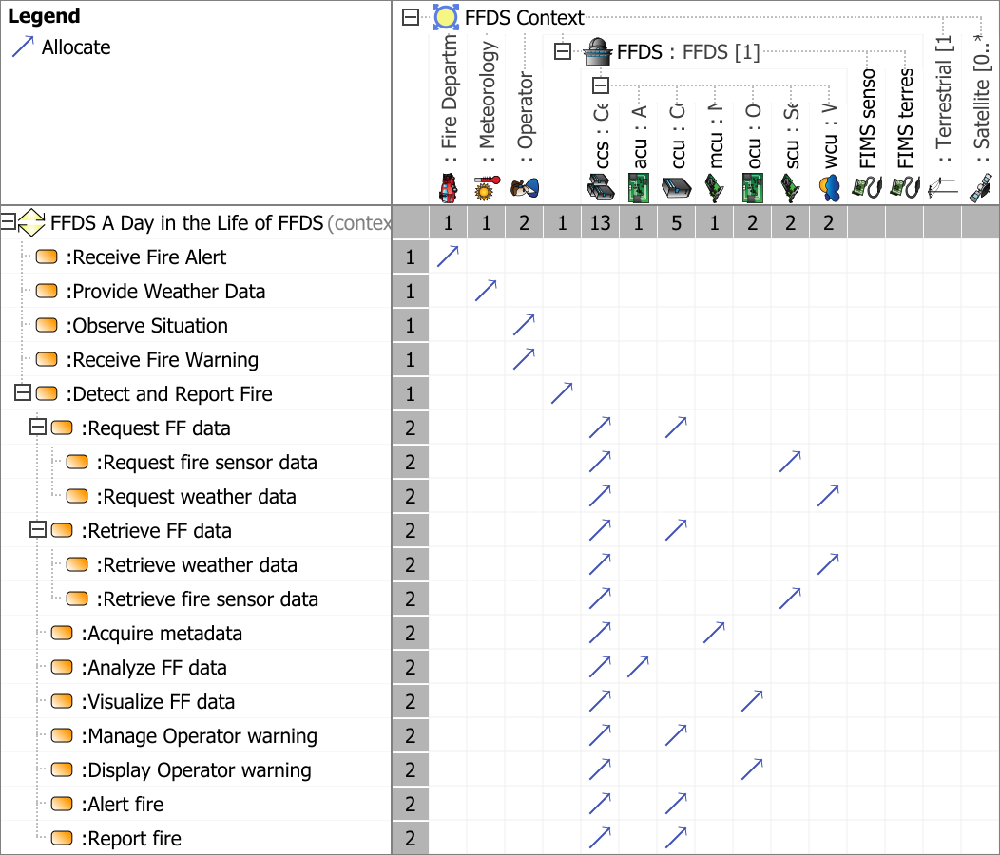

# System Function Black Box Allocation Viewpoint
*Domain:* **Functional** *Aspect:* **Mapping & Crossreference**
## Example

## Purpose
The System Function Black Box Allocation Viewpoint specifies the allocation of System Function(s) to the SOI element(s) together with the allocation of Context Function(s) to Context Element(s). It dissects functionality explicitly between the SOI and its environment elements.
## Applicability
The System Function Black Box Allocation Viewpoint supports the "System Requirements Definition process" activities of the INCOSE SYSTEMS ENGINEERING HANDBOOK 2015 [§ 4.3] and contributes to the System Function Definition and the system Functional Interface identification.
## Stakeholder
* [Acquirer](../stakeholders.md#Acquirer)
* [Safety Expert](../stakeholders.md#Safety-Expert)
* [System Architect](../stakeholders.md#System-Architect)
## Concern
* What services are expected from external entities?
## Presentation
A System Function Black Box Allocation Matrix featuring
* the Context Element(s) and Context Function(s) and
* the call behavior action representing usage of Context Function(s)
* the part property(s) representing usage of Context Element(s);
* the SOI Element(s) and System Function(s) and
* the call behavior action representing usage of System Function(s)
* the part property(s) representing usage of SOI Element(s)

## Profile Model Reference
* Allocate [SysML Profile]
* Allocate [SysML Profile]
* Association [UML_Standard_Profile]
* Association [UML_Standard_Profile]
* [SAF_LogicalRole](../stereotypes.md#SAF_LogicalRole)
* [SAF_LogicalRole](../stereotypes.md#SAF_LogicalRole)
## Input from other Viewpoints
### Required Viewpoints
* [System Process Viewpoint](System-Process-Viewpoint.md)
### Recommended Viewpoints
* [Operational Context Definition Viewpoint](Operational-Context-Definition-Viewpoint.md)
* [Operational Domain Item Kind Viewpoint](Operational-Domain-Item-Kind-Viewpoint.md)
* [System Context Definition Viewpoint](System-Context-Definition-Viewpoint.md)
* [System Domain Item Kind Viewpoint](System-Domain-Item-Kind-Viewpoint.md)
