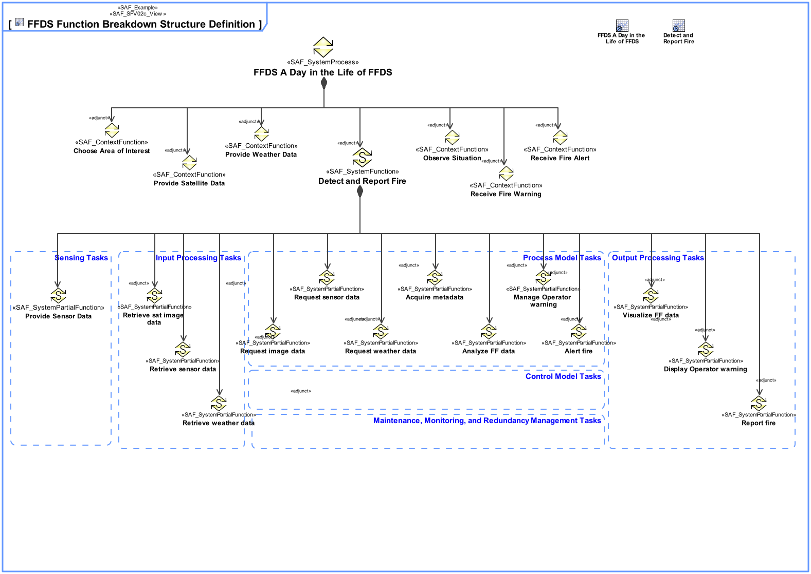

# SAF User Documentation : **F2_SFBS** System Functional Breakdown Structure Viewpoint
|**Domain**|**Aspect**|**Maturity**|
| --- | --- | --- |
|[Functional](../domains.md#Domain-Functional)|[Taxonomy & Structure](../aspects.md#Aspect-Taxonomy-&-Structure)|[released](../using-saf/maturity.md#released)|
## Example

## Purpose
The System Functional Breakdown Structure Viewpoint defines the structured, modular functional breakdown of the SOI beginning with System Processes, over identified System Functions further refined down to System Partial Functions. The reuse of System Functions, and System Partial Functions over Function Trees of the SOI is facilitated. 
## Applicability
The System Functional Breakdown Structure Viewpoint supports the "System Requirements Definition Process" activities of the INCOSE SYSTEMS ENGINEERING HANDBOOK 2015 [§4.3] and contributes to the System Function Definition.
## Presentation
One or more more block definition diagrams (BDD) featuring activities representing System Processes, System Functions, System Partial Functions, and their aggregation composing the functional breakdown structure.

Tool specific analysis diagram featuring the relationships between System Processes, System Functions, and System Partial Functions.

## Stakeholder
* [Acquirer](../stakeholders.md#Acquirer)
* [Customer](../stakeholders.md#Customer)
* [Hardware Developer](../stakeholders.md#Hardware-Developer)
* [IV&V Engineer](../stakeholders.md#IV&V-Engineer)
* [Project Manager](../stakeholders.md#Project-Manager)
* [Safety Expert](../stakeholders.md#Safety-Expert)
* [Security Expert](../stakeholders.md#Security-Expert)
* [Software Developer](../stakeholders.md#Software-Developer)
* [System Architect](../stakeholders.md#System-Architect)
## Concern
* [How are the system functions decomposed into smaller, and more manageable sub-functions? ](../concerns.md#_2021x_2_8710274_1674576758790_775644_23272)
* [What is the breakdown of functions into sub-functions?](../concerns.md#_2021x_2_8710274_1674576758728_463822_23204)
* [Which functions will the system provide?](../concerns.md#_2021x_2_8710274_1674576758649_392764_23120)
## Profile Model Reference
The following Stereotypes / Model Elements are used in the Viewpoint:
* SAF_ContextAction contained in SAF_SystemProcess
* SAF_FunctionAction contained in SAF_SystemFunction
* SAF_FunctionAction contained in SAF_SystemProcess
* [SAF_ContextFunction](../stereotypes.md#saf_contextfunction)
* [SAF_F2_SFBS](../stereotypes.md#saf_f2_sfbs)
* [SAF_SystemFunction](../stereotypes.md#saf_systemfunction)
* [SAF_SystemPartialFunction](../stereotypes.md#saf_systempartialfunction)
* [SAF_SystemProcess](../stereotypes.md#saf_systemprocess)
## Input from other Viewpoints
### Required Viewpoints
*none*
### Recommended Viewpoints
* [System Process Viewpoint](System-Process-Viewpoint.md)
